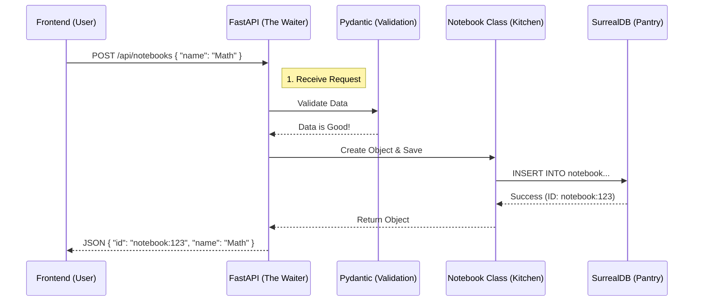

# Chapter 6: API Service Layer

In the previous chapter, **[AI Orchestration (LangGraph)](05_ai_orchestration__langgraph_.md)**, we built a sophisticated "Brain" that can remember conversations and answer complex questions.

However, right now, that brain is locked inside a Python script. A web browser (Chrome, Firefox, Safari) cannot run Python code directly. It speaks **JavaScript** and communicates via **HTTP**.

We need a translator. We need a bridge.

## The Problem: The Locked Kitchen

Imagine a world-class restaurant.
*   **The Kitchen (Backend):** This is where the Chefs (AI Models) and the Pantry (Database) are. It's hot, chaotic, and full of complex equipment.
*   **The Customer (Frontend):** This is the user sitting at the table. They just want food; they don't want to know how to chop an onion.

If the Customer walks directly into the Kitchen to demand a burger, it's a safety hazard.

## The Solution: The Waitstaff (API Layer)

In software, we solve this with an **API (Application Programming Interface)**. We use a framework called **FastAPI**.

Think of the API as the **Waitstaff**:
1.  **The Menu (Routes):** Tells the customer what they can order (e.g., "Get Notebooks", "Create Note").
2.  **The Ticket (Request):** The waiter writes down the order and ensures it makes sense ("You can't order a steak 'medium-rare-blue-purple'").
3.  **The Service:** The waiter runs to the kitchen, tells the Chef what to do, and waits.
4.  **The Serving (Response):** The waiter brings the finished meal (JSON data) back to the table.

---

## Central Use Case: "I want to create a Notebook"

Let's look at how we expose the functionality from **[Chapter 1: Domain Models & Schema](01_domain_models___schema.md)** to the web.

We want a URL—`POST /api/notebooks`—that accepts a name and creates the record in the database.

---

## Concept 1: The Router (The Table Section)

In a large restaurant, one waiter watches the patio, another watches the bar. In our app, we split our API into **Routers**.

In `api/routers/notebooks.py`, we define a router specifically for Notebook operations.

```python
from fastapi import APIRouter

# Create a specialized router for notebook URLs
router = APIRouter()
```

This acts as a mini-application that handles everything related to notebooks.

---

## Concept 2: The Request Model (The Ticket)

Before we accept an order, we need to know what a valid order looks like. We use **Pydantic Models** (similar to what we used in Chapter 1) to define the "Ticket".

```python
from pydantic import BaseModel

# The customer MUST provide a name. 
# Description is optional.
class NotebookCreate(BaseModel):
    name: str
    description: Optional[str] = None
```
*Explanation: If a user tries to send data without a `name`, FastAPI will automatically reject it with an error. This keeps "bad data" out of our kitchen.*

---

## Concept 3: The Endpoint (Taking the Order)

Now we write the function that actually does the work. This is where we connect the **HTTP Request** to our **Domain Logic**.

```python
# api/routers/notebooks.py

@router.post("/notebooks", response_model=NotebookResponse)
async def create_notebook(notebook: NotebookCreate):
    # 1. Create the Domain Object (from Chapter 1)
    new_notebook = Notebook(
        name=notebook.name,
        description=notebook.description,
    )
    
    # 2. Save it using the Repository logic (from Chapter 2)
    await new_notebook.save()

    # 3. Return the data (FastAPI converts this to JSON)
    return new_notebook
```

*   **`@router.post`**: This defines the "verb". `POST` is used for creating things. `GET` is for reading.
*   **`notebook: NotebookCreate`**: This tells FastAPI to read the data sent by the browser and validate it against our Ticket rules.
*   **`await new_notebook.save()`**: This calls the logic we wrote in previous chapters to talk to the database.

---

## Concept 4: The Manager (Main Application)

We have our router, but we need to turn on the lights. `api/main.py` is the entry point of our server.

It acts as the General Manager. It gathers all the waiters (routers) and opens the doors.

```python
# api/main.py
from fastapi import FastAPI
from api.routers import notebooks, chat

# 1. Initialize the App
app = FastAPI(title="Open Notebook API")

# 2. Hire the waiters (Include Routers)
app.include_router(notebooks.router, prefix="/api", tags=["notebooks"])
app.include_router(chat.router, prefix="/api", tags=["chat"])
```
*Explanation: Now, our application knows that if a request comes in for `/api/notebooks`, it should send that "customer" to the `notebooks.router`.*

---

## Under the Hood: The Request Lifecycle

What happens when you click "Save" on the frontend?



### Complex Logic: Deleting a Notebook

In **[Chapter 1](01_domain_models___schema.md)**, we wrote a complex `delete` method that cleans up orphan notes. The API layer makes it easy to trigger that complex logic safely.

```python
# api/routers/notebooks.py

@router.delete("/notebooks/{notebook_id}")
async def delete_notebook(notebook_id: str):
    # 1. Find the notebook in the database
    notebook = await Notebook.get(notebook_id)
    
    if not notebook:
        # If it doesn't exist, tell the user "404 Not Found"
        raise HTTPException(status_code=404, detail="Notebook not found")

    # 2. Run the complex cleanup logic from Chapter 1
    await notebook.delete()

    return {"message": "Notebook deleted successfully"}
```
*Explanation: The API layer doesn't need to know *how* to delete notes and relationships. It just asks the `Notebook` object to do it. This is called **Separation of Concerns**.*

---

## Security: The Bouncer (CORS)

Web browsers have strict security rules. By default, a website running on `localhost:3000` (Frontend) cannot talk to a server on `localhost:8000` (Backend). This is to prevent malicious sites from stealing your data.

To allow our own frontend to talk to our API, we need to set up **CORS (Cross-Origin Resource Sharing)**.

In `api/main.py`, we add "Middleware"—software that runs before the router sees the request.

```python
from fastapi.middleware.cors import CORSMiddleware

app.add_middleware(
    CORSMiddleware,
    # Allow the frontend to talk to us
    allow_origins=["*"], 
    allow_credentials=True,
    allow_methods=["*"],
    allow_headers=["*"],
)
```
*Explanation: This tells the browser, "It's okay, this API allows visitors from other ports to ask for data."*

---

## Summary

In this chapter, we built the **API Service Layer**:

1.  **FastAPI:** Our restaurant framework.
2.  **Routers:** The specific waiters handling requests for Notebooks or Chat.
3.  **Endpoints:** The functions that connect a URL (like `/api/notebooks`) to our backend logic.
4.  **Integration:** We saw how the API acts as a thin layer that calls the heavy machinery we built in previous chapters.

Now we have a fully functioning backend. It has a database, AI processing, memory, and a public interface (API).

But currently, to use it, you have to send raw code commands. We need a beautiful user interface.

In the final chapter, we will learn how the Frontend "Hooks" into this API to display data to the user.

[Next Chapter: Frontend Data Hooks](07_frontend_data_hooks.md)

---

Generated by [Code IQ](https://github.com/adityasoni99/Code-IQ)