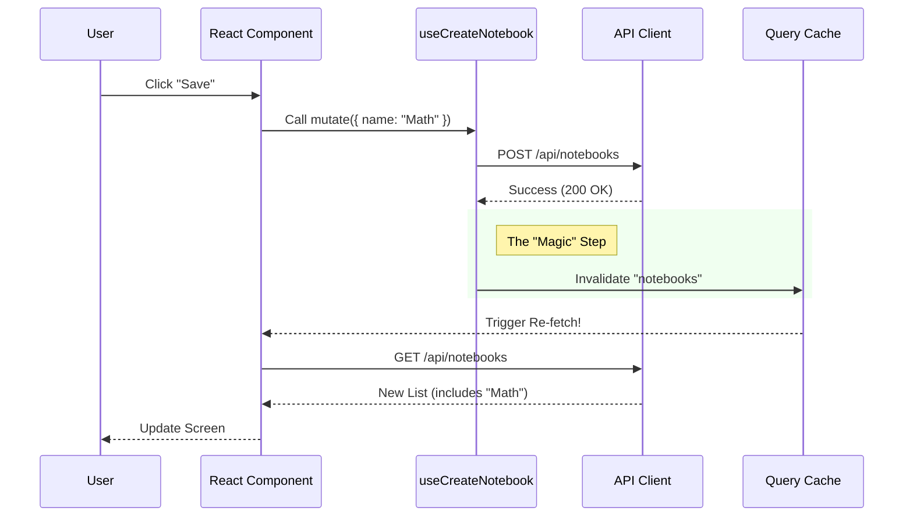

# Chapter 7: Frontend Data Hooks

In the previous chapter, **[API Service Layer](06_api_service_layer.md)**, we built the "Waitstaff" of our application. We created endpoints like `GET /api/notebooks` that allow the outside world to talk to our Python backend.

Now, we need to build the actual User Interface (UI). However, a raw React component doesn't know how to talk to a Python server. It doesn't know how to handle loading spinners, error messages, or caching data.

## The Problem: The "Loading..." Nightmare

Imagine building a webpage that lists your notebooks. Without a smart system, you have to write code for every single scenario:
1.  **Start:** Turn on a "Loading..." spinner.
2.  **Fetch:** Call the API.
3.  **Success:** Turn off the spinner, save the data to a variable.
4.  **Error:** If it fails, turn off the spinner, show an error message.
5.  **Update:** If you add a new notebook, you have to manually run the fetch again.

Writing this logic over and over again is exhausting and buggy.

## The Solution: Frontend Data Hooks

We use a library called **TanStack Query** (formerly React Query) wrapped in **Custom Hooks**.

Think of this as a **Smart Dashboard** in a car.
*   **The Component (Driver):** Just looks at the dashboard. It doesn't check the oil level manually; it just sees the light is "OK".
*   **The Hook (Dashboard):** Handles the connection to the engine. It remembers the last status (Cache) and only checks for updates when necessary.

---

## Central Use Case: "The Notebook List"

Our goal is simple: **A React component needs to display a list of notebooks.**

It should automatically show a loading skeleton while fetching, display the data when ready, and update automatically if we create a new notebook.

---

## Concept 1: The API Client (The Secure Phone Line)

Before we can ask for data, we need a configured way to make calls. We can't just use the browser's default `fetch` command easily because we need to:
1.  Know the **Base URL** (e.g., `http://localhost:8000/api`).
2.  Attach the **Authorization Token** (so the server knows who we are).
3.  Handle **Timeouts** (AI can be slow, so we need to wait longer than usual).

We create a configured client in `frontend/src/lib/api/client.ts`.

```typescript
// frontend/src/lib/api/client.ts (Simplified)
import axios from 'axios'

export const apiClient = axios.create({
  // AI operations can take time! We wait up to 10 minutes.
  timeout: 600000, 
  headers: {
    'Content-Type': 'application/json',
  },
})
```
*Explanation: We use a library called `axios`. This setup ensures every request we make follows the same rules.*

### The Interceptor (The Automatic Stamper)
We also use an "Interceptor." This is like a mail clerk who stamps every outgoing envelope with your return address (Auth Token) automatically, so you don't have to lick the stamp every time.

```typescript
// Whenever a request goes out...
apiClient.interceptors.request.use(async (config) => {
  // 1. Get the token from local storage
  const authStorage = localStorage.getItem('auth-storage')
  
  // 2. Add it to the headers
  if (token) {
    config.headers.Authorization = `Bearer ${token}`
  }
  return config
})
```

---

## Concept 2: The Query Hook (Reading Data)

Now we create the hook used to **fetch** data. We call this a "Query."

In `frontend/src/lib/hooks/use-notebooks.ts`, we define `useNotebooks`.

```typescript
// frontend/src/lib/hooks/use-notebooks.ts

export function useNotebooks(archived?: boolean) {
  return useQuery({
    // 1. A unique label for this data
    queryKey: ['notebooks', { archived }],
    
    // 2. The actual function to call the API
    queryFn: () => notebooksApi.list({ archived }),
  })
}
```

*   **`queryKey`**: This is crucial. It acts like a label on a file folder. If we ask for `['notebooks']` again later, the system checks if it already has this folder in memory (Cache) before calling the server.
*   **`queryFn`**: This is the instruction on how to get the data if the folder is empty.

### Example Usage (Input/Output)

In your React Component (e.g., `Dashboard.tsx`):

```tsx
const { data, isLoading, error } = useNotebooks();

if (isLoading) return <Spinner />;
if (error) return <ErrorMessage />;

return (
  <ul>
    {data.map(notebook => <li>{notebook.name}</li>)}
  </ul>
);
```
*Output:* The component is clean. No `useEffect`, no manual state management. The Hook handles the messy "time" logic.

---

## Concept 3: The Mutation Hook (Changing Data)

Reading is easy. But what about **writing** (creating/updating/deleting)? In React Query, this is called a **Mutation**.

When we create a new Notebook, our cached list of notebooks becomes "stale" (outdated). We need to tell the system to refresh it.

```typescript
// frontend/src/lib/hooks/use-notebooks.ts

export function useCreateNotebook() {
  const queryClient = useQueryClient()

  return useMutation({
    // 1. The function that sends data to the server
    mutationFn: (data) => notebooksApi.create(data),

    // 2. What to do when it succeeds
    onSuccess: () => {
      // "Invalidate" the cache. 
      // This forces useNotebooks() to re-fetch automatically!
      queryClient.invalidateQueries({ queryKey: ['notebooks'] })
      toast.success("Notebook created!")
    },
  })
}
```
*Explanation: `invalidateQueries` is the magic. It tells the app: "The folder labeled `['notebooks']` is now dirty. Throw it away and get a fresh copy."*

---

## Under the Hood: The Data Lifecycle

What happens when a user clicks "Create Notebook"?



### Why is this better?
Without this pattern, after creating a notebook, the list on the screen would stay empty until the user hit "Refresh" in their browser. With **Hooks + Invalidation**, the UI updates instantly and feels "snappy."

---

## Deep Dive: Handling Errors

What if the server is down? Or the user's internet cuts out?

Our Hooks handle errors gracefully using the `onError` callback.

```typescript
// Inside useCreateNotebook hook

onError: (error: unknown) => {
  // 1. Get a user-friendly error message
  const message = getApiErrorKey(error, "Something went wrong")
  
  // 2. Show a red toast notification
  toast({
    title: "Error",
    description: message,
    variant: 'destructive',
  })
}
```
*Explanation: We centrally manage errors. The component doesn't need to know how to parse a 404 or 500 error code; the hook converts it into a readable notification.*

---

## Complex Use Case: Deleting with Dependencies

In **[Chapter 1](01_domain_models___schema.md)** and **[Chapter 6](06_api_service_layer.md)**, we discussed that deleting a notebook is a heavy operation (it deletes notes and sources).

The Frontend Hook `useDeleteNotebook` handles the "Blast Radius" of this action.

```typescript
export function useDeleteNotebook() {
  const queryClient = useQueryClient()

  return useMutation({
    mutationFn: (id) => notebooksApi.delete(id),
    
    onSuccess: () => {
      // 1. Refresh the list of notebooks
      queryClient.invalidateQueries({ queryKey: ['notebooks'] })
      
      // 2. ALSO refresh the list of "Sources" (PDFs/Files)
      // because some sources might have been deleted too!
      queryClient.invalidateQueries({ queryKey: ['sources'] })
    }
  })
}
```
*Explanation: Because we understand our Domain Model, we know that deleting a notebook affects other parts of the app. The Hook acts as the coordinator to ensure **all** affected screens update.*

---

## Summary

In this final chapter, we connected the last piece of the puzzle:

1.  **API Client:** We built a secure "phone line" (`axios`) to talk to the backend.
2.  **Query Hooks:** We created `useNotebooks` to fetch and cache data, making the app feel fast.
3.  **Mutation Hooks:** We created `useCreateNotebook` to modify data and automatically refresh the screen.
4.  **Invalidation:** We learned how to keep our data fresh by marking old cache as "stale."

## Conclusion: You Built an Open Notebook!

Congratulations! You have walked through the entire architecture of a modern, AI-powered application.

1.  **[Domain Models](01_domain_models___schema.md):** You defined the shape of your data.
2.  **[Repository](02_repository_pattern__data_access_.md):** You safely stored that data.
3.  **[AI Provisioning](03_universal_ai_provisioning.md):** You connected to the "Brain" (LLMs).
4.  **[Processing Pipeline](04_content_processing_pipeline.md):** You taught the AI to read your files.
5.  **[Orchestration](05_ai_orchestration__langgraph_.md):** You gave the AI a memory.
6.  **[API Layer](06_api_service_layer.md):** You opened the doors to the world.
7.  **[Frontend Hooks](07_frontend_data_hooks.md):** You built the dashboard for the user.

You now have a complete mental map of the **Open Notebook** project. Happy coding!

---

Generated by [Code IQ](https://github.com/adityasoni99/Code-IQ)