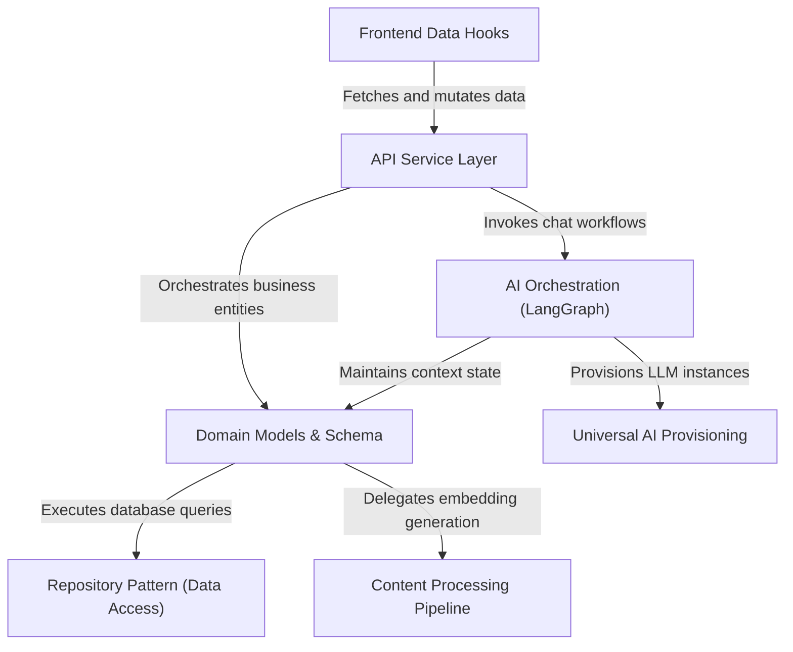

# Tutorial: open-notebook

Open Notebook is an **intelligent research assistant** designed to help users ingest, organize, and chat with their documents. It leverages a **Content Processing Pipeline** to convert raw files (PDFs, text) into vector embeddings, storing them in a structured database accessed via a **Repository Pattern**. The system exposes a **REST API** that powers a reactive frontend, while sophisticated **AI Orchestration** manages context-aware conversations using *Universal AI Provisioning* to switch between different LLM providers seamlessly.

**Source Repository:** [https://github.com/lfnovo/open-notebook](https://github.com/lfnovo/open-notebook)

## Chapters

1. [Domain Models & Schema](01_domain_models___schema.md)
2. [Repository Pattern (Data Access)](02_repository_pattern__data_access_.md)
3. [Universal AI Provisioning](03_universal_ai_provisioning.md)
4. [Content Processing Pipeline](04_content_processing_pipeline.md)
5. [AI Orchestration (LangGraph)](05_ai_orchestration__langgraph_.md)
6. [API Service Layer](06_api_service_layer.md)
7. [Frontend Data Hooks](07_frontend_data_hooks.md)

---

Generated by [Code IQ](https://github.com/adityasoni99/Code-IQ)