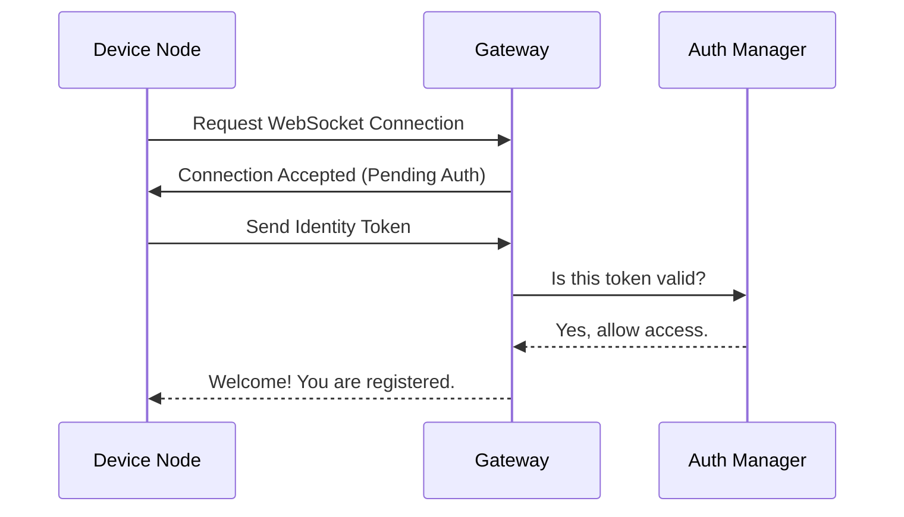

# Chapter 1: Gateway

Welcome to the first chapter of the **OpenClaw** tutorial! We are going to start with the most critical component of the entire system: the **Gateway**.

## Why do we need a Gateway?

Imagine you are in a room with three different friends. One speaks only English, one speaks only Spanish, and one speaks only Japanese. If you want to tell everyone to "Jump," it's going to be difficult. You would need a translator who understands everyone and can pass messages around.

In the world of OpenClaw, you have many different parts:
1.  **Nodes:** Devices like phones or computers (e.g., [macOS Node](05_macos_node.md) or [Android Node](07_android_node.md)).
2.  **Interfaces:** Where you control things (e.g., [Control UI](02_control_ui.md)).
3.  **Agents:** Scripts that perform tasks.

These parts don't talk to each other directly. The **Gateway** is the "translator" or the "Hub" in the middle. It solves the problem of **coordination**.

**The Central Use Case:**
You want to click a button on your computer that causes your Android phone to open an app. Your computer doesn't know where the phone is or how to talk to it. You send the command to the **Gateway**, and the Gateway knows exactly where the phone is and forwards the message.

## Key Concepts

To understand the Gateway, we only need to look at three simple concepts:

1.  ** The Daemon (The Server):**
    This is a program that runs continuously in the background on your server or computer. It waits for other devices to wake up and say hello.

2.  **WebSocket API:**
    This is the "phone line." Unlike standard web pages that load once, the Gateway keeps a line open permanently with every device. This allows for real-time speed. When a device connects, it uses the [ProtocolSchema](09_protocolschema.md) to understand the language being spoken.

3.  **Authentication:**
    The Gateway acts like a bouncer. It ensures that only *your* devices can connect, preventing strangers from controlling your nodes.

## How to Run the Gateway

Using the Gateway is very simple because it is designed to "just work" once started. It lives in the `openclaw.mjs` file and the `src/` folder.

### Step 1: Configuration
Before starting, the Gateway needs to know on which port to listen (like a radio frequency). This is handled in the setup (covered in detail in [Configuration](04_configuration.md)).

### Step 2: Start the Engine
To start the Gateway, you simply run the main file using Node.js.

```bash
# Open your terminal in the project folder
node openclaw.mjs
```

**What happens:**
*   **Output:** You will see a message like `Gateway listening on port 8080`.
*   **Result:** The Gateway is now alive and waiting for connections from the [Control UI](02_control_ui.md) or devices like the [iOS Node](06_ios_node.md).

### Step 3: Connecting a Client (Example)
While you usually connect real devices, here is a simplified example of how a client (like a Node) introduces itself to the Gateway using code.

```javascript
// A simplified example of a client connecting
import WebSocket from 'ws';

// Connect to the Gateway running locally
const socket = new WebSocket('ws://localhost:8080');

socket.on('open', () => {
    console.log("Connected to Gateway!");
    // Next: Send authentication details
});
```

**Explanation:**
1.  We import the WebSocket library.
2.  We dial the Gateway's address.
3.  When the door opens (`'open'`), we log a success message.

## Under the Hood: Internal Implementation

What actually happens inside `src/` and `openclaw.mjs` when the Gateway starts? It's a traffic controller workflow.

### The Connection Flow

Here is a visual representation of what happens when a device (like an Android phone) tries to join the network.



### Code Deep Dive

The logic inside `openclaw.mjs` acts as the entry point. It sets up the server and hands off logic to modules in `src/`.

**1. The Entry Point (`openclaw.mjs`):**
This file initializes the HTTP server and upgrades it to a WebSocket server.

```javascript
import { createServer } from 'http';
import { WebSocketServer } from 'ws';
// Import internal logic from src/
import { handleConnection } from './src/connectionHandler.js';

const server = createServer();
const wss = new WebSocketServer({ server });

// When the server starts listening...
server.listen(8080, () => {
  console.log('Gateway is running on port 8080');
});
```

**2. Handling Connections (`src/`):**
Once a connection is made, the Gateway needs to remember who is who. It keeps a list of active clients.

```javascript
// Inside src/connectionHandler.js (conceptual)

export function handleConnection(ws) {
  ws.on('message', (message) => {
    // 1. Parse the message (JSON)
    const data = JSON.parse(message);
    
    // 2. Check if it's an Auth message or a Command
    if (data.type === 'AUTH') {
       console.log('Verifying user...');
       // Perform authentication logic here
    }
  });
}
```

**Explanation:**
*   The **Entry Point** creates the physical server.
*   The **Handler** inside `src/` listens to every message sent.
*   It checks the message type (defined in [ProtocolSchema](09_protocolschema.md)) to decide if the user is trying to log in or send a command.

## Summary

In this chapter, we learned that the **Gateway** is the brain of OpenClaw. It:
1.  Runs via `openclaw.mjs`.
2.  Listens for connections on a WebSocket.
3.  Acts as the bridge between your control dashboard and your devices.

Without the Gateway, none of the other components can talk to each other. Now that we have our "Switchboard" running, we need a way to control it visually.

[Next Chapter: Control UI](02_control_ui.md)

---

Generated by [Code IQ](https://github.com/adityasoni99/Code-IQ)