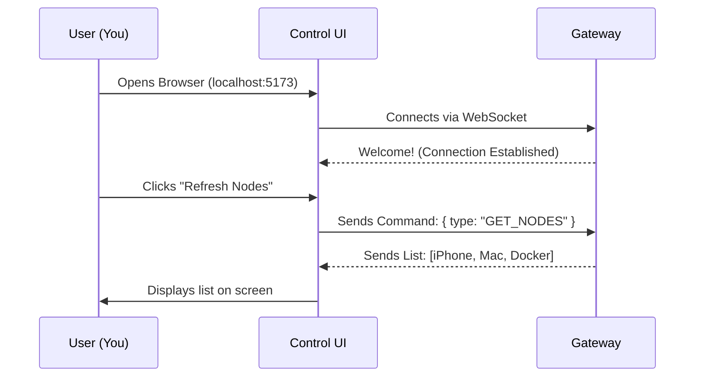

# Chapter 2: Control UI

Welcome back! In the previous chapter, we built the **[Gateway](01_gateway.md)**, which acts as the invisible "hub" or "engine" of our system.

While the Gateway is powerful, it doesn't have a face. You can't "see" it unless you stare at text logs in a terminal. Now, we are going to build the **dashboard** for your engine.

## What is the Control UI?

Imagine you have a super-advanced car (the Gateway). It works perfectly, but it has no steering wheel, no speedometer, and no windows. It would be impossible to drive!

The **Control UI** is your dashboard. It is a website running on your computer that lets you:
1.  **See** which devices (Nodes) are connected.
2.  **Chat** with your agents or friends.
3.  **Control** configurations visually.

**The Central Use Case:**
You want to see a list of all devices currently connected to OpenClaw (like your iPhone or a Docker container) and check if they are "Online." Instead of typing commands, you just open a web page and look at the "Nodes" panel.

## Key Concepts

The Control UI is built inside the `ui/` folder. It uses modern web technologies to be fast and responsive.

1.  **Lit (The Building Blocks):**
    We use a library called **Lit** to build "Components." Think of these like LEGO bricks. We build a "Chat Brick," a "Settings Brick," and a "Node List Brick," and then snap them together to make the full website.

2.  **Vite (The Runner):**
    **Vite** is a tool that runs the website on your computer while you are developing. It is incredibly fast. If you change a line of code, the website updates instantly without reloading.

3.  **WebSocket Client:**
    Just like the Gateway is the *Server*, the Control UI is a *Client*. It connects to the Gateway using the same phone line ([ProtocolSchema](09_protocolschema.md)) that your other nodes use.

## How to Run the Control UI

Getting the dashboard up and running is straightforward.

### Step 1: Install Dependencies
First, we need to download the tools (Lit and Vite) required to build the interface.

```bash
# Go to the ui folder
cd ui

# Install the necessary libraries
npm install
```

### Step 2: Start the Dashboard
Now we tell Vite to serve the website.

```bash
# Start the development server
npm run dev
```

**What happens:**
*   **Output:** You will see a link, usually `http://localhost:5173`.
*   **Action:** Open that link in your web browser (Chrome, Firefox, etc.).
*   **Result:** You will see the OpenClaw dashboard. If your **[Gateway](01_gateway.md)** is running, the dashboard will immediately connect and show a green "Connected" status.

## Under the Hood: Internal Implementation

How does a click on a web page travel to the Gateway? Let's look at the flow.

### The Dashboard Flow

When you open the Control UI in your browser, it acts like a remote control.



### Code Deep Dive

The code for the UI is located in `ui/src/`. Let's look at how we build a simple component and connect it to the Gateway.

**1. The Application Entry (`main.ts`):**
This file sets up the WebSocket connection. It listens for messages from the Gateway and updates the rest of the app.

```typescript
// ui/src/main.ts (Simplified)

// 1. Connect to the Gateway we built in Chapter 1
const socket = new WebSocket('ws://localhost:8080');

socket.addEventListener('open', () => {
  console.log('Connected to OpenClaw Gateway!');
  // The UI is now ready to send commands
});
```

**2. A Visual Component (Lit):**
Here is how we create a simple "Status Badge" component that shows if we are Online or Offline. We use **Lit** to define how it looks (HTML) and how it behaves (JS).

```typescript
// ui/src/components/StatusBadge.ts
import { html, LitElement } from 'lit';
import { customElement, property } from 'lit/decorators.js';

@customElement('status-badge')
export class StatusBadge extends LitElement {
  // A variable to hold our status
  @property() status = 'Offline';

  render() {
    // Return the HTML to display
    return html`
      <div class="badge">
        System Status: <b>${this.status}</b>
      </div>
    `;
  }
}
```

**Explanation:**
1.  We import `LitElement` (the base brick).
2.  We define a property `status`. When this changes, the HTML updates automatically.
3.  The `render()` function defines the HTML. `${this.status}` injects the variable into the text.

**3. Sending a Command:**
When you click a button in the UI, we send a formatted message to the Gateway.

```typescript
// Inside a component class...

sendMessage(text) {
  const payload = {
    type: 'CHAT_MESSAGE',
    content: text,
    // Configuration details might be added here
  };
  
  // Send JSON string to the Gateway
  socket.send(JSON.stringify(payload));
}
```

This JSON message must match the rules defined in the **[ProtocolSchema](09_protocolschema.md)**, or the Gateway won't understand it.

## Summary

In this chapter, we added a face to our project.
1.  **Control UI** is a web dashboard in the `ui/` folder.
2.  It uses **Lit** for visual components and **Vite** to run.
3.  It connects to the **[Gateway](01_gateway.md)** just like any other node, allowing you to visualize and control the network.

Now that we have a Brain (Gateway) and a Dashboard (Control UI), we need something smart to say. In the next chapter, we will introduce the "AI" or logic engine that generates text.

[Next Chapter: OpenProse](03_openprose.md)

---

Generated by [Code IQ](https://github.com/adityasoni99/Code-IQ)