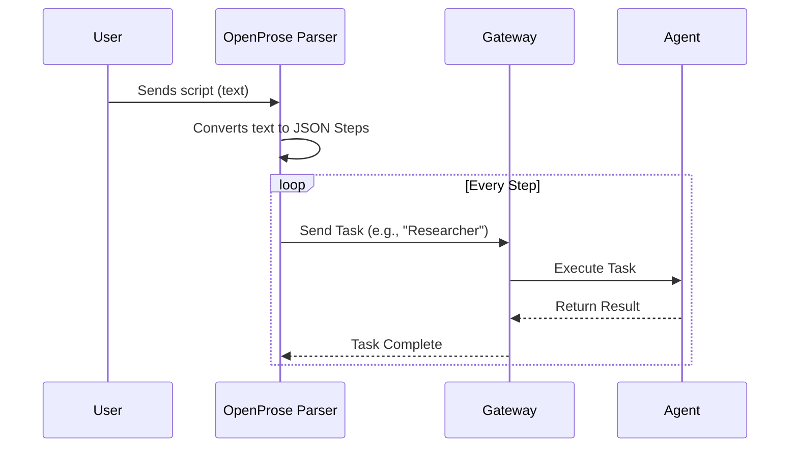

# Chapter 3: OpenProse

Welcome back! In the previous chapters, we built the **[Gateway](01_gateway.md)** (the brain) and the **[Control UI](02_control_ui.md)** (the dashboard).

Now we have a system that can talk to devices, but we haven't told it *what* to say or do. We need a way to create complex plans for our agents. Enter **OpenProse**.

## What is OpenProse?

Writing code to coordinate multiple AI agents can be messy. Imagine trying to write a Python script that says: *"Ask Agent A to write a joke, then take that joke and ask Agent B to translate it, but only if the joke is funny."*

**OpenProse** is a custom language designed specifically for OpenClaw. It allows you to write "scripts" or "workflows" that look almost like English text. It lives in the `extensions/open-prose` folder.

**The Central Use Case:**
You want to create an automated "News Team." One agent (The Researcher) finds a topic, and a second agent (The Writer) writes a paragraph about it. Instead of writing 100 lines of complex JavaScript, you want to define this relationship in just 3 lines of readable text.

## Key Concepts

To understand OpenProse, think of it as writing a script for a movie.

1.  **The Script (.op file):**
    This is a text file where you define the story. It lists which characters (Agents) are involved and what they should say or do.

2.  **The Parser:**
    This is the translator. It reads your readable OpenProse script and turns it into ugly machine code (JSON) that the **[Gateway](01_gateway.md)** understands.

3.  **The Workflow:**
    A series of steps. OpenProse ensures that Step 2 doesn't start until Step 1 is finished.

## How to Write OpenProse

OpenProse is designed to be readable. Let's look at how to solve our "News Team" use case.

### Step 1: The Syntax
An OpenProse file usually looks like `AgentName -> Instruction`.

Here is an example script `news_team.op`:

```text
# This is a comment
Researcher -> Find a fun fact about dolphins.
Writer -> Take the result from Researcher and write a poem.
```

**Explanation:**
*   **Line 1:** We tell the "Researcher" agent to do a task.
*   **Line 2:** We tell the "Writer" agent to act. OpenProse automatically passes the answer from line 1 into line 2.

### Step 2: Running the Script
To run this script, you would pass it to the OpenProse extension within your application code.

```javascript
import { runOpenProse } from './extensions/open-prose/index.js';

// The script we wrote above
const myScript = `
Researcher -> Find a fun fact about dolphins.
Writer -> Write a poem about it.
`;

// Execute it!
runOpenProse(myScript);
```

**What happens:**
*   **Input:** The text script.
*   **Output:** The system prints the Researcher's fact, followed by the Writer's poem.

## Under the Hood: Internal Implementation

How does text become action? The OpenProse extension acts as a compiler. It doesn't execute the AI itself; it prepares instructions for the **[Gateway](01_gateway.md)**.

### The Parsing Flow

Here is what happens when you run a script.



### Code Deep Dive

The magic happens inside `extensions/open-prose/src/`. Let's look at a simplified version of the **Parser**.

**1. The Parser (`parser.js`):**
This function takes the text and splits it into actionable objects.

```javascript
// A simplified parser function
export function parseScript(scriptText) {
  // Split the file by new lines
  const lines = scriptText.split('\n');
  
  return lines.map(line => {
    // Split "Agent -> Action" by the arrow
    const [agent, action] = line.split('->');
    return { 
      agentName: agent.trim(), 
      prompt: action.trim() 
    };
  });
}
```

**Explanation:**
1.  We take the whole text and cut it into individual lines.
2.  We look for the `->` arrow.
3.  The left side becomes the `agentName` (Who), and the right side becomes the `prompt` (What).

**2. The Execution Engine:**
Once we have the list of objects (steps), we need to iterate through them.

```javascript
// A simplified execution loop
async function executeWorkflow(parsedSteps) {
  let context = ""; // Holds the result of the previous step

  for (const step of parsedSteps) {
    console.log(`Calling ${step.agentName}...`);
    
    // Combine previous context with new prompt
    const fullPrompt = `${context}\n\n${step.prompt}`;
    
    // Simulate sending to Gateway and waiting
    context = await sendToGateway(step.agentName, fullPrompt);
  }
}
```

**Explanation:**
1.  We loop through the steps we created in the Parser.
2.  We append the result of the *last* step (`context`) to the current request. This gives the AI "memory" of what just happened.
3.  We wait for the **[Gateway](01_gateway.md)** to finish the job before moving to the next line.

## Summary

In this chapter, we learned about **OpenProse**, the scripting language of OpenClaw.
1.  It lives in `extensions/open-prose`.
2.  It allows you to define multi-agent workflows using simple text (`Agent -> Action`).
3.  It parses this text into instructions that the **[Gateway](01_gateway.md)** executes sequentially.

However, for OpenProse to work, the system needs to know *who* "Researcher" and "Writer" actually are. Are they GPT-4? Are they a local script? To define these identities, we need to configure our system.

[Next Chapter: Configuration](04_configuration.md)

---

Generated by [Code IQ](https://github.com/adityasoni99/Code-IQ)