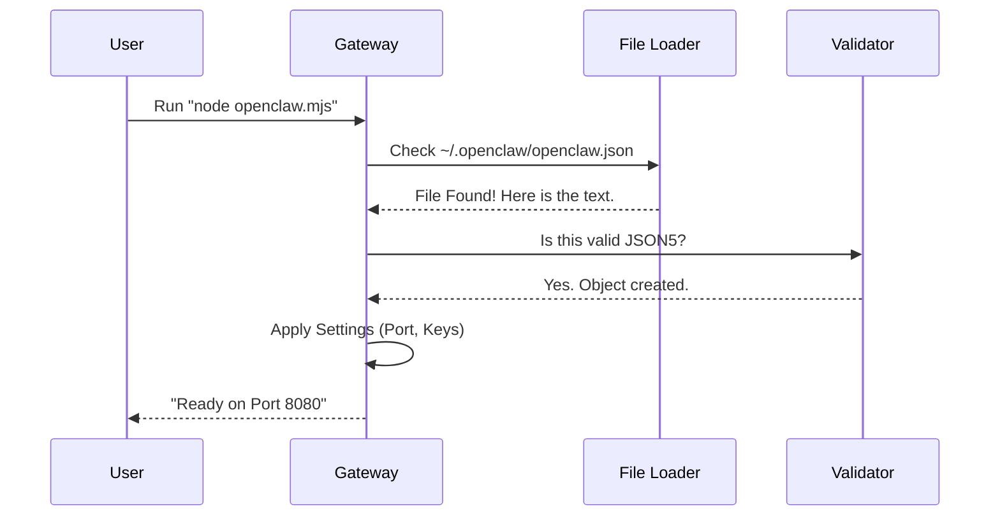

# Chapter 4: Configuration

Welcome back! In the previous chapter, we explored **[OpenProse](03_openprose.md)**, a way to write scripts for our agents (e.g., "Researcher -> Write a poem").

However, we hit a small wall. When we tell the "Researcher" to do something, how does the system know *who* the Researcher is? Is it ChatGPT? Is it Claude? And crucially, **where are the API keys** stored?

We need a place to store our secrets and settings. We need **Configuration**.

## Why do we need Configuration?

Imagine buying a new smartphone. When you first turn it on, it doesn't know your name, your Wi-Fi password, or who your friends are. You have to go into "Settings" to set it up.

OpenClaw is the same. By default, the **[Gateway](01_gateway.md)** is a blank slate.

**The Central Use Case:**
You want to use OpenAI's GPT-4 to power your agents. To do this, you need to provide your `sk-...` API key. You don't want to hard-code this into your scripts (that's unsafe!). Instead, you want to save it in a private file on your computer that OpenClaw reads automatically.

## Key Concepts

We use a specific format and location for our settings to keep things organized.

1.  **JSON5 ( The Format):**
    Standard JSON files are strict (no comments allowed). **JSON5** is a friendlier version. It allows you to write comments (`// like this`) inside the file, which is helpful for remembering what an API key does.

2.  **The Home Directory (`~/.openclaw`):**
    OpenClaw looks for a folder named `.openclaw` in your user's home folder. This is a standard place for developer tools to store config files so they don't get mixed up with your project code.

## How to Create the Configuration

Let's solve our use case by creating the configuration file.

### Step 1: Locate the Folder
On macOS or Linux, the "Home" directory is represented by the symbol `~`.
You need to create a folder there.

```bash
# Open your terminal
mkdir ~/.openclaw
```

### Step 2: Create the File
Now, create a file named `openclaw.json` inside that folder. You can use any text editor (Notepad, TextEdit, VS Code).

Here is an example of what goes inside:

```json5
{
  // Gateway Settings
  "port": 8080,

  // Your AI Models
  "llm": {
    "default": "gpt-4",
    "providers": {
      "openai": {
        "apiKey": "sk-your-secret-key-here"
      }
    }
  }
}
```

**Explanation:**
1.  **`port`**: Tells the **[Gateway](01_gateway.md)** to listen on port 8080.
2.  **`llm`**: Defines our Large Language Models.
3.  **`apiKey`**: This is where you paste your credential. OpenClaw reads this when it needs to "talk" to the AI.

## Under the Hood: Internal Implementation

How does the **[Gateway](01_gateway.md)** actually find and read this file when you run `node openclaw.mjs`?

### The Loading Flow

When the application starts, it pauses to load its "memory" before doing anything else.



### Code Deep Dive

The logic for reading this file is usually found in a utility file, often called `configLoader.js`. It uses Node.js's built-in file system tools.

**1. Finding the Home Directory:**
First, we need to know where the user's computer actually is.

```javascript
import os from 'os';
import path from 'path';

// os.homedir() returns '/Users/yourname' or 'C:\Users\yourname'
const homeDir = os.homedir();

// Construct the full path: /Users/yourname/.openclaw/openclaw.json
const configPath = path.join(homeDir, '.openclaw', 'openclaw.json');
```

**2. Reading the JSON5:**
We use a library called `json5` to parse the text, because standard `JSON.parse` would crash if it saw comments.

```javascript
import fs from 'fs';
import JSON5 from 'json5';

function loadConfig() {
  // 1. Read the file content as a string
  const rawText = fs.readFileSync(configPath, 'utf8');

  // 2. Convert string to a JavaScript Object
  const config = JSON5.parse(rawText);
  
  return config;
}
```

**3. Using the Config:**
Now, in our main Gateway file, we use these values.

```javascript
// Inside openclaw.mjs
const config = loadConfig();

// Use the port from the file, or default to 8080
const PORT = config.port || 8080;

server.listen(PORT, () => {
    console.log(`Gateway listening on ${PORT}`);
});
```

**Explanation:**
*   We read the file synchronously (blocking) because the server *cannot* start without knowing the settings.
*   The `config` object now holds your API keys, ready to be passed to **[OpenProse](03_openprose.md)** or other agents securely.

## Summary

In this chapter, we learned:
1.  **Configuration** separates our code from our secrets (API keys).
2.  We use the **JSON5** format located at `~/.openclaw/openclaw.json`.
3.  The system loads this file immediately upon startup.

Now that our Gateway is configured and has API keys to think, we need to give it "hands" to do work on your computer. It's time to set up a specific device node.

[Next Chapter: macOS Node](05_macos_node.md)

---

Generated by [Code IQ](https://github.com/adityasoni99/Code-IQ)