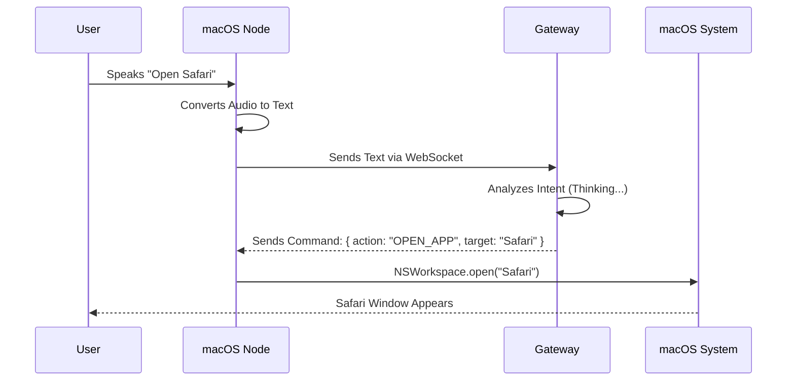

# Chapter 5: macOS Node

Welcome back! In the previous chapter, we set up our **[Configuration](04_configuration.md)** so our system knows our secrets and settings. Before that, we built the **[Gateway](01_gateway.md)** (the brain) and the **[Control UI](02_control_ui.md)** (the dashboard).

But right now, our "Brain" is just floating in software. It can *think* about opening an app, but it doesn't have "hands" to actually click the icon on your computer.

In this chapter, we are building the **macOS Node**. This is the physical body that gives OpenClaw control over your Mac computer.

## Why do we need a macOS Node?

The **[Gateway](01_gateway.md)** is usually running in a terminal or on a server. It doesn't have permission to look at your screen, listen to your microphone, or open Spotify.

To fix this, we build a **Native App**. This is a real application (like Finder or Safari) that you install on your Mac. It acts as a loyal soldier, taking orders from the Gateway and executing them on the system.

**The Central Use Case:**
You are sitting at your desk. You don't want to touch the keyboard. You say out loud: **"Computer, open Calculator."**
The **macOS Node** hears you, sends the text to the Gateway, receives a command back, and physically launches the Calculator app on your screen.

## Key Concepts

The macOS Node is different from the previous chapters because it is written in **Swift** (Apple's programming language), not JavaScript. It lives in the `apps/macos/` folder.

1.  **The Native Client:**
    This is a desktop application. Because it runs natively on macOS, it has access to system features like the Microphone, the File System, and other running Apps.

2.  **Voice Wake (Hotword):**
    The Node acts as an ear. It runs a special loop that listens for a specific phrase (like "Hey Claw"). It stays asleep until it hears this magic word, saving energy.

3.  **System Integration:**
    This allows the Node to perform "hand" actions. It uses Apple's internal tools (`NSWorkspace`) to launch programs, resize windows, or change volume.

## How to Run the macOS Node

Since this is a Mac app, we use **Xcode** (Apple's development tool) to run it.

### Step 1: Open the Project
Navigate to the folder `apps/macos/` and look for the project file.

```bash
# In your Finder or Terminal
open apps/macos/OpenClaw.xcodeproj
```

### Step 2: Configure the Endpoint
Inside the code (usually in a file named `AppConfig.swift`), you need to tell the app where your **[Gateway](01_gateway.md)** is living.

```swift
// A setting inside the Swift code
struct AppConfig {
    // Point this to your Gateway
    static let gatewayURL = "ws://localhost:8080"
}
```

### Step 3: Build and Run
1.  Press the **Play** button (▶️) in the top-left corner of Xcode.
2.  **Result:** The OpenClaw app will launch in your dock.
3.  **Status:** You should see a small green light or log message saying "Connected to Gateway."

Now, if you speak to your Mac, the text appears in the **[Control UI](02_control_ui.md)** logs!

## Under the Hood: Internal Implementation

How does your voice travel from the air to the Gateway and back to an app launching?

### The Voice Command Flow

Here is the journey of a spoken command.



### Code Deep Dive

The macOS Node is built using **SwiftUI**. Let's look at the two most important parts: Connecting to the network and Opening an app.

**1. The Network Manager (Client):**
Just like our web dashboard, the Mac app needs to dial the **[Gateway](01_gateway.md)**.

```swift
import Foundation

class NetworkManager: ObservableObject {
    var webSocketTask: URLSessionWebSocketTask?

    func connect() {
        let url = URL(string: "ws://localhost:8080")!
        // Create the connection task
        webSocketTask = URLSession.shared.webSocketTask(with: url)
        // Start listening
        webSocketTask?.resume()
        print("Mac Node Connecting...")
    }
}
```

**Explanation:**
1.  We create a `URL` pointing to localhost:8080.
2.  We use `URLSession` (Apple's built-in networking tool) to start a WebSocket task.
3.  `.resume()` acts as the "On" switch.

**2. The System Executor:**
When the Gateway says "Open Safari," this code runs. We use `NSWorkspace`, which is the part of macOS that manages apps and windows.

```swift
import AppKit // Apple's UI Framework

func openApplication(appName: String) {
    let workspace = NSWorkspace.shared
    
    // Attempt to find the app by name
    if let appUrl = workspace.urlForApplication(withBundleIdentifier: "com.apple.Safari") {
        let config = NSWorkspace.OpenConfiguration()
        
        // Physically launch the app
        workspace.openApplication(at: appUrl, configuration: config) { app, error in
            print("Opened \(appName) successfully!")
        }
    }
}
```

**Explanation:**
1.  `NSWorkspace.shared`: This gives us access to the Mac desktop environment.
2.  `urlForApplication`: We find where "Safari" is installed on the hard drive.
3.  `openApplication`: This is the digital equivalent of double-clicking the icon.

## Summary

In this chapter, we gave OpenClaw a body.
1.  **macOS Node** runs natively on your computer.
2.  It uses **Swift** to talk to the operating system.
3.  It listens for voice commands and executes actions (like opening apps) sent by the **[Gateway](01_gateway.md)**.

But what if you aren't at your desk? What if you are in the kitchen or out for a walk? You need OpenClaw in your pocket.

[Next Chapter: iOS Node](06_ios_node.md)

---

Generated by [Code IQ](https://github.com/adityasoni99/Code-IQ)