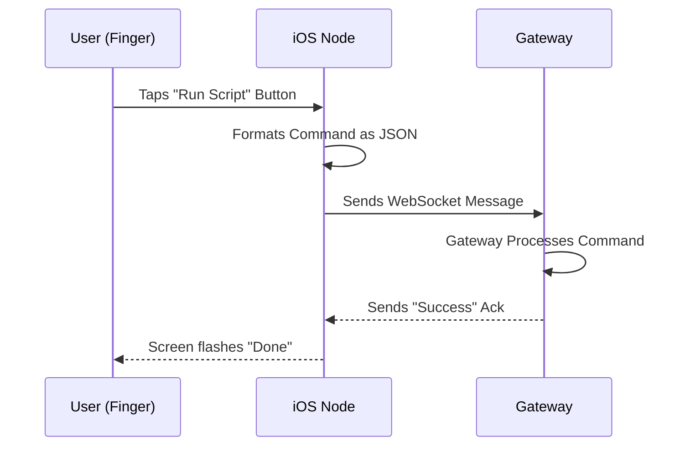

# Chapter 6: iOS Node

Welcome back! In the previous chapter, we built the **[macOS Node](05_macos_node.md)**. We gave OpenClaw "hands" to control your desktop computer.

But there is a limitation: desktops don't move. If you are in the kitchen, in the garden, or on the bus, you can't talk to your computer.

In this chapter, we are going to build the **iOS Node**. This turns your iPhone or iPad into a portable remote control for your entire OpenClaw system.

## Why do we need an iOS Node?

The **[Gateway](01_gateway.md)** is the brain, and it usually stays in one place (on a server or your home computer). The iOS Node is a "satellite" device. It allows you to send commands *to* the brain, and receive notifications *from* the brain, no matter where you are standing in your house.

**The Central Use Case:**
You are sitting on your couch. You realize you forgot to start a data processing script on your computer. instead of walking to your desk, you open the OpenClaw app on your phone, tap **"Start Script,"** and the phone sends the signal to the Gateway to do the work.

## Key Concepts

The iOS Node is located in `apps/ios/`. It shares many similarities with the macOS Node, but with a few mobile-specific twists.

1.  **SwiftUI (The Interface):**
    We use Apple's modern toolkit to build the buttons and text on the screen. It is declarative, meaning we just describe what the screen should look like, and the phone draws it.

2.  **The "Localhost" Trap:**
    This is the most important concept for mobile development. On your computer, `localhost` means "this computer." But on your phone, `localhost` means "the phone itself."
    To talk to the Gateway, the phone must use your computer's **Local IP Address** (like `192.168.1.5`), not `localhost`.

3.  **Background State:**
    Unlike a computer, phones aggressively sleep apps to save battery. The iOS Node needs to handle connecting quickly when you open the app and disconnecting gracefully when you lock the screen.

## How to Run the iOS Node

To run this, you need a Mac with **Xcode** installed. You can run the app on a real iPhone or the virtual Simulator on your screen.

### Step 1: Open the Project
Navigate to the iOS folder.

```bash
# In your terminal or Finder
open apps/ios/OpenClaw.xcodeproj
```

### Step 2: Configure the Connection
We need to tell the iPhone where the **[Gateway](01_gateway.md)** lives. Remember, we cannot use `localhost` here!

Find your computer's IP address (System Settings -> Wi-Fi -> Details). Let's assume it is `192.168.1.5`.

Open the file `Config.swift` in Xcode:

```swift
struct Config {
    // REPLACE 'localhost' with your computer's IP!
    // Example: "ws://192.168.1.5:8080"
    static let gatewayUrl = "ws://192.168.1.5:8080"
}
```

### Step 3: Run the Simulator
1.  In the top-left of Xcode, select an iPhone (e.g., "iPhone 15 Pro").
2.  Click the **Play** button (▶️).
3.  **Result:** A virtual iPhone appears on your screen.
4.  **Action:** The app launches. If your Gateway is running, the status text should change to "Connected."

## Under the Hood: Internal Implementation

What happens when you tap a button on the screen? It's a journey from your finger to the server.

### The Touch Flow

Here is the sequence of events when you use the app as a remote.



### Code Deep Dive

The iOS app is built using **SwiftUI** for the visuals and `URLSession` for the networking.

**1. The Visuals (`ContentView.swift`):**
This file defines what you see. We create a simple button that triggers an action.

```swift
import SwiftUI

struct ContentView: View {
    // We connect this view to our logic engine
    @ObservedObject var client = WebSocketClient()

    var body: some View {
        VStack {
            Text("Status: \(client.status)")
            
            // A button to send a command
            Button("Run Script") {
                client.sendMessage("START_SCRIPT")
            }
        }
    }
}
```

**Explanation:**
1.  `VStack`: Arranges items vertically (Status on top, Button below).
2.  `Text(...)`: Shows if we are connected or offline.
3.  `Button(...)`: When tapped, it calls `sendMessage` on our client.

**2. The Logic (`WebSocketClient.swift`):**
This is the engine that actually talks to the **[Gateway](01_gateway.md)**.

```swift
import Foundation

class WebSocketClient: ObservableObject {
    var webSocket: URLSessionWebSocketTask?
    @Published var status = "Disconnected"

    func connect() {
        // Use the IP address from Config
        let url = URL(string: Config.gatewayUrl)!
        webSocket = URLSession.shared.webSocketTask(with: url)
        webSocket?.resume() // Turn it on
        self.status = "Connected"
    }
}
```

**Explanation:**
1.  `ObservableObject`: This allows the UI to update automatically when the status changes.
2.  `URLSession`: The standard Apple way to handle networking.
3.  `resume()`: Starts the connection.

**3. Sending a Message:**
When the user taps the button, we need to send data.

```swift
func sendMessage(_ text: String) {
    // Create a text message object
    let message = URLSessionWebSocketTask.Message.string(text)
    
    // Send it through the pipe
    webSocket?.send(message) { error in
        if let error = error {
            print("Sending failed: \(error)")
        }
    }
}
```

**Explanation:**
1.  We wrap our string in a `Message` object.
2.  `send()` fires it off to the Gateway.
3.  We check for errors just in case the Wi-Fi dropped.

## Summary

In this chapter, we expanded our network to mobile devices.
1.  **iOS Node** lives in `apps/ios/`.
2.  It uses **SwiftUI** for the interface.
3.  We learned the critical lesson that mobile devices need a **Real IP Address** to talk to the Gateway, not `localhost`.

Now you can control your OpenClaw system from your pocket! But what if you don't have an iPhone? What if you use the other major mobile operating system?

[Next Chapter: Android Node](07_android_node.md)

---

Generated by [Code IQ](https://github.com/adityasoni99/Code-IQ)