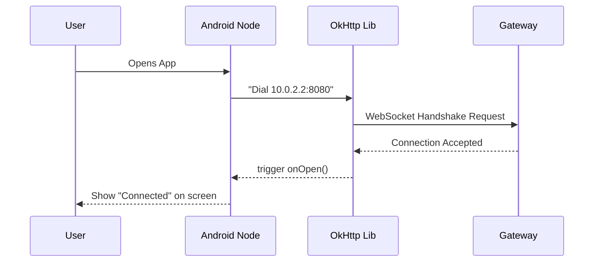

# Chapter 7: Android Node

Welcome back! in the previous chapter, we built the **[iOS Node](06_ios_node.md)**, allowing iPhone users to control OpenClaw from anywhere in the house.

But what if you are on Team Android? We can't leave half the world behind! Just like we built a native app for Apple devices, we need a native app for Google's ecosystem.

In this chapter, we are building the **Android Node**. This is a mobile application that gives your Android phone (Samsung, Pixel, etc.) the power to talk to the OpenClaw network.

## Why do we need an Android Node?

Just like the iOS Node, the Android Node acts as a remote control. It allows your phone to send commands to the **[Gateway](01_gateway.md)** and receive status updates.

**The Central Use Case:**
You are testing a new automation script. You want to trigger it while walking your dog. You pull out your Android phone, open the OpenClaw app, and tap **"Activate"**. Your phone sends the signal over 4G/Wi-Fi to your home computer to start the job.

## Key Concepts

The Android Node lives in the `apps/android/` folder. It uses technologies specific to the Android ecosystem.

1.  **Kotlin (The Language):**
    While the Gateway uses JavaScript and iOS uses Swift, Android uses **Kotlin**. It is a modern, concise language officially supported by Google.

2.  **Jetpack Compose (The UI):**
    This is the modern way to build screens on Android. Instead of dragging and dropping buttons in a visual editor, we write code that describes the screen (very similar to SwiftUI in the previous chapter).

3.  **OkHttp (The Messenger):**
    Android doesn't have a built-in WebSocket tool as simple as the web browser's. We use a popular library called **OkHttp** to handle the connection to the Gateway.

4.  **The "10.0.2.2" Magic Number:**
    If you run this app on an Android **Emulator** on your computer, `localhost` refers to the *phone*, not the computer. To talk to your computer's **[Gateway](01_gateway.md)**, you must use the special IP address `10.0.2.2`.

## How to Run the Android Node

To run this, you need **Android Studio** installed on your computer.

### Step 1: Open the Project
Launch Android Studio and select "Open". Navigate to the `apps/android` folder.

### Step 2: Configure the Address
We need to tell the app where the Gateway is. This is usually found in a file like `Constants.kt` or `Config.kt`.

**Important:**
*   If using an **Emulator**: Use `ws://10.0.2.2:8080`.
*   If using a **Real Phone**: Use your computer's Wi-Fi IP (e.g., `ws://192.168.1.5:8080`).

```kotlin
// Inside apps/android/app/src/main/java/.../Config.kt

object Config {
    // Special IP for Android Emulator to reach host machine
    const val GATEWAY_URL = "ws://10.0.2.2:8080"
}
```

### Step 3: Run the App
1.  Look at the top toolbar in Android Studio.
2.  Select a device (e.g., "Pixel 7 API 33").
3.  Click the **Run** button (green triangle ▶️).
4.  **Result:** The emulator will pop up, the app will install, and if your Gateway is running, it will connect!

## Under the Hood: Internal Implementation

How does a tap on a Samsung screen reach a Node.js server? Let's trace the path.

### The Connection Flow



### Code Deep Dive

Let's look at the Kotlin code that powers this logic.

**1. The WebSocket Listener:**
We need a class that listens for events (like "Connected" or "Message Received"). We extend the `WebSocketListener` class provided by OkHttp.

```kotlin
import okhttp3.*

class ClawSocketListener : WebSocketListener() {
    
    // This runs when we successfully connect
    override fun onOpen(webSocket: WebSocket, response: Response) {
        println("Android Node Connected to Gateway!")
        // We can now send messages
    }

    override fun onMessage(webSocket: WebSocket, text: String) {
        println("Received from Gateway: $text")
    }
}
```

**2. Starting the Connection:**
Somewhere in our main activity or a repository, we use the `OkHttpClient` to start the engine.

```kotlin
// Create the client
val client = OkHttpClient()

// Create the request using our Config
val request = Request.Builder()
    .url(Config.GATEWAY_URL)
    .build()

// Create the listener we defined above
val listener = ClawSocketListener()

// Dial the phone!
val ws = client.newWebSocket(request, listener)
```

**3. The UI (Jetpack Compose):**
Here is how we draw the screen. We create a simple column with a text label and a button.

```kotlin
@Composable
fun MainScreen(viewModel: MainViewModel) {
    Column {
        // Show status
        Text(text = "Status: ${viewModel.status}")

        // A button to send a command
        Button(onClick = { viewModel.sendCommand("HELLO_ANDROID") }) {
            Text("Say Hello")
        }
    }
}
```

**Explanation:**
1.  **`@Composable`**: This tag tells Android this function draws UI.
2.  **`Column`**: Arranges items vertically.
3.  **`Button`**: When clicked, it calls a function in our ViewModel to send data over the WebSocket we created earlier.

## Summary

In this chapter, we completed our mobile suite.
1.  **Android Node** lives in `apps/android/`.
2.  It uses **Kotlin** and **Jetpack Compose**.
3.  It uses **OkHttp** to talk to the **[Gateway](01_gateway.md)**.
4.  We learned that Android Emulators need `10.0.2.2` to see the host computer.

Now we have nodes everywhere: macOS, iOS, Android, and the Web. Data is flying back and forth between all these devices. However, managing raw text messages (Strings) can get messy. We need a better way to structure the data and memories our agents use.

[Next Chapter: Swabble](08_swabble.md)

---

Generated by [Code IQ](https://github.com/adityasoni99/Code-IQ)