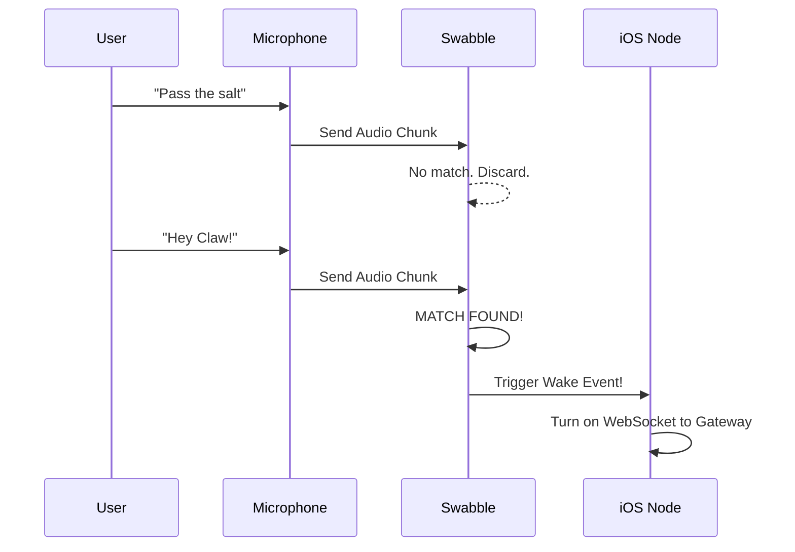

# Chapter 8: Swabble

Welcome back! In the previous chapters, we built nodes for [macOS Node](05_macos_node.md), [iOS Node](06_ios_node.md), and [Android Node](07_android_node.md). We gave OpenClaw "bodies" to interact with the world.

However, there is a missing piece. Right now, to give a voice command, you might have to press a button on the screen. We want a true "Star Trek" experience where you can just speak into the air.

But we can't send *everything* you say to the **[Gateway](01_gateway.md)**. That would be slow, expensive, and a huge privacy risk. We need a way to filter the noise locally.

Enter **Swabble**.

## What is Swabble?

**Swabble** is the "Ear" of OpenClaw. It is a Swift-based engine located in the `Swabble/` directory. Its only job is to listen for a specific **Wake Word** (like "Hey Claw").

Think of Swabble like a guard dog sleeping by the door. It ignores the TV, the wind, and your casual conversations. But the moment it hears a specific sound (the intruder), it barks to wake up the rest of the house.

**The Central Use Case:**
You are in a room chatting with friends. You say, "The weather is nice." Swabble does nothing.
Then you say, **"Hey Claw, turn on the lights."**
Swabble detects the phrase "Hey Claw," wakes up the **[iOS Node](06_ios_node.md)**, and *only then* does the phone start recording your command to send to the Gateway.

## Key Concepts

Swabble is a library designed to be imported into your Apple apps (macOS and iOS).

1.  **Local Processing:**
    Swabble runs 100% on your device. It does not need the internet. This ensures that your private conversations never leave the room until you explicitly summon the bot.

2.  **The Audio Buffer:**
    Imagine a conveyor belt carrying boxes of sound. The microphone captures sound in small chunks (frames). Swabble looks at these chunks in real-time.

3.  **The Trigger:**
    This is a "Callback" or a signal. When Swabble hears the magic word, it flips a switch from `false` to `true`, telling the main app to start recording.

## How to Use Swabble

Because Swabble is a library, you don't run it by itself. You use it inside the **[macOS Node](05_macos_node.md)** or **[iOS Node](06_ios_node.md)** code.

### Step 1: Import the Engine
First, inside your iOS or macOS app code, you bring in the library.

```swift
import Swabble

// Create an instance of the engine
let ear = SwabbleEngine(wakeWord: "Hey Claw")
```

### Step 2: Start Listening
We need to turn the microphone on and feed the data to Swabble.

```swift
// This is a simplified example
microphone.startRecording { audioBuffer in
    
    // Feed the raw sound to Swabble
    ear.process(buffer: audioBuffer)
}
```

### Step 3: Handle the Wake Event
We need to tell Swabble what to do when it hears the name.

```swift
ear.onWakeWordDetected = {
    print("I heard you!")
    
    // Now we connect to the Gateway
    GatewayClient.startSendingAudio()
}
```

**What happens:**
1.  **Input:** Continuous audio from your room.
2.  **Process:** Swabble analyzes the sound waves.
3.  **Output:** When "Hey Claw" is spoken, the `onWakeWordDetected` code runs.

## Under the Hood: Internal Implementation

How does Swabble distinguish "Hey Claw" from "Hay Stack"? It uses pattern matching on audio waves.

### The Listening Flow

Here is the visual process of a wake word engine.



### Code Deep Dive

The core logic lives in `Swabble/Sources/SwabbleEngine.swift`. It manages the audio stream.

**1. The Buffer Manager:**
We need to hold onto the last few seconds of audio to analyze it. This is often called a "Sliding Window."

```swift
// Swabble/Sources/SwabbleEngine.swift

public class SwabbleEngine {
    // A temporary holder for sound data
    private var audioBuffer: [Float] = []
    
    // The sensitivity (0.0 to 1.0)
    public var sensitivity: Float = 0.5
    
    // The function your app calls when the mic has data
    public func process(frame: [Float]) {
        audioBuffer.append(contentsOf: frame)
        
        // Check if the buffer matches our model
        detect()
    }
}
```

**Explanation:**
1.  `audioBuffer`: Holds the numbers representing sound.
2.  `process(frame)`: This is the entry point. The microphone gives us a small slice of time (a frame), and we add it to our memory.

**2. The Detection Logic:**
This is where the math happens. In a real engine, this uses a trained machine learning model. For this tutorial, we will visualize the logic simply.

```swift
private func detect() {
    // 1. Analyze the buffer
    let score = Model.analyze(self.audioBuffer)
    
    // 2. Check if it's confident enough
    if score > self.sensitivity {
        // 3. Fire the event!
        self.onWakeWordDetected?()
        
        // 4. Clear the buffer so we don't trigger twice
        self.audioBuffer.removeAll()
    }
}
```

**Explanation:**
1.  `Model.analyze`: This compares the shape of the sound waves in memory against the shape of the word "Hey Claw."
2.  `sensitivity`: We allow some margin for error (background noise).
3.  `onWakeWordDetected?()`: If it's a match, we call the function provided by the main app.

## Summary

In this chapter, we learned about **Swabble**, the privacy-focused listening engine.
1.  It lives in the `Swabble/` directory.
2.  It runs locally on **[macOS Node](05_macos_node.md)** and **[iOS Node](06_ios_node.md)**.
3.  It acts as a gatekeeper, only allowing audio to pass to the network when the correct phrase is spoken.

Now our system has a Brain (Gateway), a Body (Nodes), and Ears (Swabble). But as these parts start talking to each other, they need to agree on a strict language. If the iOS Node sends a message saying `{ "text": "Hello" }` but the Gateway expects `{ "message": "Hello" }`, the whole system breaks.

We need a dictionary for our robot language.

[Next Chapter: ProtocolSchema](09_protocolschema.md)

---

Generated by [Code IQ](https://github.com/adityasoni99/Code-IQ)