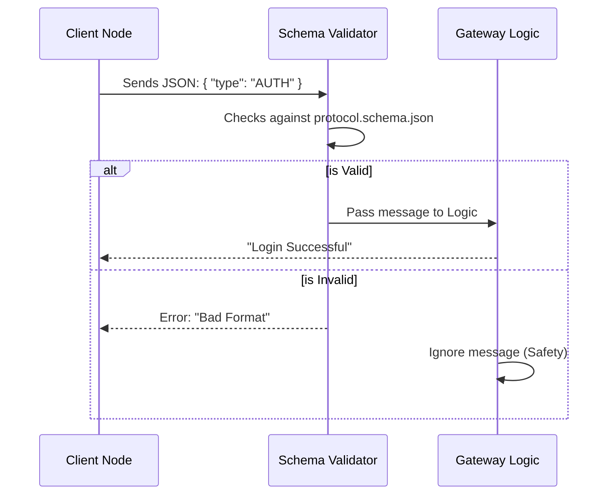

# Chapter 9: ProtocolSchema

Welcome back! In the previous chapter, we explored **[Swabble](08_swabble.md)**, giving our system "ears" to listen for commands locally.

We now have a complete system: a **[Gateway](01_gateway.md)** (the brain), a **[Control UI](02_control_ui.md)** (the dashboard), and various Nodes like **[iOS](06_ios_node.md)** and **[Android](07_android_node.md)** (the bodies).

However, we have a hidden danger. Imagine if the iOS Node sends a message saying: `{"text": "Hello"}` but the Gateway is programmed to expect: `{"message": "Hello"}`. The Gateway won't understand, and the command will fail.

To prevent this chaos, we need a strict rulebook that everyone agrees to follow. We need the **ProtocolSchema**.

## Why do we need a ProtocolSchema?

In a team of people, communication works best when everyone speaks the same language and uses the same grammar. In a network of computers, this is even more critical. Computers are not good at guessing; they need exact instructions.

The **ProtocolSchema** is a single file located at `dist/protocol.schema.json`. It acts as the "Dictionary" or "Constitution" of OpenClaw. It defines exactly what a message *must* look like to be accepted by the system.

**The Central Use Case:**
You are writing a new script for the **[Control UI](02_control_ui.md)**. You want to tell the Gateway to "Stop." You check the ProtocolSchema, which tells you that you **must** send a message with `type: "COMMAND"` and `action: "STOP"`. If you forget the `action`, the Gateway will reject your message immediately.

## Key Concepts

We use a standard format called **JSON Schema** to define our rules.

1.  **The Contract:**
    Think of the schema as a legal contract. Both the Sender (e.g., your iPhone) and the Receiver (the Gateway) agree that all messages will follow this specific structure.

2.  **Validation:**
    This is the "Bouncer" at the door. When a message arrives at the **[Gateway](01_gateway.md)**, it is automatically checked against the schema. If the message doesn't match the rules (e.g., missing a required field), it is thrown out before it can crash the system.

3.  **The Packet Structure:**
    Every message in OpenClaw is a "Packet." The schema forces every packet to have at least a `type` (what is this?) and a `payload` (the data).

## How to Read the Schema

You don't usually "run" the schema; you use it as a reference when writing code. Let's look at how to structure a valid message based on the rules.

### Step 1: The Rulebook (`dist/protocol.schema.json`)
Here is a simplified view of what the schema looks like. It says: "A message is an object. It *must* have a `type`."

```json
{
  "$id": "OpenClawProtocol",
  "type": "object",
  "required": ["type", "payload"],
  "properties": {
    "type": { "type": "string" },
    "payload": { "type": "object" }
  }
}
```

**Explanation:**
*   **`"required": ["type"]`**: This means if you send a message without a `type`, it is illegal.
*   **`"payload"`**: This is where the actual data (like "Turn on lights") goes.

### Step 2: Creating a Valid Message
Based on the rules above, here is how the **[Control UI](02_control_ui.md)** would send a valid command in JavaScript.

```javascript
// A valid message that passes the test
const validPacket = {
  type: "COMMAND",
  payload: {
    action: "RUN_SCRIPT",
    scriptName: "DailyReport"
  }
};
```

### Step 3: An Invalid Message (The Failure)
If you try to cut corners, the system catches you.

```javascript
// This will be REJECTED by the Gateway
const badPacket = {
  // Missing "type"!
  cmd: "Do something",
  data: "Important info"
};
```

**What happens:**
*   **Input:** `badPacket`.
*   **Process:** The Validator sees that `type` is missing.
*   **Output:** The Gateway returns an error: `Invalid Protocol: Missing property 'type'`.

## Under the Hood: Internal Implementation

How does the **[Gateway](01_gateway.md)** actually use this JSON file to police the traffic?

### The Validation Flow

Every time a WebSocket message arrives, it goes through a checkpoint.



### Code Deep Dive

The Gateway uses a library (often `ajv` in Node.js) to load the schema file and create a validator function.

**1. Loading the Schema:**
When the Gateway starts, it reads the file.

```javascript
import Ajv from 'ajv';
import schema from '../dist/protocol.schema.json' assert { type: 'json' };

const ajv = new Ajv();
// Compile the rules into a fast function
const validate = ajv.compile(schema);
```

**Explanation:**
1.  We import the JSON file directly.
2.  `ajv.compile(schema)` creates a highly optimized function called `validate`. We use this function on every single incoming message.

**2. enforcing the Rules:**
Inside the WebSocket connection handler (discussed in [Chapter 1](01_gateway.md)), we apply the check.

```javascript
ws.on('message', (rawText) => {
  const packet = JSON.parse(rawText);

  // Run the validation function
  const isValid = validate(packet);

  if (!isValid) {
    console.error("Invalid packet received:", validate.errors);
    return; // STOP! Do not process further.
  }

  // If we get here, the message is safe to use
  processPacket(packet);
});
```

**Explanation:**
1.  We parse the text into an object.
2.  `validate(packet)` returns `true` or `false`.
3.  If it returns `false`, we simply stop. This protects the Gateway from crashing due to weird data sent by a buggy [Android Node](07_android_node.md) or a hacker.

**3. Sharing the Schema:**
The beauty of `dist/protocol.schema.json` is that it can be shared.
*   The **[Gateway](01_gateway.md)** uses it to validate input.
*   The **[Control UI](02_control_ui.md)** can use it to validate output before sending.
*   The **[macOS Node](05_macos_node.md)** uses it to generate Swift data types.

## Summary

In this chapter, we learned about the **ProtocolSchema**.
1.  It defines the "Law" of how devices talk to each other.
2.  It lives in `dist/protocol.schema.json`.
3.  It prevents bugs by ensuring every message (from **[iOS Node](06_ios_node.md)**, **[OpenProse](03_openprose.md)**, etc.) follows the same structure.

We have now built the Brain, the Dashboard, the Bodies, the Ears, and the Language. Our application is complete!

But... it currently runs on your messy laptop with manual commands. To make this a professional, reliable service that runs 24/7, we need to package it up neatly.

[Next Chapter: Docker Deployment](10_docker_deployment.md)

---

Generated by [Code IQ](https://github.com/adityasoni99/Code-IQ)