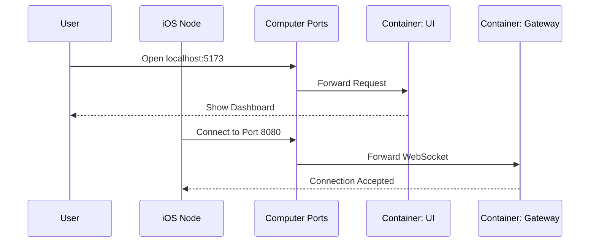

# Chapter 10: Docker Deployment

Welcome to the final chapter of the OpenClaw tutorial! 

In the previous chapter, we established the **[ProtocolSchema](09_protocolschema.md)**, the rulebook that ensures all our devices speak the same language.

We now have a complete system:
1.  **[Gateway](01_gateway.md)** (The Brain)
2.  **[Control UI](02_control_ui.md)** (The Dashboard)
3.  **Nodes** ([macOS](05_macos_node.md), [iOS](06_ios_node.md), [Android](07_android_node.md)) (The Bodies)

However, running this system right now is messy. You probably have three different terminal windows open. If you restart your computer, everything stops. If you want to move the system to a Raspberry Pi, you have to reinstall everything manually.

In this chapter, we will wrap everything into a neat package using **Docker**.

## Why do we need Docker?

Imagine you want to ship a house to a new location. You wouldn't move the furniture piece by piece, then the bricks, then the pipes. You would want to put the whole house on a truck and drive it there.

**Docker** allows us to put our software into a "Container." This container includes the code, the settings, and the tools needed to run it. It guarantees that if it works on my computer, it will work on yours.

**The Central Use Case:**
You want your **[Gateway](01_gateway.md)** and **[Control UI](02_control_ui.md)** to run automatically on a home server 24/7. instead of typing commands every time the server reboots, you want a single command that says: "Start everything."

## Key Concepts

To understand Docker deployment, we need three simple concepts:

1.  **The Dockerfile (The Recipe):**
    This is a text file that tells Docker how to build your application. It says things like: "Start with Node.js, copy my files, and run this command."

2.  **The Image (The Blueprint):**
    When you run the recipe (Dockerfile), you get an **Image**. This is a frozen snapshot of your application. You can share this image with friends.

3.  **Docker Compose (The Manager):**
    We have two parts to run: the Gateway and the UI. **Docker Compose** is a tool that lets us run multiple containers at the same time using a single file (`docker-compose.yml`).

## How to Set Up Docker

We will create a setup that launches both the backend and the frontend together.

### Step 1: The Gateway Recipe
Create a file named `Dockerfile` in the root folder of your project (where `openclaw.mjs` is).

```dockerfile
# Start with a lightweight version of Node.js
FROM node:18-alpine

# Create a folder inside the container
WORKDIR /app

# Copy our project files into that folder
COPY . .

# Install dependencies
RUN npm install

# The command to start the brain
CMD ["node", "openclaw.mjs"]
```

**Explanation:**
1.  `FROM`: We pick a base operating system that already has Node.js installed.
2.  `COPY`: We move our code from your computer into the container.
3.  `CMD`: This is the exact same command you typed in Chapter 1.

### Step 2: The Orchestrator
Now, we need to tell Docker to run this Gateway *and* the UI together. Create a file named `docker-compose.yml` in the root folder.

```yaml
version: '3'

services:
  # Service 1: The Brain
  gateway:
    build: .
    ports:
      - "8080:8080" # Map container port to your computer

  # Service 2: The Dashboard
  ui:
    build: ./ui
    ports:
      - "5173:5173" # Map UI port to your computer
```

**Explanation:**
1.  **`services`**: We list the parts of our app.
2.  **`build`**: Tells Docker where to find the `Dockerfile` for each part.
3.  **`ports`**: This opens a "window." It connects port 8080 inside the container to port 8080 on your real computer, so your **[iOS Node](06_ios_node.md)** can connect.

### Step 3: Launch!
Now, open your terminal in the root folder and run one magic command.

```bash
docker-compose up
```

**What happens:**
*   **Output:** You will see logs from both the Gateway and the UI appearing in one stream.
*   **Result:** Open your browser to `http://localhost:5173`. The Control UI loads!
*   **Benefit:** If you close the terminal, it stops. If you run `docker-compose up -d` (detached), it runs in the background forever.

## Under the Hood: Internal Implementation

How do these containers talk to each other and the outside world?

### The Network Flow

Docker creates a virtual network inside your computer.



### Code Deep Dive

Let's look closely at how the **Configuration** is handled. Remember **[Chapter 4: Configuration](04_configuration.md)**? We stored secrets in `~/.openclaw`.

By default, Docker containers are isolated. They cannot see your home folder. We need to "mount" the configuration file so the container can read your API keys.

**Updating `docker-compose.yml` for Configuration:**

```yaml
  gateway:
    build: .
    ports:
      - "8080:8080"
    # Give the container access to your config file
    volumes:
      - ~/.openclaw:/root/.openclaw
```

**Explanation:**
*   **`volumes`**: This is a bridge.
*   The Left side (`~/.openclaw`) is the folder on your real computer.
*   The Right side (`/root/.openclaw`) is where it appears inside the container.
*   Now, when `openclaw.mjs` runs inside Docker, it finds the config file just as if it were running natively.

## Summary

In this final chapter, we learned how to professionalize our deployment.
1.  **Docker** packages our code into portable containers.
2.  **Docker Compose** allows us to run the **[Gateway](01_gateway.md)** and **[Control UI](02_control_ui.md)** simultaneously.
3.  We used **Volumes** to safely pass our **[Configuration](04_configuration.md)** into the container.

### Conclusion

Congratulations! You have completed the **OpenClaw** tutorial series.

You started with nothing and built:
1.  A central **Gateway** to coordinate traffic.
2.  A web-based **Control UI** to visualize the system.
3.  An AI scripting engine with **OpenProse**.
4.  Native Nodes for **macOS**, **iOS**, and **Android**.
5.  A privacy-first wake word engine with **Swabble**.
6.  A robust communication system with **ProtocolSchema**.
7.  And finally, a production-ready **Docker** setup.

You now have a fully functional, extensible, and private home automation system. From here, you can write new scripts in OpenProse, add new sensors, or build new nodes. The system is yours to command.

**End of Tutorial.**

---

Generated by [Code IQ](https://github.com/adityasoni99/Code-IQ)