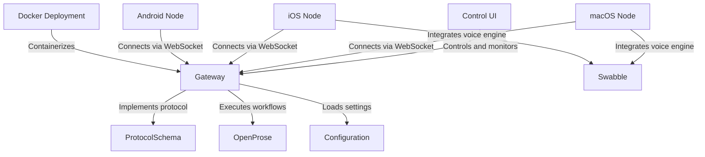

# Tutorial: openclaw

OpenClaw is a modular **AI agent platform** that unifies various devices into a single intelligent network. At its core is a **Gateway** daemon that manages connections, executes multi-agent workflows defined in the *OpenProse* language, and facilitates real-time communication between the **Control UI**, mobile nodes, and desktop applications using a custom WebSocket protocol.

**Source Repository:** [https://github.com/openclaw/openclaw](https://github.com/openclaw/openclaw)

## Chapters

1. [Gateway](01_gateway.md)
2. [Control UI](02_control_ui.md)
3. [OpenProse](03_openprose.md)
4. [Configuration](04_configuration.md)
5. [macOS Node](05_macos_node.md)
6. [iOS Node](06_ios_node.md)
7. [Android Node](07_android_node.md)
8. [Swabble](08_swabble.md)
9. [ProtocolSchema](09_protocolschema.md)
10. [Docker Deployment](10_docker_deployment.md)

---

Generated by [Code IQ](https://github.com/adityasoni99/Code-IQ)