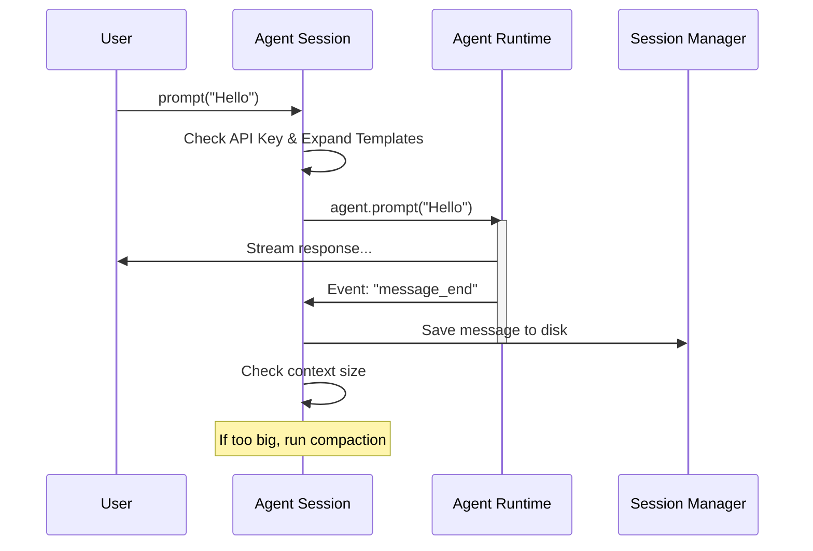

# Chapter 1: Agent Session

Welcome to the **pi-mono** project tutorial! We are kicking things off with the most fundamental building block for creating a persistent, interactive AI experience: the **Agent Session**.

## Motivation: The Brain Needs a Body

Imagine you have a brilliant AI "brain" (the Large Language Model). It can answer questions and write code. However, if you turn it off, it forgets everything. If the conversation gets too long, it gets confused. If it crashes, you lose your progress.

The **Agent Session** acts as the "body" and "operating system" for that AI brain. It solves three critical problems:

1.  **Long-Term Memory:** It automatically saves every message to a "save file" so you can close the program and resume later.
2.  **Lifecycle Management:** It handles starting, stopping, and even retrying requests if the API fails.
3.  **Context Management:** It watches the conversation length. If it gets too big, it "compacts" (summarizes) old memories so the AI doesn't run out of space.

In this chapter, we will learn how `AgentSession` wraps the raw AI runtime to create a robust, usable application.

## Key Concepts

Before looking at code, let's understand the machinery.

### 1. The Wrapper
The `AgentSession` is a wrapper class. It holds an instance of an `Agent` (the core logic) and a `SessionManager` (the storage logic). When you want to talk to the AI, you talk to the **Session**, not the Agent directly.

### 2. Event-Based Saving
Instead of manually saving after every line of code, the Session "subscribes" to the Agent. When the Agent finishes speaking, the Session automatically catches that event and writes it to disk.

### 3. Branching (Time Travel)
Because the Session manages the history file, it allows for "branching." You can go back to a previous message, edit it, and the Session creates a new timeline (fork) without deleting the old one.

## Use Case: A Persistent Chat

Let's look at how `AgentSession` is used to create a chat loop.

### 1. Initialization
First, we create the session. We need to give it an `Agent` (the brain) and a `SessionManager` (the notebook).

```typescript
const session = new AgentSession({
    agent: myAgent,
    sessionManager: mySessionManager,
    settingsManager: mySettings,
    cwd: process.cwd(), // Current working directory
    resourceLoader: myLoader,
    modelRegistry: myRegistry
});
```

*Explanation:* We instantiate the class with dependencies. This sets up the environment where the AI will "live."

### 2. Listening to Events
We want to see what's happening, so we subscribe to the session.

```typescript
// Listen to everything the session does
session.subscribe((event) => {
    if (event.type === "message_start") {
        console.log("AI is starting to type...");
    }
    if (event.type === "auto_compaction_start") {
        console.log("Context is full! Summarizing...");
    }
});
```

*Explanation:* The `subscribe` method lets the UI (like a terminal or web app) know what's happening without knowing the complex logic inside.

### 3. Sending a Prompt
Finally, we send a user message.

```typescript
try {
    // Send a message to the AI
    await session.prompt("Write a Hello World program");
} catch (error) {
    console.error("Something went wrong:", error);
}
```

*Explanation:* The `prompt` method does a lot of heavy lifting: it checks your API keys, handles template expansion (like filling in variables), and then passes the message to the AI.

## Internal Implementation: How it Works

What happens when you call `session.prompt()`? It's not just a pass-through. The Session acts as a guardian.

### The Flow
1.  **Validation:** Do we have a model selected? Do we have an API key?
2.  **Expansion:** Does the user's message contain shortcuts (like `/skill:coding`)? If so, expand them into full text.
3.  **Delegation:** Pass the clean message to the internal `Agent`.
4.  **Observation:** Watch the `Agent` work. If it emits a `message_end` event, save it to the session file.
5.  **Maintenance:** After the turn ends, check if the memory is full. If so, trigger **Compaction**.

### Sequence Diagram



## Deep Dive: The Code

Let's look at how `AgentSession` implements these features internally.

### Automatic Persistence
The constructor sets up a listener immediately. This ensures that no matter how the agent is run, data is always saved.

```typescript
constructor(config: AgentSessionConfig) {
    // ... setup config ...

    // Always subscribe to agent events for internal handling
    // (session persistence, extensions, auto-compaction)
    this._unsubscribeAgent = this.agent.subscribe(this._handleAgentEvent);
}
```

*Explanation:* `this.agent.subscribe` connects the Session to the Agent's nervous system. `_handleAgentEvent` is the central brain for processing these signals.

### Handling The Events
Here is a simplified view of `_handleAgentEvent`. This is where the magic of "auto-saving" happens.

```typescript
private _handleAgentEvent = async (event: AgentEvent): Promise<void> => {
    // 1. Notify external listeners (like the UI)
    this._emit(event);

    // 2. Handle Persistence
    if (event.type === "message_end") {
        // Save the message to the history file
        this.sessionManager.appendMessage(event.message);
    }
};
```

*Explanation:* When the agent finishes a message (`message_end`), the Session grabs that message and tells `sessionManager` to write it down. This separation ensures the Agent doesn't need to know about file systems.

### The "Prompt" Guard
The `prompt` method ensures everything is ready before bothering the AI.

```typescript
async prompt(text: string, options?: PromptOptions): Promise<void> {
    // 1. Check for Model and API Key
    if (!this.model) throw new Error("No model selected.");
    
    const apiKey = await this._modelRegistry.getApiKey(this.model);
    if (!apiKey) throw new Error("No API key found.");

    // 2. Expand Templates (e.g. loading file contents)
    let expandedText = expandPromptTemplate(text, [...this.promptTemplates]);

    // 3. Send to Agent
    await this.agent.prompt([{ role: "user", content: expandedText }]);
}
```

*Explanation:* This logic prevents the Agent from crashing due to missing configuration. It also handles "Prompt Templates," which we will discuss in the [Standard Tools](04_standard_tools.md) chapter.

### Auto-Compaction Logic
One of the most advanced features of `AgentSession` is keeping the memory clean.

```typescript
private async _checkCompaction(assistantMessage: AssistantMessage): Promise<void> {
    const settings = this.settingsManager.getCompactionSettings();
    
    // Check if we have exceeded the context window threshold
    if (shouldCompact(currentTokens, contextWindow, settings)) {
        // Trigger the compaction process
        await this._runAutoCompaction("threshold", false);
    }
}
```

*Explanation:* After every turn, the Session checks the token count. If it's too high, it pauses and summarizes older messages. You can learn more about this in the [Context Compaction](06_context_compaction.md) chapter.

## Conclusion

The **Agent Session** is the sturdy container that holds your AI application together. It turns a raw "text-in, text-out" engine into a persistent, robust assistant that remembers your history and manages its own lifecycle.

In this chapter, we learned:
*   **AgentSession** wraps the runtime to handle saving and state.
*   It uses **Events** to automatically persist data.
*   It acts as a **Gatekeeper** for API keys and models.

In the next chapter, we will peel back the wrapper and look at the "brain" itself: the [Agent Runtime](02_agent_runtime.md).

---

Generated by [Code IQ](https://github.com/adityasoni99/Code-IQ)