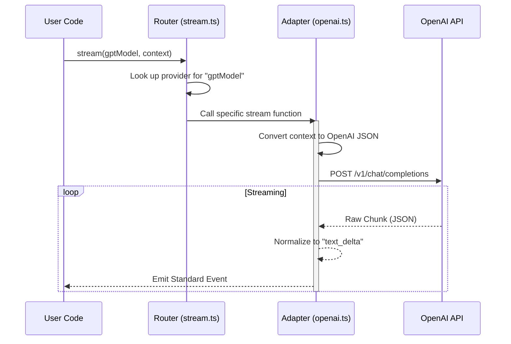

# Chapter 3: Unified AI Interface

In the previous [Agent Runtime](02_agent_runtime.md) chapter, we built the "brain" that can think in loops and execute tasks. However, that brain needs a raw source of intelligence to function.

Currently, there are many sources of intelligence: OpenAI (GPT-4), Anthropic (Claude), Google (Gemini), and local models (Mistral). Each of these providers speaks a different "language" via their API. OpenAI expects `messages`, Anthropic expects `system` + `messages`, and their output formats differ wildly.

This creates a problem: **If you want to switch from GPT-4 to Claude, you would normally have to rewrite your entire codebase.**

Enter the **Unified AI Interface**.

## Motivation: The Universal Translator

Think of the Unified AI Interface as a **Universal Travel Adapter**.

When you travel to different countries, the wall sockets change shape. You don't rewire your hair dryer for every country; you just buy an adapter.

Similarly, **pi-mono** defines *one* standard way to talk to an AI. It then uses "adapters" (Providers) to translate that standard request into whatever format OpenAI, Anthropic, or others require.

This allows your Agent to:
1.  Swap models instantly (even in the middle of a conversation).
2.  Use the same code for cloud models and local models.
3.  Handle complex features like "Tool Calling" consistently, regardless of the backend.

## Key Concepts

### 1. The Model Definition
A `Model` is just a simple object that acts as an ID card. It tells the system *who* we want to talk to.

It contains the `provider` (e.g., "openai") and the specific `id` (e.g., "gpt-4o").

### 2. The Standard Stream
Instead of getting different response objects from every library, `pi-mono` converts everything into a standard **Event Stream**. Whether the AI is thinking, writing text, or calling a tool, the events look exactly the same to your application.

### 3. The Provider Registry
This is a map that connects a provider name (like "anthropic") to the actual code that handles the translation.

## Use Case: Switching Brains

Let's see how easy it is to switch between competitors using this interface. We want to send the same prompt to two different AIs.

### 1. Define the Models
First, we get references to the models we want to use.

```typescript
import { getModel } from "@mariozechner/pi-ai";

// Get specific models by provider and ID
const gpt4 = getModel("openai", "gpt-4o");
const claude = getModel("anthropic", "claude-3-5-sonnet-20241022");
```

*Explanation:* `getModel` looks up the configuration for these AIs. We now have two objects representing our brains.

### 2. The Universal Stream Function
Now, we use the `stream` function. Notice we don't import `OpenAI` or `Anthropic` SDKs directly here.

```typescript
import { stream } from "@mariozechner/pi-ai";

// We can pass EITHER model to this function
const eventStream = stream(gpt4, {
    messages: [{ role: "user", content: "Hello!" }]
});
```

*Explanation:* The `stream` function acts as the router. It sees that we passed `gpt4`, so it routes the request to the OpenAI adapter. If we passed `claude`, it would route to the Anthropic adapter.

### 3. Handling the Output
Because the output is unified, we process the results the exact same way for both.

```typescript
for await (const event of eventStream) {
    if (event.type === "text_delta") {
        process.stdout.write(event.delta);
    }
}
```

*Explanation:* We simply listen for text updates. We don't care if OpenAI calls it `choice.delta.content` or Anthropic calls it `content_block_delta`. The interface normalized it to `text_delta` for us.

## Internal Implementation: How it Works

What happens inside that `stream()` function?

### The Flow
1.  **Lookup:** The system checks the `model.provider` string (e.g., "anthropic-messages").
2.  **Resolution:** It finds the matching Provider Adapter in the registry.
3.  **Translation (Request):** The adapter converts our standard `Message[]` array into the specific JSON format the API needs.
4.  **Translation (Response):** As data comes back from the API, the adapter converts it into standard events (like `text_start`, `toolcall_delta`).

### Sequence Diagram



### Deep Dive: The Code

Let's look at the actual code that makes this abstraction possible.

#### 1. The Router (`stream.ts`)
This file is the traffic controller. It doesn't know how to talk to APIs; it just knows who *does*.

```typescript
export function stream(model: Model, context: Context, options) {
    // 1. Find the correct provider based on the model
    const provider = getApiProvider(model.api);
    
    if (!provider) throw new Error(`No provider for: ${model.api}`);

    // 2. Delegate the work to that provider
    return provider.stream(model, context, options);
}
```

*Explanation:* This is the entry point. It finds the registered provider (the "Translator") and passes the work to it.

#### 2. The Adapter (`providers/openai-completions.ts`)
This is where the dirty work happens. This code must understand the specific 3rd-party SDK.

First, it creates the specific client:

```typescript
// Inside streamOpenAICompletions...

// Create the official OpenAI SDK client
const client = new OpenAI({
    apiKey: apiKey,
    baseURL: model.baseUrl, // Allows using proxies/local models
});
```

*Explanation:* It initializes the official library using settings from our generic `Model` object.

Then, it normalizes the **Input**:

```typescript
// Convert our generic messages to OpenAI's format
const params = {
    model: model.id,
    messages: convertMessages(model, context, compat),
    stream: true,
};
```

*Explanation:* `convertMessages` is a helper that loops through our standard history and formats it perfectly for OpenAI (handling things like image inputs or tool results).

Finally, it normalizes the **Output**:

```typescript
for await (const chunk of openaiStream) {
    // OpenAI sends updates in `chunk.choices[0].delta`
    if (chunk.choices[0].delta.content) {
        
        // We translate that to our standard event
        stream.push({
            type: "text_delta",
            delta: chunk.choices[0].delta.content,
            // ... metadata ...
        });
    }
}
```

*Explanation:* This loop reads the raw OpenAI stream. When it sees text, it pushes a `text_delta`. If it saw a tool call, it would push `toolcall_start`.

#### 3. Handling Differences
Some models support features others don't. For example, "Thinking" (Reasoning models). The interface handles this gracefully.

```typescript
// In models.ts
export function supportsXhigh(model: Model): boolean {
    // Logic to check if a specific model ID supports advanced reasoning
    return model.id.includes("gpt-5.2") || model.id.includes("opus-4.6");
}
```

*Explanation:* The interface provides helper functions to check capabilities so the UI can adapt (e.g., showing a "Reasoning" loading bar only if the model supports it).

## Conclusion

The **Unified AI Interface** is the glue that makes `pi-mono` flexible. It decouples your Agent's logic from the specific AI provider being used.

In this chapter, we learned:
*   **Adapters** translate specific API calls into a universal format.
*   **Models** are configuration objects that select the provider.
*   **Event Streams** allow us to handle text and tools uniformly.

Now that our Agent has a Body (Session), a Brain (Runtime), and a Voice (Unified Interface), it needs Hands to actually *do* things.

[Next Chapter: Standard Tools](04_standard_tools.md)

---

Generated by [Code IQ](https://github.com/adityasoni99/Code-IQ)