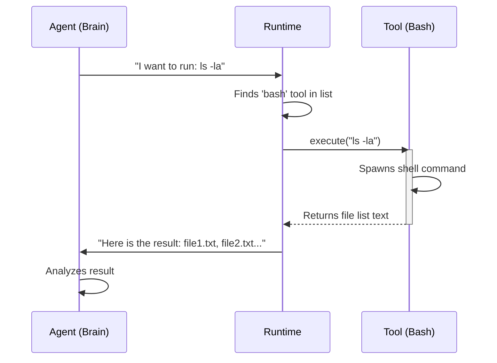

# Chapter 4: Standard Tools

Welcome to Chapter 4 of the **pi-mono** tutorial!

In the previous [Unified AI Interface](03_unified_ai_interface.md) chapter, we gave our Agent a "universal translator" so it can speak with any AI model. Before that, in [Agent Runtime](02_agent_runtime.md), we gave it a brain to think in loops.

However, right now, our Agent is like a "Brain in a Jar." It can think brilliant thoughts and write perfect code in its mind, but it cannot touch the real world. It cannot actually save a file, run a test, or search a directory.

In this chapter, we will give the Agent its **Hands**: the **Standard Tools**.

## Motivation: Crossing the Gap

Large Language Models (LLMs) are text-in, text-out engines.
*   **Input:** "Write a Python script to say Hello."
*   **Output:** "Here is the code: `print('Hello')`"

This is passive. To build a true **Coding Agent**, we need the AI to actually *create* the file `script.py` and *run* it.

**Standard Tools** bridge this gap. They are specific functions (JavaScript code) that we expose to the AI. When the AI says "I want to run the `write` tool," our system executes the code and sends the result back to the AI.

## Key Concepts

### 1. The Tool Definition
The AI doesn't know what "save file" means magically. We must provide a menu (a JSON Schema) that describes:
*   **Name:** `write_file`
*   **Description:** "Writes text to a file at a specific path."
*   **Arguments:** `path` (string), `content` (string).

### 2. The Tool Handler
This is the actual TypeScript code that runs on your computer. It takes the arguments from the AI and performs the real operation (like using Node.js `fs.writeFile`).

### 3. Tool Groups
Not every agent should have every power.
*   **Read-Only Tools:** For agents that just analyze code (safe).
*   **Coding Tools:** For agents that can modify code (powerful).

## Use Case: Fixing a Typo

Let's imagine a scenario where we want the Agent to fix a typo in a file named `hello.txt`.

1.  **Agent:** "I need to see what is in `hello.txt`." -> Calls `read` tool.
2.  **System:** Returns content: "Hullo World".
3.  **Agent:** "Ah, it is a typo. I will fix it." -> Calls `write` tool with "Hello World".
4.  **System:** Updates file. Returns "Success".

## Using Standard Tools

The **pi-mono** project comes with a pre-built set of tools located in the `coding-agent` package. You don't need to write them from scratch!

### 1. Importing the Factory
Tools often need context, like the "Current Working Directory" (`cwd`). We use factory functions to create them.

```typescript
import { createCodingTools } from "@mariozechner/pi-coding-agent";

// Define where the tools are allowed to operate
const workingDir = process.cwd();

// Create the standard set (read, write, bash, etc.)
const tools = createCodingTools(workingDir);
```

*Explanation:* `createCodingTools` prepares the tools. By passing `workingDir`, we ensure the Agent creates files in the right folder, not somewhere random on your computer.

### 2. Providing Tools to the Agent
Now we connect these "hands" to the "brain" (the Agent Runtime).

```typescript
import { Agent } from "@mariozechner/pi-agent-core";

const agent = new Agent({
    initialState: {
        model: myModel,
        // We pass the array of tools here
        tools: tools 
    }
});
```

*Explanation:* When the Agent starts, it sends the descriptions of these tools to the LLM automatically. The LLM now knows it has the power to read and write.

### 3. Restricting Access
Sometimes you want safety. You can use a different set of tools that can look but not touch.

```typescript
import { createReadOnlyTools } from "@mariozechner/pi-coding-agent";

// Only allows ls, read, grep, find
const safeTools = createReadOnlyTools(process.cwd());

const safeAgent = new Agent({
    initialState: { tools: safeTools }
});
```

*Explanation:* If this agent tries to write a file, the LLM will realize it doesn't have a `write` tool in its list and will tell the user "I cannot do that."

## Internal Implementation: How it Works

How does the Agent actually "call" the tool? It's a structured conversation.

### The Flow
1.  **Discovery:** The Agent looks at the list of tools available in `initialState`.
2.  **Selection:** The LLM outputs a special JSON structure asking to call a function (e.g., `bash`).
3.  **Execution:** The system finds the matching TypeScript function in the tool list and runs it.
4.  **Result:** The return value (e.g., the output of an `ls` command) is converted to text and sent back to the LLM.

### Sequence Diagram



## Deep Dive: The Code

Let's look at how `pi-mono` organizes these tools in `index.ts`.

### Tool Exports
The library exports individual tools and grouped lists. This uses the **Factory Pattern**.

```typescript
// packages/coding-agent/src/core/tools/index.ts

// Export individual factories
export { createReadTool, readTool } from "./read.js";
export { createWriteTool, writeTool } from "./write.js";

// Export type definitions so TypeScript knows what inputs are valid
export type { ReadToolOptions, WriteToolOptions } from "./read.js";
```

*Explanation:* This allows advanced users to pick and choose exactly which tools they want, rather than taking the whole bundle.

### Creating Tool Bundles
The `createCodingTools` function is a helper that bundles the essential tools for a developer agent.

```typescript
export function createCodingTools(cwd: string, options?: ToolsOptions): Tool[] {
    return [
        createReadTool(cwd, options?.read),
        createBashTool(cwd, options?.bash),
        createEditTool(cwd),
        createWriteTool(cwd),
    ];
}
```

*Explanation:* 
*   It takes `cwd` (Current Working Directory) and passes it down to every tool.
*   It returns an array `Tool[]`. This is exactly the format the `Agent` from [Agent Runtime](02_agent_runtime.md) expects.

### The `Bash` Tool (The Powerhouse)
One specific tool mentioned is `bashTool`.

```typescript
export const allTools = {
    // ...
    bash: bashTool,
    // ...
};
```

*Explanation:* The `bash` tool is special. It allows the Agent to execute **any** system command. This is what gives the agent the ability to install packages (`npm install`), run tests (`npm test`), or manage git (`git commit`).

## Why "Standard" Tools?

You might wonder: "Why not just let the AI write its own scripts to do things?"

1.  **Reliability:** We wrote the `readTool` to handle errors gracefully (e.g., if a file doesn't exist).
2.  **Safety:** We can restrict the `writeTool` to only write within a specific folder, preventing the AI from deleting your operating system.
3.  **Parsability:** The tools return output in a format the AI understands easily.

## Conclusion

Standard Tools transform our Agent from a passive chatterbox into an active worker.
*   **Coding Tools** allow reading, writing, and editing code.
*   **Read-Only Tools** allow safe exploration.
*   Factories like `createCodingTools` make it easy to set up an environment.

Now the Agent can perform actions and get results. But there is a problem: Tools like `cat` or `ls` produce a lot of text output. How do we display this to the user nicely without a messy wall of text?

In the next chapter, we will build a beautiful interface for our agent using the [TUI Engine](05_tui_engine.md).

---

Generated by [Code IQ](https://github.com/adityasoni99/Code-IQ)