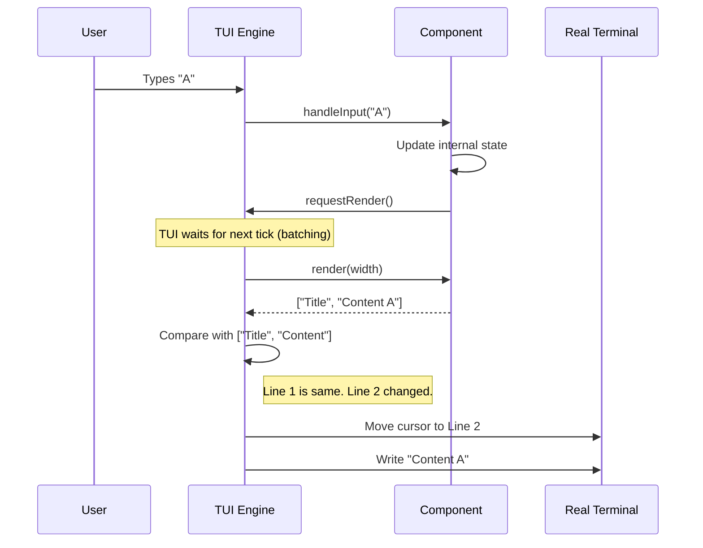

# Chapter 5: TUI Engine

Welcome to Chapter 5 of the **pi-mono** tutorial!

In the previous [Standard Tools](04_standard_tools.md) chapter, we gave our Agent "hands" to execute commands and write files. However, seeing the raw output of these tools scrolling endlessly in a terminal can be messy and hard to read.

In this chapter, we will build the **Face** of our application using the **TUI (Terminal User Interface) Engine**.

## Motivation: The "Flicker" Problem

Standard command-line programs work like a receipt printer: they just append text to the bottom.
*   `console.log("Hello")` prints a line.
*   `console.log("World")` prints another line below it.

But what if you want a **status bar** that stays at the bottom, or a **text editor** where you can move the cursor around?

To do this, you might try clearing the screen and re-printing everything every time something changes.
**The Problem:** If you do this 60 times a second, the screen will flash and flicker uncontrollably. It creates a terrible user experience.

**The Solution:** The **TUI Engine**. It acts like a web browser's rendering engine. It keeps a "Virtual Screen" in memory, compares it to what is currently on the real screen, and **only updates the lines that have changed**.

## Key Concepts

### 1. The Component
In web development, you have HTML elements (`<div>`, `<span>`). In our TUI, we have **Components**.
A Component is simply a class that knows how to turn itself into an array of strings (lines of text).

### 2. The Render Cycle
Instead of drawing directly to the screen, components "request" a render.
1.  **State Change:** User types a key.
2.  **Render:** The TUI asks components "What do you look like now?"
3.  **Diff:** The TUI compares the new lines with the old lines.
4.  **Patch:** The TUI sends strictly minimal commands to the terminal to update only the changed characters.

### 3. Input Handling
The TUI listens to the keyboard. It captures raw data (like `^[[A` for "Up Arrow") and passes it to the component that currently has **Focus**.

## Use Case: A Static Dashboard

Let's build a very simple interface that displays a title and a text box.

### 1. Defining a Component
To create a UI element, we implement the `Component` interface. We just need a `render` method that returns an array of strings.

```typescript
import { Component } from "@mariozechner/pi-tui";

class TitleComponent implements Component {
    render(width: number): string[] {
        // Return an array of strings. 
        // Each string is one horizontal line on the terminal.
        return [
            "┌──────────────────┐",
            "│   MY AI AGENT    │",
            "└──────────────────┘"
        ];
    }
}
```

*Explanation:* This component draws a box. The `width` argument tells us how wide the terminal currently is, so we can stretch our box if we wanted to.

### 2. Setting up the Engine
Now we need to start the engine and add our component to it.

```typescript
import { TUI, ProcessTerminal } from "@mariozechner/pi-tui";

// 1. Create the connection to the real OS terminal
const terminal = new ProcessTerminal();

// 2. Create the TUI engine
const tui = new TUI(terminal);

// 3. Add our component
tui.addChild(new TitleComponent());

// 4. Start the loop
tui.start();
```

*Explanation:* 
*   `ProcessTerminal` wraps Node.js `process.stdout` and handles raw modes.
*   `tui.start()` kicks off the event loop, hiding the cursor and listening for resize events.

## Internal Implementation: Differential Rendering

This is the magic part. How does the TUI avoid flickering?

### The Algorithm
When `render()` is called:
1.  The TUI collects all strings from all components.
2.  It compares `newLines[i]` with `previousLines[i]`.
3.  If line 5 hasn't changed, it does nothing.
4.  If line 6 *has* changed, it moves the cursor to line 6, clears it, and writes the new text.

### Sequence Diagram



## Deep Dive: The Code

Let's look at the implementation details in `packages/tui/src/tui.ts`.

### The Render Loop
The `doRender` method contains the "Diffing" logic.

```typescript
// packages/tui/src/tui.ts

private doRender(): void {
    // 1. Get new lines from components
    let newLines = this.render(width);
    
    // 2. Find start and end of changes
    let firstChanged = -1;
    let lastChanged = -1;

    for (let i = 0; i < maxLines; i++) {
        if (this.previousLines[i] !== newLines[i]) {
            if (firstChanged === -1) firstChanged = i;
            lastChanged = i;
        }
    }

    // 3. If nothing changed, stop.
    if (firstChanged === -1) return;

    // 4. Only update the specific lines on screen
    let buffer = "";
    // ... logic to move cursor to firstChanged ...
    for (let i = firstChanged; i <= lastChanged; i++) {
        buffer += newLines[i]; // Add only changed lines
    }
    
    this.terminal.write(buffer);
}
```

*Explanation:* This optimization is crucial. If you have a 100-line screen and only the clock in the corner updates, `firstChanged` and `lastChanged` ensure we only transmit the bytes for that one line, making the UI feel instant even over slow SSH connections.

### The Editor Component
Text editing is surprisingly hard. You have to handle arrow keys, backspace, and line wrapping. The `pi-mono` project includes a robust `Editor` component in `packages/tui/src/components/editor.ts`.

It separates **Logical Lines** (the string in memory) from **Visual Lines** (how it wraps on screen).

```typescript
// packages/tui/src/components/editor.ts

render(width: number): string[] {
    // 1. Wrap text based on screen width
    const layoutLines = this.layoutText(width);

    // 2. Handle Scrolling
    const visibleLines = layoutLines.slice(
        this.scrollOffset, 
        this.scrollOffset + height
    );

    // 3. Draw the cursor
    // The Editor manually inserts a specific "Reverse Color" ANSI code
    // where the cursor should be.
    // ...
    return result;
}
```

*Explanation:* The Editor component handles the complexity of text manipulation. When you use it in your agent, you simply subscribe to `onChange` or `onSubmit` to get the text back.

## Compositing and Overlays
Sometimes we need a popup (like an autocomplete menu) to appear *over* the text. The TUI supports this via an **Overlay Stack**.

1.  Base components render first.
2.  The TUI checks if an overlay (like `SelectList`) is active.
3.  It overwrites the strings of the base layer with the strings of the overlay before sending them to the terminal.

## Conclusion

The **TUI Engine** provides the visual layer for `pi-mono`. It transforms our AI from a command-line script into a professional-looking application.
*   **Components** make UI code modular.
*   **Differential Rendering** ensures high performance.
*   **Input Handling** allows for interactive editing.

However, displaying all this information can fill up the screen—and the AI's context window—very quickly. How do we make sure the AI remembers important information without running out of memory?

In the next chapter, we will discuss [Context Compaction](06_context_compaction.md).

---

Generated by [Code IQ](https://github.com/adityasoni99/Code-IQ)