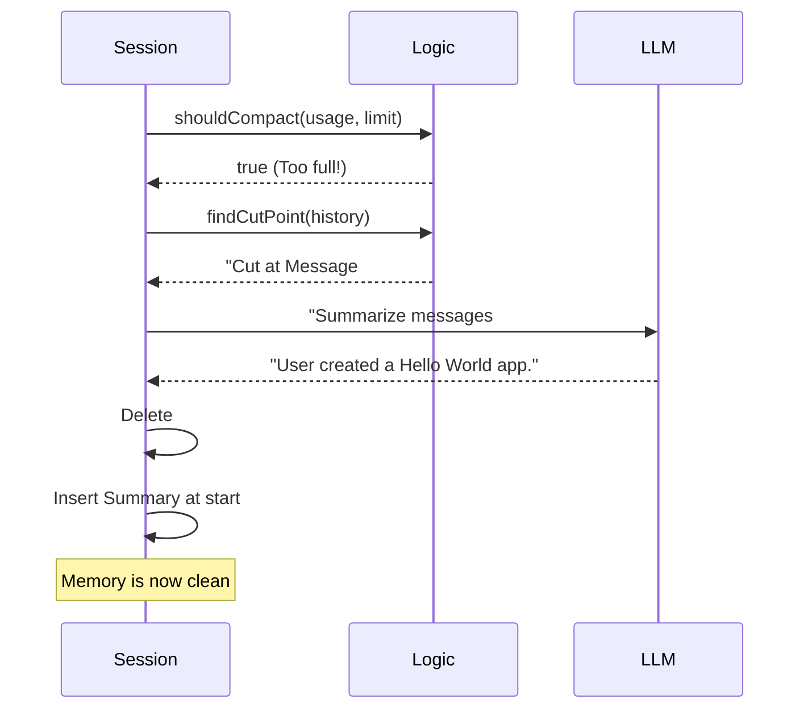

# Chapter 6: Context Compaction

Welcome to Chapter 6 of the **pi-mono** tutorial!

In the previous [TUI Engine](05_tui_engine.md) chapter, we built a visual interface to display the agent's output. However, as the agent works, it generates a massive amount of text—thousands of lines of code, logs, and conversation history.

This leads to a critical problem: **AI models have a memory limit.** If you talk too long, the AI will crash or start forgetting instructions.

In this chapter, we will introduce **Context Compaction**, the "Garbage Collector" for the agent's memory that allows it to run indefinitely.

## Motivation: The Overflowing Chalkboard

Imagine a professor solving a massive math problem on a small chalkboard.
1.  They write equations.
2.  The board gets full.
3.  To continue, they must erase the top of the board.

**The Problem:** If they erase the *problem statement*, they forget what they are solving. If they erase the *variable definitions*, the equation stops making sense.

**The Solution:** Before erasing, the professor writes a small **Summary** in the corner: *"Solving for X, knowing that Y=5."*

**Context Compaction** does exactly this for the AI. It watches the conversation length. When it gets "full," it takes the oldest messages, summarizes them into a concise note, and deletes the raw logs.

## Key Concepts

### 1. The Context Window
This is the limit of the AI's short-term memory (measured in "tokens"). For example, 128,000 tokens. If we exceed this, the API rejects our request.

### 2. The Threshold
We set a "Safety Margin." If the conversation fills 90% of the window, we trigger compaction. This ensures we never actually hit the hard limit.

### 3. The Summary Chain
We don't just delete old messages; we ask the AI to read them and write a summary. When compaction happens again later, the AI reads the *old* summary plus the *new* messages to create an *updated* summary. This creates an unbroken chain of memory.

## Use Case: The Never-Ending Session

Imagine you are building a complex game with the agent.
*   **Turn 1-50:** You set up the game engine.
*   **Turn 51-100:** You design the characters.
*   **Turn 101:** You ask to fix a bug in the engine.

Without compaction, the AI would have forgotten Turn 1 (where the engine was built) because it fell off the memory cliff.
With compaction, the AI sees a summary: *"User built a game engine in Python. Key files are engine.py and player.py."*

## Usage: Configuring Compaction

In `pi-mono`, compaction is handled automatically by the [Agent Session](01_agent_session.md), but it requires configuration settings.

### 1. The Settings Object
We define when compaction should trigger.

```typescript
// Define how memory is managed
const compactionSettings = {
    enabled: true,
    // Start compacting when we only have 16k tokens left
    reserveTokens: 16384, 
    // After compacting, keep the last 20k tokens of raw text
    keepRecentTokens: 20000 
};
```

*Explanation:* `reserveTokens` is our safety buffer. `keepRecentTokens` ensures the AI still sees the exact text of the most recent interaction, so the conversation doesn't feel disjointed.

### 2. Checking the Level
The system needs to constantly check if the "cup is full."

```typescript
import { shouldCompact } from "./compaction";

// Check if current usage + safety buffer > limit
if (shouldCompact(currentTokens, contextWindow, settings)) {
    console.log("Memory full! Triggering compaction...");
    await session.runCompaction();
}
```

*Explanation:* This function is a simple boolean check. If it returns `true`, the session pauses the agent and starts the cleaning process.

## Internal Implementation: How it Works

The compaction process is a multi-step operation involving the LLM itself.

### The Flow
1.  **Detection:** The Session notices the token count is high.
2.  **Cut Point:** The logic calculates where to cut the history to keep exactly `keepRecentTokens`.
3.  **Summarization:** The system takes the *older* messages and sends them to the LLM with a special prompt: "Summarize this conversation."
4.  **Replacement:** The old messages are removed from the array and replaced with a single `SummaryMessage`.

### Sequence Diagram



## Deep Dive: The Code

The logic resides in `packages/coding-agent/src/core/compaction/compaction.ts`. Let's break down the critical functions.

### 1. Finding Where to Cut
We can't just cut in the middle of a sentence or a tool result. We must find a valid boundary.

```typescript
// Simplified logic from findCutPoint
export function findCutPoint(entries, settings): CutPointResult {
    let tokens = 0;
    
    // Walk backwards from the newest message
    for (let i = entries.length - 1; i >= 0; i--) {
        tokens += estimateTokens(entries[i]);
        
        // Stop if we have saved enough "recent" memory
        if (tokens >= settings.keepRecentTokens) {
            return { firstKeptEntryIndex: i };
        }
    }
    return { firstKeptEntryIndex: 0 };
}
```

*Explanation:* We count tokens from the bottom up. Once we have enough "recent context" to satisfy the user, everything above that index is marked for the shredder (summarization).

### 2. The Summarization Prompt
We use a structured prompt to ensure the AI doesn't lose critical details like file names.

```typescript
// The system prompt used to compress memory
const SUMMARIZATION_PROMPT = `
Summarize the conversation. Use this EXACT format:

## Goal
[What is the user trying to accomplish?]

## Progress
### Done
- [x] [Completed tasks]

## Key Decisions
- [Rationale for changes]
`;
```

*Explanation:* By forcing the AI to use a standard format (Goal, Progress, Decisions), we ensure that the summary is actually useful for the *next* compaction cycle.

### 3. Generating the Summary
This function actually calls the AI to perform the compression.

```typescript
export async function generateSummary(messages, model, apiKey) {
    // 1. Convert message objects to a string script
    const conversationText = serializeConversation(messages);

    // 2. Ask the AI to summarize it
    const response = await completeSimple(model, {
        systemPrompt: "You are a precise summarizer.",
        messages: [{ role: "user", content: prompt + conversationText }]
    });

    return response.content; // The summary text
}
```

*Explanation:* We use `serializeConversation` to turn the complex JSON message objects into a readable script, then send it to the [Unified AI Interface](03_unified_ai_interface.md) via `completeSimple`.

### 4. Tracking Files
A unique feature of `pi-mono` is that it tracks which files were modified in the summarized history.

```typescript
// Inside the main compact function
const { readFiles, modifiedFiles } = computeFileLists(fileOps);

// Append file history to the text summary
summary += `\n\nModified Files: ${modifiedFiles.join(", ")}`;
```

*Explanation:* Even if the text summary is vague, the system explicitly appends a list of files touched. This cues the Agent to check those files if it needs context later.

## Conclusion

**Context Compaction** is what differentiates a simple chatbot from a robust Agent. By automatically managing its own memory, the agent becomes capable of handling tasks that span hours or days.

In this chapter, we learned:
*   **Compaction** prevents the AI from running out of context tokens.
*   **Summarization** preserves the semantic meaning of old messages.
*   **Cut Points** ensure we keep the immediate history intact for a smooth user experience.

We have now covered the core engine, the interface, the tools, the UI, and the memory. The final piece of the puzzle is how to let *other developers* add features to our agent without changing the core code.

[Next Chapter: Extension System](07_extension_system.md)

---

Generated by [Code IQ](https://github.com/adityasoni99/Code-IQ)