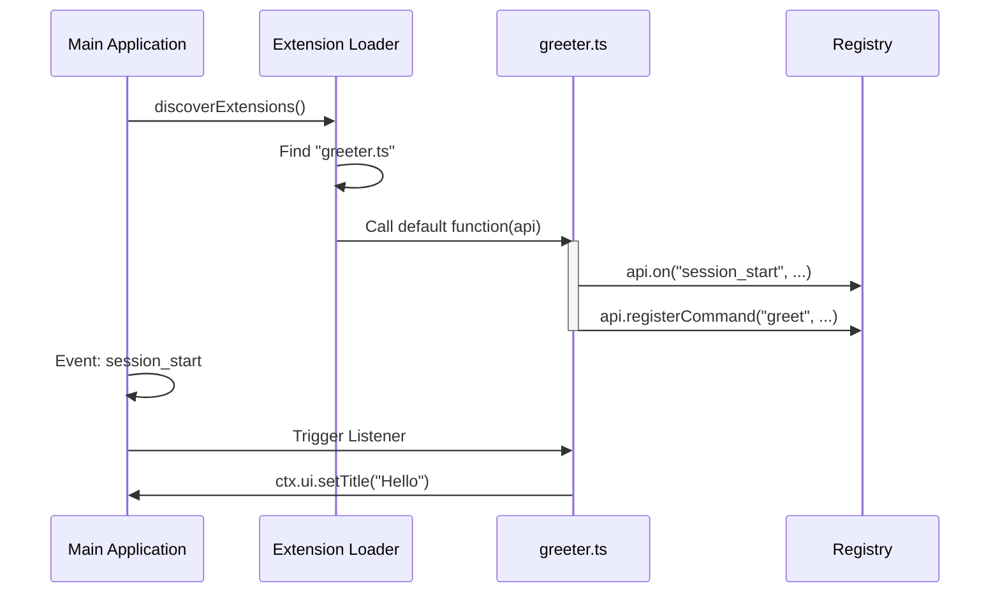

# Chapter 7: Extension System

Welcome to Chapter 7 of the **pi-mono** tutorial!

In the previous [Context Compaction](06_context_compaction.md) chapter, we learned how to manage the AI's memory so it can run forever. By now, we have a fully functional agent: it has a body (Session), a brain (Runtime), hands (Tools), and a face (TUI).

However, what if you want to customize the agent? What if you want to add a specific command, change the color scheme, or integrate a new tool without rewriting the core source code?

In this chapter, we will build the **Extension System**. Think of this as a "Mod Loader" for your AI.

## Motivation: The "Moddable" AI

Imagine playing a video game like Minecraft or Skyrim. The base game is great, but "Mods" (modifications) allow players to add new items, magic spells, or interface changes.

We want the same for **pi-mono**. We want to allow users to drop a single TypeScript file into a folder to magically give the agent new powers.

The **Extension System** allows you to:
1.  **Inject Features:** Add new commands (like `/reset` or `/deploy`) at runtime.
2.  **Hook Events:** Listen for when the agent starts, stops, or errors.
3.  **Extend UI:** Add widgets to the TUI (like a status bar or a clock) without touching the rendering engine.

## Key Concepts

### 1. The Extension Factory
An extension is just a function. It receives an `api` object that acts as a toolbox. You use this toolbox to tell the main application what you want to do.

### 2. The Hook (Event Listener)
Hooks allow your extension to wait for specific moments. For example, `on("session_start")` lets you run code immediately when the application launches.

### 3. The Runtime Proxy
Extensions run in a "Sandbox." They don't have direct access to the core `Agent` class. Instead, they send messages to a `Runtime` proxy. This keeps the core system safe from crashing if a plugin fails.

## Use Case: A "Greeter" Extension

Let's build a simple extension that:
1.  Changes the window title when the session starts.
2.  Adds a status widget saying "Hello World".
3.  Adds a custom command `/greet`.

### 1. The Extension Skeleton
An extension is a TypeScript file that exports a default function.

```typescript
// extensions/my-greeter.ts
import type { ExtensionAPI } from "@mariozechner/pi-coding-agent";

export default function(pi: ExtensionAPI) {
    // We will write our logic here
    console.log("Extension loaded!");
}
```
*Explanation:* The `pi` argument is our gateway to the system. It contains methods like `on`, `registerCommand`, and `ui`.

### 2. Hooking into Lifecycle Events
We want to change the title when the app starts.

```typescript
pi.on("session_start", async (event, ctx) => {
    // Set the window title
    ctx.ui.setTitle("My Custom AI Agent");
    
    // Add a widget to the TUI
    ctx.ui.setStatus("greeter-widget", "System Online ✅");
});
```
*Explanation:* We subscribe to `session_start`. When it fires, we get a `ctx` (Context) object. `ctx.ui` lets us manipulate the [TUI Engine](05_tui_engine.md) safely.

### 3. Registering a Command
Now let's add a command so the user can type `/greet`.

```typescript
pi.registerCommand("greet", {
    description: "Says hello to the user",
    handler: async (args, ctx) => {
        // Show a notification in the UI
        ctx.ui.notify("Hello there, human!", "info");
    }
});
```
*Explanation:* `registerCommand` tells the system: "If the user types `/greet`, run this function." The `notify` method shows a popup bubble.

## Internal Implementation: How it Works

How does the application find these files and run them?

### The Flow
1.  **Discovery:** The Loader scans specific folders (like `.pi/extensions`) for `.ts` or `.js` files.
2.  **Compilation:** It uses a tool called `jiti` to compile TypeScript on the fly (no manual build step needed!).
3.  **Initialization:** It calls the default exported function, passing in the `ExtensionAPI`.
4.  **Registration:** The extension registers its listeners and commands into the global registries.

### Sequence Diagram



## Deep Dive: The Code

Let's look at the `loader.ts` file to see how `pi-mono` manages this magic.

### 1. Creating the API API
We don't give the extension full access. We create a restricted `api` object.

```typescript
// packages/coding-agent/src/core/extensions/loader.ts

function createExtensionAPI(extension, runtime, cwd, eventBus): ExtensionAPI {
    return {
        // Allow registering events
        on(event, handler) {
            extension.handlers.get(event).push(handler);
        },
        
        // Allow registering commands
        registerCommand(name, options) {
            extension.commands.set(name, { name, ...options });
        },
        
        // Expose safe actions (delegated to runtime)
        sendMessage(msg) {
            runtime.sendMessage(msg);
        }
    };
}
```
*Explanation:* This pattern is called the **Facade Pattern**. We hide the complex internal `runtime` and expose a clean, simple `ExtensionAPI`. The extension stores its commands in its own local map (`extension.commands`), making it easy to unload later if needed.

### 2. Loading the Module (JITI)
We need to load TypeScript files dynamically. Node.js cannot do this natively, so we use `jiti`.

```typescript
async function loadExtensionModule(extensionPath: string) {
    // Create the compiler instance
    const jiti = createJiti(import.meta.url, {
        // Use internal modules if running as a binary
        virtualModules: isBunBinary ? VIRTUAL_MODULES : undefined 
    });

    // Import the file like a standard module
    const module = await jiti.import(extensionPath, { default: true });
    return module;
}
```
*Explanation:* `jiti` allows us to import a `.ts` file as if it were a ready-to-use JavaScript library. The `virtualModules` part ensures that if we compile our app into a single binary file, the extensions can still find the core libraries they depend on.

### 3. Discovery Logic
Where do we look for extensions?

```typescript
export async function discoverAndLoadExtensions(cwd: string) {
    const paths = [];

    // 1. Look in the global agent folder
    paths.push(path.join(getAgentDir(), "extensions"));

    // 2. Look in the local project folder (.pi/extensions)
    paths.push(path.join(cwd, ".pi", "extensions"));

    // Load everything found
    return loadExtensions(paths, cwd);
}
```
*Explanation:* This hierarchy allows for "Global Extensions" (installed for every project) and "Local Extensions" (specific to just one project).

### 4. Safety First (Runtime Stubs)
When loading, the extension might try to call `sendMessage` immediately. But the agent hasn't started yet! We handle this with "Stubs".

```typescript
export function createExtensionRuntime() {
    // Temporary placeholder that throws errors
    const notInitialized = () => {
        throw new Error("Runtime not ready yet!");
    };

    return {
        sendMessage: notInitialized,
        // ... other methods ...
    };
}
```
*Explanation:* We create a dummy runtime first. Later, when the core system wakes up, it overwrites these dummy functions with the real logic. This prevents race conditions during startup.

## Conclusion

The **Extension System** is the final piece of the puzzle. It transforms `pi-mono` from a static tool into a **Platform**.

*   **Flexibility:** Users can customize their experience without forking the codebase.
*   **Simplicity:** The API abstracts away the complexity of the [Agent Runtime](02_agent_runtime.md) and [TUI Engine](05_tui_engine.md).
*   **Power:** Through hooks and commands, extensions can control almost every aspect of the agent's lifecycle.

**Congratulations!** You have completed the `pi-mono` architectural tutorial.

We have built:
1.  **[Agent Session](01_agent_session.md):** The persistence layer.
2.  **[Agent Runtime](02_agent_runtime.md):** The thinking loop.
3.  **[Unified AI Interface](03_unified_ai_interface.md):** The model translator.
4.  **[Standard Tools](04_standard_tools.md):** The hands.
5.  **[TUI Engine](05_tui_engine.md):** The face.
6.  **[Context Compaction](06_context_compaction.md):** The memory manager.
7.  **Extension System:** The mod loader.

You now understand the architecture of a modern, production-grade AI Agent framework. Happy coding!

---

Generated by [Code IQ](https://github.com/adityasoni99/Code-IQ)