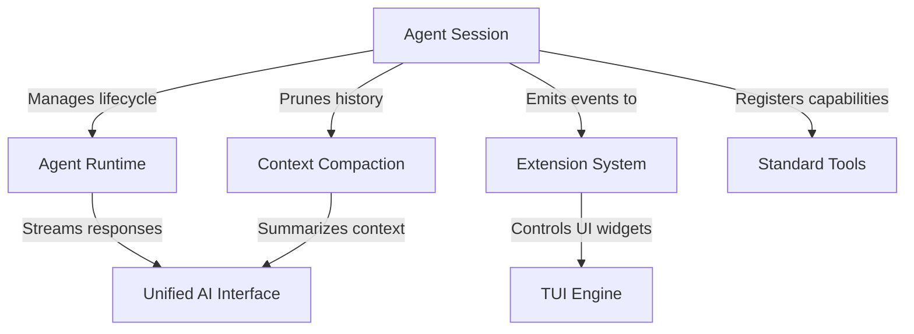

# Tutorial: pi-mono

**pi-mono** is an advanced AI coding assistant built on a modular architecture. At its core, an **Agent Runtime** manages the thought loop, while an **Agent Session** handles long-term memory and persistence. It features a robust **TUI Engine** for a flicker-free terminal interface, a **Context Compaction** system to manage token limits by summarizing history, and a flexible **Extension System** to dynamically add new commands and capabilities.

**Source Repository:** [https://github.com/badlogic/pi-mono](https://github.com/badlogic/pi-mono)

## Chapters

1. [Agent Session](01_agent_session.md)
2. [Agent Runtime](02_agent_runtime.md)
3. [Unified AI Interface](03_unified_ai_interface.md)
4. [Standard Tools](04_standard_tools.md)
5. [TUI Engine](05_tui_engine.md)
6. [Context Compaction](06_context_compaction.md)
7. [Extension System](07_extension_system.md)

---

Generated by [Code IQ](https://github.com/adityasoni99/Code-IQ)