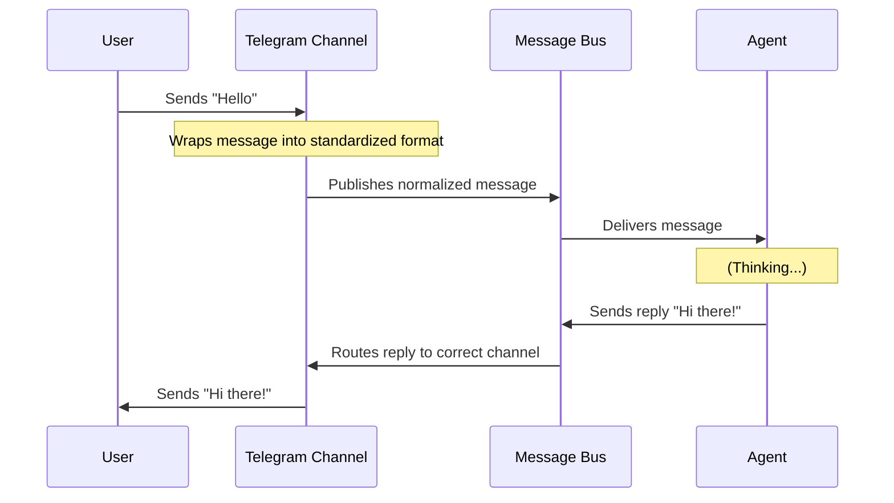

# Chapter 1: Communication Channels

Welcome to the world of **PicoClaw**! Before we can build a brain for our AI agent, we need to give it a way to interact with the outside world.

Imagine you are a hotel receptionist. Guests arrive via taxi, bus, or on foot. Regardless of **how** they arrived, once they walk through the door, you treat them simply as "guests."

In PicoClaw, **Communication Channels** work the same way. They act as the "ears" and "mouth" of your agent. Whether a message comes from a chat app like Telegram, a hardware camera like MaixCam, or a Discord server, this layer translates everything into a standard language your agent understands.

## Why do we need this?

Different platforms speak different languages:
*   **Telegram** sends complex JSON objects with `chat_id` and `username`.
*   **MaixCam** (a hardware AI camera) sends raw TCP data streams with coordinates like `x: 100, y: 200`.
*   **Discord** uses gateway events.

If we wrote logic for every specific platform inside the agent's brain, the code would be a mess. Instead, we create a **Channel Abstraction**.

### The Goal
We want our agent to receive a simple, clean message like this, no matter where it came from:

```text
From: User123
Content: "I see a person."
Platform: MaixCam
```

## Concept 1: The "Ears" (Inbound)

The primary job of a channel is to **listen**. It waits for data from the outside world, cleans it up (normalization), and passes it to the agent.

Let's look at how the **Telegram** channel handles an incoming message.

### Telegram Example
When a user sends "Hello!" on Telegram, the library triggers a function. We strip away the complexity:

```go
// pkg/channels/telegram.go (Simplified)

func (c *TelegramChannel) handleMessage(ctx context.Context, update telego.Update) {
    // 1. Extract the raw text and user info
    rawMsg := update.Message
    content := rawMsg.Text
    senderID := fmt.Sprintf("%d", rawMsg.From.ID)

    // 2. Pass it to the internal system (The Bus)
    // We normalize the data so the agent doesn't need to know about Telegram specifics
    c.HandleMessage(senderID, "telegram_chat_1", content, nil, nil)
}
```

**What happened here?**
1.  We received a specific Telegram update object.
2.  We pulled out the text ("Hello!") and the User ID.
3.  We called `c.HandleMessage`. This pushes the clean data onto the **Message Bus** (which we will cover in [The Agent Loop](02_the_agent_loop.md)).

### MaixCam Example (Hardware)
Now, look at the **MaixCam**. It's a camera that detects objects. It doesn't send text; it sends data. The channel converts that data into a sentence the AI can read.

```go
// pkg/channels/maixcam.go (Simplified)

func (c *MaixCamChannel) handlePersonDetection(msg MaixCamMessage) {
    // 1. Extract coordinates from the hardware
    x, _ := msg.Data["x"].(float64)
    y, _ := msg.Data["y"].(float64)

    // 2. Convert data into a natural language description
    content := fmt.Sprintf("📷 Person detected at position (%.0f, %.0f)", x, y)

    // 3. Send to the agent as if the camera "spoke" to it
    c.HandleMessage("maixcam", "default", content, nil, nil)
}
```

**Key Takeaway:** The agent thinks the camera actually *said* "Person detected...". The channel did the translation.

## Concept 2: The "Mouth" (Outbound)

When the agent wants to reply, it just sends a string of text. It doesn't know how to make an HTTP request to Telegram or a TCP write to a camera. The Channel handles the **Sending**.

```go
// pkg/channels/telegram.go (Simplified)

func (c *TelegramChannel) Send(ctx context.Context, msg bus.OutboundMessage) error {
    // 1. Convert the generic ID back to a Telegram Chat ID
    chatID, _ := parseChatID(msg.ChatID)

    // 2. Format the text (e.g., convert Markdown to HTML)
    htmlContent := markdownToTelegramHTML(msg.Content)

    // 3. Use the bot library to send it
    _, err := c.bot.SendMessage(ctx, tu.Message(tu.ID(chatID), htmlContent))
    return err
}
```

## Concept 3: The Manager

With multiple channels (Telegram, Discord, Slack, etc.) potentially running at once, we need a boss to organize them. This is the **Channel Manager**.

The Manager acts as a switchboard. It holds a list of all active channels.

```go
// pkg/channels/manager.go (Simplified)

type Manager struct {
    channels map[string]Channel // A map to hold "telegram", "maixcam", etc.
    bus      *bus.MessageBus    // The connection to the rest of the system
}

func (m *Manager) StartAll(ctx context.Context) error {
    // Loop through every enabled channel and turn it on
    for name, channel := range m.channels {
        go channel.Start(ctx) // Run each channel in the background
    }
    return nil
}
```

## Internal Workflow

How does a message flow through this system? Let's visualize the lifecycle of a message from a User on Telegram to the Agent, and back.



### The "Dispatch" Loop
You might wonder: "How does the Manager know when the Agent replies?"

The Manager runs a background task called `dispatchOutbound`. It watches the internal bus for any outgoing messages and routes them to the correct channel.

```go
// pkg/channels/manager.go (Simplified)

func (m *Manager) dispatchOutbound(ctx context.Context) {
    for {
        // 1. Wait for a message from the Agent
        msg, ok := m.bus.SubscribeOutbound(ctx)
        
        // 2. Find the right channel (e.g., "telegram")
        channel := m.channels[msg.Channel]

        // 3. Tell the channel to send it
        channel.Send(ctx, msg)
    }
}
```

## Summary

In this chapter, we learned:
1.  **Channels** abstract away the differences between platforms (like Telegram vs. Hardware).
2.  **Inbound (Listening):** Channels convert raw platform data into standardized text messages.
3.  **Outbound (Speaking):** Channels convert the agent's text replies into platform-specific API calls.
4.  **Manager:** Orchestrates multiple channels simultaneously.

Now that our agent can "hear" and "speak," it needs a brain to process what it hears.

In the next chapter, we will look at the core of the system:
[The Agent Loop](02_the_agent_loop.md)

---

Generated by [Code IQ](https://github.com/adityasoni99/Code-IQ)