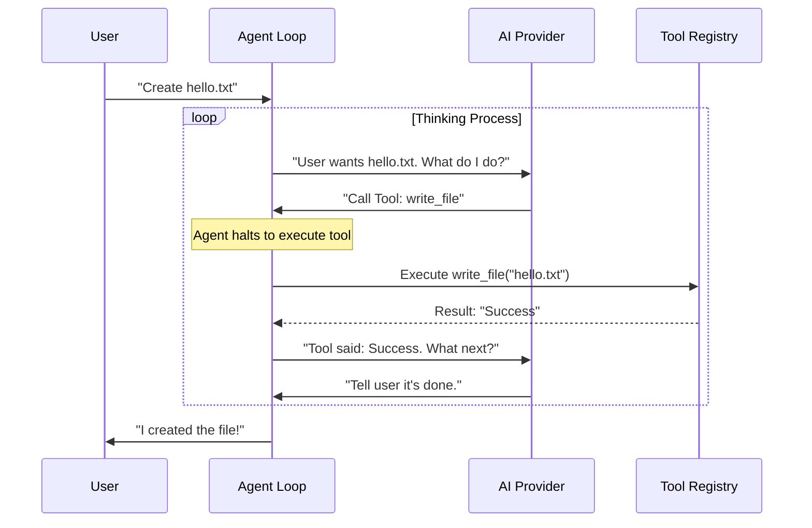

# Chapter 2: The Agent Loop

In the previous chapter, [Communication Channels](01_communication_channels.md), we gave our agent "ears" to hear messages and a "mouth" to speak. But right now, if a user says "Hello", the agent is just a hollow shell. It receives the message, but it doesn't know how to think or decide what to do.

This chapter introduces the **Agent Loop**. Think of this as the "Brain" or the "Conductor" of the entire application.

## The Problem: Why a Loop?

Imagine you ask a standard chatbot: *"Check the weather in London and tell me if I need an umbrella."*

A simple script might look like this:
1. Receive text.
2. Send text to AI.
3. Print AI response.

But an AI model (LLM) cannot *actually* check the weather. It's just a text generator frozen in time. It might hallucinate: *"It is raining in London"* (even if it's sunny).

To solve this, we need a **Loop** that allows the agent to:
1. **Think:** "I need to check the weather first."
2. **Act:** Run a weather tool.
3. **Observe:** See the result ("It is sunny").
4. **Think again:** "Okay, since it is sunny, I will tell the user they don't need an umbrella."

This cycle (Thinking → Action → Observation) is the heartbeat of **PicoClaw**.

## Concept 1: The Main Event Loop

At the highest level, the Agent Loop is an infinite process that waits for signals from the "Ears" (Channels).

It sits in the background, constantly asking: *"Is there a new message?"*

```go
// pkg/agent/loop.go (Conceptual Simplified)

func (al *AgentLoop) Run(ctx context.Context) {
    // Keep running forever until the program stops
    for al.running.Load() {
        
        // 1. Wait for a message from the Bus (Ears)
        msg, ok := al.bus.ConsumeInbound(ctx)
        if !ok {
            continue
        }

        // 2. Process the message (The Brain)
        response := al.processMessage(ctx, msg)

        // 3. Send the result back (Mouth)
        al.bus.PublishOutbound(response)
    }
}
```

**Explanation:**
1.  **`ConsumeInbound`**: This blocks and waits. As soon as a Telegram or Discord message arrives, it wakes up.
2.  **`processMessage`**: This is where the magic happens (we explain this next).
3.  **`PublishOutbound`**: Once the brain is done, the reply is sent back to the user.

## Concept 2: The "Thinking" Cycle (Iteration)

When `processMessage` is called, we don't just send one prompt to the AI. We start a **Conversation Loop**.

This is often called the **ReAct Pattern** (Reasoning + Acting).

### The Scenario
User: *"Create a file named hello.txt."*

### The Workflow
1.  **Iteration 1:**
    *   **Input:** "Create a file named hello.txt"
    *   **Agent:** Sends this to the AI Provider.
    *   **AI Reply:** "I want to use the tool `write_file`." (It doesn't talk to the user yet; it talks to the system).

2.  **System Action:**
    *   The Agent Loop sees the AI wants to use a tool.
    *   It executes `write_file("hello.txt")`.
    *   It gets a result: "Success".

3.  **Iteration 2:**
    *   **Input:** (History + "Tool executed successfully")
    *   **Agent:** Sends the tool result back to the AI.
    *   **AI Reply:** "I have created the file for you." (Now it talks to the user).

4.  **Finish:**
    *   The Agent sends the final text to the user.

### Visualizing the Cycle



## Internal Implementation

Let's look at how **PicoClaw** implements this inner loop. This logic is found inside `pkg/agent/loop.go`.

We call this function `runLLMIteration`. It keeps spinning until the AI gives a final answer or we hit a limit (to prevent infinite loops).

### Step 1: The Loop Setup
We define a limit (e.g., 10 turns) so the bot doesn't get stuck arguing with itself.

```go
// pkg/agent/loop.go (Simplified)

func (al *AgentLoop) runLLMIteration(ctx context.Context, messages []Message) (string, error) {
    iteration := 0
    
    // Keep looping while the AI wants to use tools
    for iteration < al.maxIterations {
        iteration++

        // Ask the AI what to do
        response, _ := al.provider.Chat(ctx, messages, al.tools)
        
        // ... (Logic continues below)
    }
}
```

### Step 2: Handling Decisions
When the `response` comes back from the AI, we check: Did it ask for a tool?

```go
        // If the AI didn't ask for a tool, it's a direct answer.
        if len(response.ToolCalls) == 0 {
            return response.Content, nil // We are done!
        }

        // If we are here, the AI wants to run tools.
        // We append the AI's "thought" to the memory history.
        messages = append(messages, Message{
            Role: "assistant", 
            ToolCalls: response.ToolCalls,
        })
```

### Step 3: Execution and Feedback
Now we actually run the code the AI requested. Note how we feed the result back into `messages`. This updates the context for the next loop.

```go
        // Loop through all requested tools (e.g., creating 3 files at once)
        for _, toolCall := range response.ToolCalls {
            
            // 1. Execute the tool
            result := al.tools.Execute(toolCall.Name, toolCall.Arguments)

            // 2. Add the result to memory so the AI knows what happened
            messages = append(messages, Message{
                Role:       "tool",
                Content:    result.Content,
                ToolCallID: toolCall.ID,
            })
        }
        // The loop now repeats! The AI sees the tool result and decides what to do next.
```

## Coordinating Components

The Agent Loop doesn't work alone. It acts as the coordinator for several other systems:

1.  **[LLM Providers](03_llm_providers.md)**: The Agent Loop hands the context to the Provider (like OpenAI or Anthropic) to get intelligence.
2.  **[Context & Memory Builder](04_context___memory_builder.md)**: Before starting the loop, the Agent prepares the conversation history.
3.  **[Tool Registry & Execution](06_tool_registry___execution.md)**: When the AI decides to act, the Agent Loop looks up the correct function here.

## Summary

In this chapter, we learned:
1.  **The Agent Loop** is the central brain that connects inputs to outputs.
2.  It uses an **Infinite Loop** to wait for new messages.
3.  It uses an **Iteration Loop** (Think-Act-Observe) to process a single message.
4.  It allows the AI to use **Tools** multiple times before answering the user.

However, the Agent Loop is just a process manager. It is not "smart" on its own. It relies on an external brain—the **Large Language Model (LLM)**—to make the actual decisions.

In the next chapter, we will learn how to plug in different brains (like OpenAI, Anthropic, or Local models).

[Next: Chapter 3 - LLM Providers](03_llm_providers.md)

---

Generated by [Code IQ](https://github.com/adityasoni99/Code-IQ)