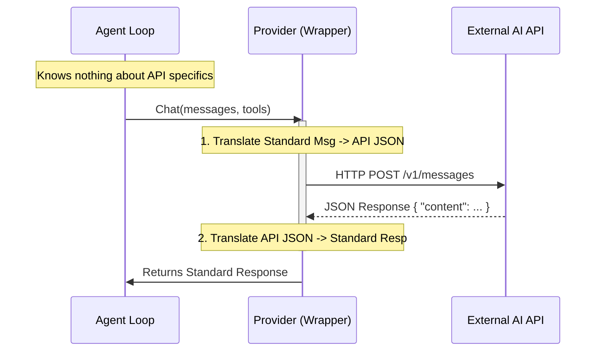

# Chapter 3: LLM Providers

In the previous chapter, [The Agent Loop](02_the_agent_loop.md), we built the "Conductor" of our application—the loop that manages the cycle of Thinking, Acting, and Observing.

However, we mentioned a crucial detail: **The Agent Loop doesn't actually "think."** It is just a process manager. To make decisions, it needs to consult a "Brain."

This brings us to **LLM (Large Language Model) Providers**.

## The Problem: The "Language" Barrier

Imagine you want to build an AI agent. Today, you want to use **OpenAI's GPT-4**. Tomorrow, you might want to switch to **Anthropic's Claude 3.5** because it's better at coding, or use a **Local Model (Ollama)** to save money.

Here is the problem: **Every AI company speaks a different computer language.**

*   **OpenAI** expects a JSON object with `messages: [{"role": "user", ...}]`.
*   **Anthropic** expects `system` prompts to be separate from user messages.
*   **Google Gemini** calls user messages "parts".
*   **GitHub Copilot** uses a completely different protocol called gRPC.

If we wrote our Agent Loop to speak "OpenAI," we would have to rewrite the whole application just to switch to "Claude."

## The Solution: The Universal Translator

In `picoclaw`, we solve this with the **Provider Abstraction**.

Think of the Provider as a **Universal Translator**.
1.  **The Agent** speaks one standard language (PicoClaw format).
2.  **The Provider** translates that into the specific language of the AI model (OpenAI, Claude, etc.).
3.  **The Provider** translates the AI's answer back into PicoClaw format.

This allows you to treat AI models like interchangeable batteries. You can swap them out by changing a single line of configuration.

## Concept 1: The Standard Interface

Regardless of which AI model acts as the brain, `picoclaw` interacts with it using a single, unified function signature.

Here is what the "Interface" looks like conceptually:

```go
// pkg/providers/interface.go (Simplified)

type LLMProvider interface {
    // 1. Context: Standard Go context
    // 2. Messages: The conversation history (Standard Format)
    // 3. Tools: A list of functions the AI is allowed to use
    Chat(ctx context.Context, messages []Message, tools []ToolDefinition) (*LLMResponse, error)
}
```

The Agent Loop (from Chapter 2) *only* calls this function. It doesn't know if `Chat` is calling a server in California or a graphics card on your desk.

## Concept 2: Inside a Provider (Claude Example)

Let's look at how the **Claude Provider** works under the hood. It acts as the bridge between our standard message format and Anthropic's API.

### Step 1: The Client Wrapper
First, we wrap the official Anthropic client. This holds our connection settings.

```go
// pkg/providers/claude_provider.go (Simplified)

type ClaudeProvider struct {
    client *anthropic.Client // The official SDK
}

func NewClaudeProvider(token string) *ClaudeProvider {
    // Initialize the connection to Anthropic
    client := anthropic.NewClient(option.WithAuthToken(token))
    return &ClaudeProvider{client: &client}
}
```

### Step 2: The Translation (Input)
When the Agent calls `Chat`, the Provider must convert our generic messages into Claude-specific structures.

For example, Claude treats `system` messages differently than generic chat messages.

```go
// pkg/providers/claude_provider.go (Simplified Logic)

func buildClaudeParams(messages []Message) anthropic.MessageNewParams {
    var anthropicMessages []anthropic.MessageParam
    
    for _, msg := range messages {
        // Translate "Standard User Message" -> "Anthropic User Message"
        if msg.Role == "user" {
            anthropicMessages = append(anthropicMessages, 
                anthropic.NewUserMessage(anthropic.NewTextBlock(msg.Content)))
        }
        // ... handle other roles like 'assistant' or 'tool' ...
    }
    return anthropic.MessageNewParams{Messages: anthropicMessages}
}
```
*Note: The actual code handles more complex logic for Tool Results, but the concept remains: Loop through inputs -> Convert -> Return specific format.*

### Step 3: The Translation (Output)
When Claude replies, it sends back a complex JSON object. We need to simplify this back into a `LLMResponse` so the Agent Loop can understand it.

```go
// pkg/providers/claude_provider.go (Simplified)

func parseClaudeResponse(resp *anthropic.Message) *LLMResponse {
    // Extract the plain text answer
    content := resp.Content[0].Text 
    
    // Create a standard response object
    return &LLMResponse{
        Content:      content,
        FinishReason: "stop", // Tell the agent we are done
    }
}
```

## Concept 3: Dealing with Exotic Protocols (GitHub Copilot)

Sometimes, the difference isn't just JSON formatting. **GitHub Copilot**, for example, doesn't use standard HTTP REST calls like OpenAI or Claude. It uses a persistent connection protocol called **gRPC**.

Because of our abstraction, the Agent Loop doesn't care!

```go
// pkg/providers/github_copilot_provider.go (Simplified)

func (p *GitHubCopilotProvider) Chat(ctx, msgs, tools) (*LLMResponse, error) {
    // 1. Marshal messages into a single string prompt
    promptJSON, _ := json.Marshal(msgs)

    // 2. Send via the specialized Copilot Session (gRPC)
    content, _ := p.session.Send(ctx, copilot.MessageOptions{
        Prompt: string(promptJSON),
    })

    // 3. Return standard response
    return &LLMResponse{ Content: content }, nil
}
```

**Key Takeaway:** The complexity of managing a specialized gRPC session is completely hidden inside this provider.

## Internal Workflow

Let's visualize exactly what happens when the Agent Loop asks the "Brain" a question.



## Configuration: Switching Brains

Because all complexity is hidden, switching the active provider is done entirely in the configuration file (`config.json`).

To use **Claude**:
```json
{
  "agents": {
    "defaults": {
      "provider": "anthropic",
      "model": "claude-3-5-sonnet-20240620"
    }
  }
}
```

To switch to **OpenAI**:
```json
{
  "agents": {
    "defaults": {
      "provider": "openai",
      "model": "gpt-4o"
    }
  }
}
```

## Summary

In this chapter, we learned:
1.  **The "Language Barrier"**: AI models have different APIs and data formats.
2.  **The Provider Abstraction**: A "Universal Translator" that creates a standard way to chat with any AI.
3.  **Swappability**: The Agent Loop creates the logic, but the Provider supplies the intelligence. We can swap intelligence sources easily.

We now have the **Body** (Agent Loop), the **Senses** (Channels), and the **Brain** (Provider).

However, if you talk to this agent, it will feel very forgetful. If you say "My name is Alice," and then ask "What is my name?", it might forget. This is because we haven't given the brain any **Context**.

In the next chapter, we will learn how to construct the memory and history that gets sent to the Provider.

[Next: Chapter 4 - Context & Memory Builder](04_context___memory_builder.md)

---

Generated by [Code IQ](https://github.com/adityasoni99/Code-IQ)