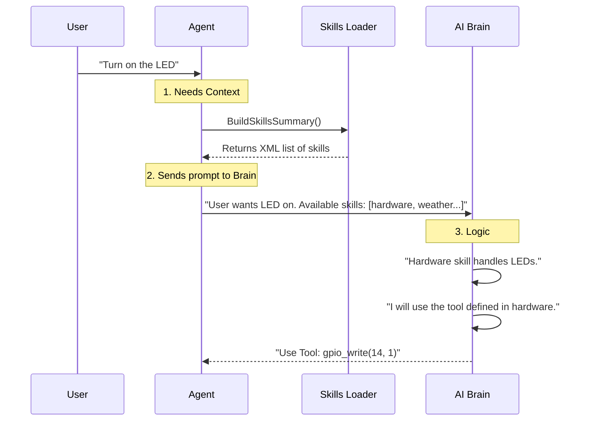

# Chapter 5: Skills System

In the previous chapter, [Context & Memory Builder](04_context___memory_builder.md), we gave our agent a personality and the ability to remember previous conversations.

However, there is still a major gap. Even if an agent knows *who* it is ("I am a robot") and remembers *what* you said ("Turn on the light"), it doesn't necessarily know **how** to do it.

Does "Turn on the light" mean sending an HTTP request? Toggling a hardware pin? Or sending a message to a smart home API?

This is where the **Skills System** comes in.

## The Problem: Tools vs. Manuals

In **PicoClaw**, we distinguish between two concepts:

1.  **Tools:** The actual Go code that performs an action (e.g., `func GPIO_Write(pin int, value int)`).
2.  **Skills:** The **documentation** that teaches the agent how and when to use those tools.

Imagine buying a new IKEA shelf.
*   The **Tools** are the screwdriver and the hammer.
*   The **Skill** is the instruction booklet.

Without the booklet (Skill), you have the tools, but you don't know which screw goes where.

## Concept 1: The Skill File

A **Skill** in PicoClaw is simply a folder containing a Markdown file named `SKILL.md`.

Instead of writing complex logic in Go, you write instructions in plain English. The agent reads this file to understand its capabilities.

### Example: The Hardware Skill
Let's look at a real skill file for controlling hardware pins.

```markdown
---
name: hardware
description: Control physical pins (GPIO) on the device.
---

# Hardware Control

Use this skill when the user asks to control lights or sensors.

## Configuration
- **LED Light**: Connected to Pin 14. Set to "1" to turn ON.
- **Fan**: Connected to Pin 2. Set to "1" to turn ON.

## How to use
Use the tool `gpio_write` to change the state.
```

**What happens here?**
1.  **Frontmatter (Top):** Metadata telling the system the name ("hardware") and a short summary.
2.  **Body:** Context-specific knowledge. It tells the agent that "Light" = "Pin 14". The underlying code doesn't know this; only the Skill does.

## Concept 2: The Loader (The Librarian)

We need a system to find all these instruction booklets and organize them. This is the **Skills Loader**.

It looks in three places:
1.  **Built-in:** Skills that come with PicoClaw.
2.  **Global:** Skills installed in your user folder (`~/.picoclaw/skills`).
3.  **Workspace:** Skills specific to your current project.

The Loader scans these folders to build a catalog.

```go
// pkg/skills/loader.go (Simplified)

func (sl *SkillsLoader) ListSkills() []SkillInfo {
    var skills []SkillInfo

    // 1. Check the workspace folder for "SKILL.md" files
    dirs, _ := os.ReadDir(sl.workspaceSkills)
    
    for _, dir := range dirs {
        // 2. Load the metadata (name, description)
        path := filepath.Join(sl.workspaceSkills, dir.Name(), "SKILL.md")
        meta := sl.getSkillMetadata(path)
        
        // 3. Add to our list
        skills = append(skills, SkillInfo{Name: meta.Name, Path: path})
    }
    return skills
}
```

**Explanation:**
The Loader acts like a librarian walking through the shelves (directories), looking at the book covers (metadata), and making a list of what is available.

## Concept 3: Context Injection (The Menu)

We cannot feed the *entire* text of every skill manual into the AI at once. That would be too much text (Context Window limit) and too expensive.

Instead, we provide a **Summary** or a **Menu**.

When the agent starts thinking, the Skills System generates a list of available capabilities and injects it into the System Prompt.

```xml
<skills>
  <skill>
    <name>weather</name>
    <description>Get current weather info.</description>
  </skill>
  <skill>
    <name>hardware</name>
    <description>Control physical pins (GPIO).</description>
  </skill>
</skills>
```

### The Code
Here is how the loader builds this summary string:

```go
// pkg/skills/loader.go (Simplified)

func (sl *SkillsLoader) BuildSkillsSummary() string {
    // Get the list of all skills
    allSkills := sl.ListSkills()
    var lines []string

    lines = append(lines, "<skills>")
    
    // Loop through and format them as XML
    for _, s := range allSkills {
        lines = append(lines, fmt.Sprintf("  <skill>"))
        lines = append(lines, fmt.Sprintf("    <name>%s</name>", s.Name))
        lines = append(lines, fmt.Sprintf("    <description>%s</description>", s.Description))
        lines = append(lines, "  </skill>")
    }
    
    lines = append(lines, "</skills>")
    return strings.Join(lines, "\n")
}
```

## Internal Workflow

How does the agent go from "List of Skills" to actually using one?

1.  **Summary:** The Agent sees the summary in the system prompt.
2.  **Trigger:** The User asks: "Turn on the LED."
3.  **Association:** The Agent's Brain (LLM) sees the word "LED" and looks at the skill list. It sees `hardware` skill mentions "Control physical pins".
4.  **Action:** The Agent decides to use the specific knowledge inside that skill.



## Advanced: Retrieving Full Knowledge

In the basic version, the summary is often enough. But sometimes, a Skill is very long (like a reference manual for a complex chip).

If the agent needs the **full** text of a skill, the Loader provides a function to read the specific file content.

```go
// pkg/skills/loader.go (Simplified)

func (sl *SkillsLoader) LoadSkill(name string) (string, bool) {
    // Construct the path: workspace/skills/hardware/SKILL.md
    skillFile := filepath.Join(sl.workspaceSkills, name, "SKILL.md")
    
    // Read the file from disk
    content, err := os.ReadFile(skillFile)
    if err != nil {
        return "", false
    }

    // Remove the top metadata (-- name: hardware --) and return the rest
    return sl.stripFrontmatter(string(content)), true
}
```

This allows the Context Builder (from Chapter 4) to dynamically pull in the full manual if the agent is focused on a specific task.

## Why is this beginner-friendly?

The beauty of the Skills System is that **you don't need to be a programmer to teach the AI.**

If you want to teach your agent that "Code Red" means "Turn on all lights and play a siren," you don't edit the Go code. You just edit a Markdown file:

```markdown
# Emergency Procedures
If the user says "Code Red":
1. Use tool `light_control` to set brightness to 100.
2. Use tool `sound_play` to play "siren.mp3".
```

The Agent reads this, understands it, and executes it using the Tools it has available.

## Summary

In this chapter, we learned:
1.  **Skills are Documentation:** They are Markdown files that explain *how* to use the agent's capabilities.
2.  **Separation of Concerns:** Code (Tools) handles the mechanics; Text (Skills) handles the logic and knowledge.
3.  **The Loader:** Scans directories to find available skills.
4.  **Context Injection:** Feeds a summary of skills to the AI so it knows what it can do.

Now the agent knows *what* it can do (via Skills) and *how* to plan it. But we haven't actually executed any code yet! The Agent might decide to "Use Tool: gpio_write", but how does the system actually run that function?

In the next chapter, we will dive into the engine room to see how Tools are registered and executed.

[Next: Chapter 6 - Tool Registry & Execution](06_tool_registry___execution.md)

---

Generated by [Code IQ](https://github.com/adityasoni99/Code-IQ)