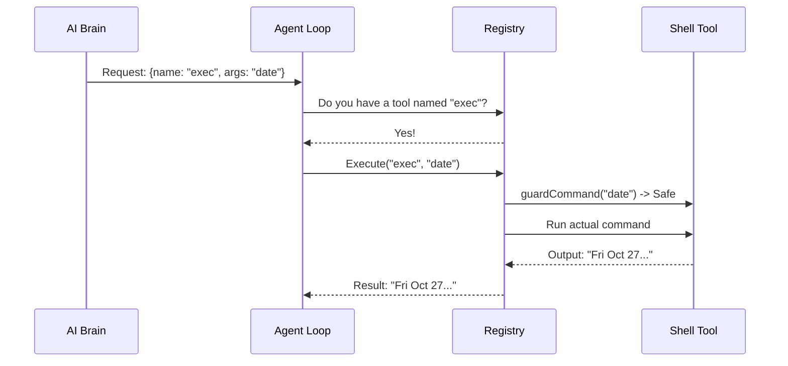

# Chapter 6: Tool Registry & Execution

Welcome back! In the previous chapter, [Skills System](05_skills_system.md), we taught our agent *how* to use tools by giving it instruction manuals (Markdown files).

But here is the problem: **Reading a manual on how to hammer a nail doesn't actually hammer the nail.**

The AI (the brain) exists only in the cloud or on a GPU. It outputs text like: `"Please run the command: echo hello"`. It cannot physically reach into your computer's operating system to execute that command.

We need a pair of "Hands" to do the actual work. In **PicoClaw**, this is the **Tool Registry & Execution** layer.

## The Problem: Text vs. Action

Imagine you are at a restaurant.
1.  **The Menu (Skills):** Describes the food.
2.  **The Order (LLM Output):** You say "I want the burger."
3.  **The Kitchen (Tool Execution):** The actual process of cooking the burger.

If the restaurant had a menu but no kitchen, you would starve. The **Tool Registry** is the kitchen. It takes the "Order" (text from the AI) and turns it into "Food" (executed code).

## Concept 1: The Registry (The Toolbox)

The Registry is a simple dictionary (or Map) that connects a **Name** (string) to a **Go Function**.

The AI doesn't know about Go functions. It only knows names.
*   **AI Says:** "Use `exec`."
*   **Registry:** "Okay, let me look up `exec`... Ah, that corresponds to the `ExecTool` struct in the code."

### The Interface
Every tool in PicoClaw must look the same so the Registry can handle them comfortably. They all adhere to a specific interface (shape).

```go
// The standard shape for any tool
type Tool interface {
    Name() string
    Description() string
    // The actual work happens here
    Execute(ctx context.Context, args map[string]interface{}) *ToolResult
}
```

### The Registration
When PicoClaw starts, we put our tools into the toolbox.

```go
// pkg/tools/registry.go (Conceptual)

func SetupRegistry() *ToolRegistry {
    registry := NewToolRegistry()

    // Add the "Hand" that runs shell commands
    shellTool := NewExecTool("/home/user", true)
    
    // Put it in the box
    registry.Register(shellTool)
    
    return registry
}
```

**Explanation:** We create the tool once, configure it (setting the working directory), and store it. Now the system knows that the tool exists.

## Concept 2: Safe Execution (The Guard)

Giving an AI access to your computer's shell is powerful, but dangerous. What if the AI gets confused and tries to delete your files?

The Tool system includes **Safety Guards**. Before running any code, the tool inspects the arguments.

Let's look at the `ExecTool` (Shell). It checks the command against a "Deny List" before running it.

```go
// pkg/tools/shell.go (Simplified)

func (t *ExecTool) guardCommand(command string) string {
    // Check for dangerous patterns
    if strings.Contains(command, "rm -rf") {
        return "Command blocked: dangerous pattern detected"
    }
    
    if strings.Contains(command, "format c:") {
        return "Command blocked: disk format attempt"
    }

    return "" // Empty string means it's safe
}
```

**Why is this important?**
The AI is probabilistic—it makes guesses. Sometimes it guesses wrong. The Registry ensures that a wrong guess doesn't destroy your computer.

## Concept 3: The Execution Flow

So, how do we get from a text message to a running program?

1.  **AI Request:** The Provider (Chapter 3) returns a standardized object saying: "Call `exec` with arguments `command='date'`".
2.  **Lookup:** The Registry finds the tool named `exec`.
3.  **Run:** The Registry calls `tool.Execute()`.
4.  **Result:** The tool returns a string: `"Fri Oct 27 10:00:00 UTC 2023"`.



## Internal Implementation

Let's look under the hood at how PicoClaw manages this inside `pkg/tools/registry.go` and `pkg/tools/toolloop.go`.

### The Lookup and Run
The `ExecuteWithContext` function is the main entry point. It adds logging and handles errors gracefully so the whole program doesn't crash if a tool fails.

```go
// pkg/tools/registry.go (Simplified)

func (r *ToolRegistry) Execute(name string, args map[string]interface{}) *ToolResult {
    // 1. Look up the tool in our map
    tool, found := r.tools[name]
    
    if !found {
        return ErrorResult("Tool not found")
    }

    // 2. Run the tool's Execute function
    // We time it to see how long it takes
    start := time.Now()
    result := tool.Execute(context.Background(), args)
    
    // 3. Log the result
    logger.Info("Tool finished in", time.Since(start))
    
    return result
}
```

### The "Tool Loop"
This is a critical piece of logic found in `pkg/tools/toolloop.go`.

When an AI uses a tool, it usually expects to see the result so it can give a final answer.
*   **User:** "What files are in this folder?"
*   **AI:** (Calls `ls`)
*   **Tool:** (Returns `file1.txt, file2.txt`)
*   **AI:** (sees result) -> "The files are file1.txt and file2.txt."

The **Tool Loop** automates this back-and-forth.

```go
// pkg/tools/toolloop.go (Simplified Logic)

func RunToolLoop(messages []Message, registry *ToolRegistry) {
    for {
        // 1. Ask the AI what to do
        response := CallAI(messages)

        // 2. If AI wants to use a tool...
        if len(response.ToolCalls) > 0 {
            
            // 3. Execute the tool
            result := registry.Execute(response.ToolName, response.Args)

            // 4. Add the result to memory (Context)
            messages = append(messages, Message{
                Role: "tool",
                Content: result.Output,
            })
            
            // 5. Loop executes again! The AI will now see the tool output.
            continue
        }

        // If no tool calls, we are done.
        break
    }
}
```

## Integrating with Previous Chapters

This chapter connects everything we've built so far:

1.  **[Communication Channels](01_communication_channels.md):** The user sends a command.
2.  **[Context & Memory Builder](04_context___memory_builder.md):** We tell the AI "You have a tool named `exec`."
3.  **[Skills System](05_skills_system.md):** The AI reads the manual to know *when* to use `exec`.
4.  **[LLM Providers](03_llm_providers.md):** The AI decides to pull the trigger.
5.  **Tool Registry (This Chapter):** We actually execute the command.

## Summary

In this chapter, we learned:
1.  **The Registry** is the "Hands" of the agent, converting text requests into code execution.
2.  **Tools** are standard Go structs that perform specific actions (like running shell commands).
3.  **Safety Guards** prevent the AI from running dangerous commands accidentally.
4.  **The Tool Loop** feeds the result of the tool back into the AI, allowing it to "see" what it did.

Now our agent can talk, think, remember, and run computer commands. But what if we want it to interact with the physical world? What if we want it to move a robot arm or read a physical sensor?

In the final chapter, we will connect our software brain to hardware.

[Next: Chapter 7 - Hardware Interface](07_hardware_interface.md)

---

Generated by [Code IQ](https://github.com/adityasoni99/Code-IQ)