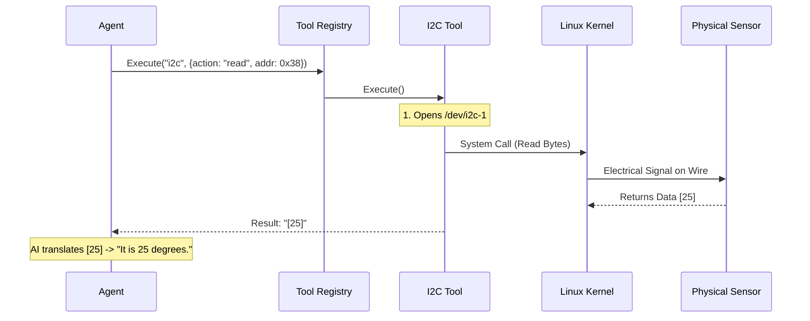

# Chapter 7: Hardware Interface

Welcome to the final chapter of the **PicoClaw** tutorial!

In the previous chapter, [Tool Registry & Execution](06_tool_registry___execution.md), we gave our agent a pair of "hands" to execute software commands. We learned how the agent can run shell commands to manage files or check system time.

But **PicoClaw** is designed for *embedded devices*—computers that interact with the physical world. We want our agent to do more than just manage files; we want it to read temperature sensors, control robot motors, and detect when a USB camera is plugged in.

This chapter introduces the **Hardware Interface**, the "Nervous System" that bridges the gap between high-level AI text and low-level electrical signals.

## The Problem: The Language Barrier

AI models (LLMs) live in a world of **Text**. They understand sentences like "Turn on the light."
Hardware devices (Sensors, Motors) live in a world of **Electricity** and **Protocols**. They understand signals like "Send 0x01 to I2C Address 0x38."

If you connect a temperature sensor to your computer, the AI cannot simply "look" at it. We need a translation layer that:
1.  **Talks to Hardware:** Uses protocols like I2C or SPI to send electrical signals.
2.  **Talks to AI:** converts those signals into text the agent understands.

## Concept 1: The Protocols (Active Control)

To control hardware, we wrap standard communication protocols inside **Tools** (just like we did in Chapter 6). The two most common protocols used in embedded Linux are **I2C** and **SPI**.

### Analogy: The Classroom (I2C)
Imagine a teacher (The CPU) and many students (Sensors) in a classroom.
*   **The Bus:** Everyone shares the air in the room to talk.
*   **The Address:** The teacher says "Hey **Alice** (Address 0x10), what is the answer?" Only Alice replies.
*   **The Data:** Alice says "42".

In PicoClaw, the **I2C Tool** acts as the teacher. It allows the AI to pick a specific device address and ask for data.

### Analogy: The Private Phone Line (SPI)
Imagine a boss (CPU) with direct, private phone lines to specific employees (Displays/Motors).
*   **Speed:** Because it's a private line, they can talk extremely fast.
*   **Duplex:** They can talk and listen at the same time.

In PicoClaw, the **SPI Tool** manages these high-speed connections.

## Concept 2: The Device Service (Passive Listening)

Sometimes, the hardware needs to talk to the agent *first*.

Imagine you plug a USB camera into your robot. The agent shouldn't have to constantly ask, "Is a camera plugged in yet? How about now? Now?"

Instead, we use a **Device Service**. This acts like a doorbell.
1.  **Wait:** It sits in the background monitoring the Linux kernel.
2.  **Event:** You plug in a USB device.
3.  **Notify:** The service rings the doorbell and sends a message to the Agent: *"New USB device detected: WebCam."*

## Internal Workflow

Let's visualize how an AI request travels all the way down to a physical wire.

**Scenario:** The user asks, "What is the temperature?" (The sensor is on the I2C bus).



## Implementation: The I2C Tool

Let's look at how we build the bridge for I2C. We treat it exactly like the software tools from Chapter 6, but this time we interact with Linux device files (like `/dev/i2c-1`).

### Step 1: Defining the Tool
The tool defines the "grammar" the AI must use. The AI needs to know it must provide an `address` and an `action`.

```go
// pkg/tools/i2c.go (Simplified)

type I2CTool struct{}

func (t *I2CTool) Parameters() map[string]interface{} {
    return map[string]interface{}{
        // We tell the AI: You must pick an action like "read" or "write"
        "action":  []string{"detect", "read", "write"},
        // You must provide the hardware address (e.g., 0x38)
        "address": "integer", 
        // You must say which bus to use
        "bus":     "string",
    }
}
```

### Step 2: Executing the Logic
When the AI decides to "read," this function runs. It checks if we are running on Linux (since Windows doesn't have I2C files) and then routes the command.

```go
// pkg/tools/i2c.go (Simplified)

func (t *I2CTool) Execute(ctx context.Context, args map[string]interface{}) *ToolResult {
    // 1. Safety Check: Are we on a board that supports this?
    if runtime.GOOS != "linux" {
        return ErrorResult("I2C is only supported on Linux.")
    }

    // 2. Figure out what the AI wants to do
    action := args["action"].(string)

    switch action {
    case "detect":
        return t.detect() // List all devices
    case "read":
        return t.readDevice(args) // Get data from sensor
    }
    return ErrorResult("Unknown action")
}
```

### Step 3: Scanning the Hardware
How does `detect` work? In Linux, I2C buses appear as files. We just look for files named `/dev/i2c-*`.

```go
// pkg/tools/i2c.go (Simplified)

func (t *I2CTool) detect() *ToolResult {
    // Look for files like /dev/i2c-0, /dev/i2c-1
    matches, _ := filepath.Glob("/dev/i2c-*")

    if len(matches) == 0 {
        return SilentResult("No I2C buses found.")
    }

    // Return the list to the AI
    return SilentResult(fmt.Sprintf("Found I2C buses: %v", matches))
}
```

**Explanation:** The AI calls `detect`, and the code checks the file system. If it finds `/dev/i2c-1`, it tells the AI: *"I found a bus you can use!"*

## Implementation: The Event Monitor

Now let's look at the passive listener. This runs alongside the [Agent Loop](02_the_agent_loop.md) and injects messages when hardware changes.

### Step 1: The Service Manager
The service manages a list of "Event Sources" (like USB or Bluetooth monitors).

```go
// pkg/devices/service.go (Simplified)

type Service struct {
    bus     *bus.MessageBus // Link to the Agent's brain
    sources []EventSource   // Things to watch (e.g., USB)
}

func (s *Service) Start(ctx context.Context) error {
    // Loop through sources (like USB monitor) and start them
    for _, src := range s.sources {
        // Start a background process (goroutine) for each
        go s.handleEvents(src.Start(ctx))
    }
    return nil
}
```

### Step 2: Injecting the Message
When a USB event happens, we don't want to just log it. We want the Agent to *react*. We construct a message and send it to the [Communication Channels](01_communication_channels.md) (specifically, the one the user is currently using).

```go
// pkg/devices/service.go (Simplified)

func (s *Service) sendNotification(ev *DeviceEvent) {
    // 1. Find out where the user is (e.g., Telegram)
    platform, userID := s.getLastUserChannel()

    // 2. Create a message
    // e.g., "USB Device Inserted: Mass Storage"
    msg := bus.OutboundMessage{
        Channel: platform,
        Content: ev.FormatMessage(),
    }

    // 3. Push it to the Agent
    s.bus.PublishOutbound(msg)
}
```

**Result:** You plug in a USB drive, and suddenly your Telegram bot messages you: *"I noticed you plugged in a USB drive. Should I scan it?"*

## Putting It All Together

We have now built the entire pipeline for a physical AI agent.

1.  **[Communication Channels](01_communication_channels.md):** User sends "Turn on the Fan" via Telegram.
2.  **[The Agent Loop](02_the_agent_loop.md):** The Agent receives the message.
3.  **[Context & Memory Builder](04_context___memory_builder.md):** The Agent remembers who it is.
4.  **[Skills System](05_skills_system.md):** The Agent reads the `hardware` skill and learns that "Fan" = "I2C Address 0x40".
5.  **[Tool Registry](06_tool_registry___execution.md):** The Agent selects the `i2c` tool.
6.  **Hardware Interface (This Chapter):** The `i2c` tool writes bytes to the physical chip on the Linux board.
7.  **Reality:** The fan spins!

## Conclusion

Congratulations! You have completed the PicoClaw architecture tutorial.

We started with a simple text-processing bot and evolved it into an intelligent agent capable of:
*   Speaking multiple protocols (Telegram, Discord).
*   Thinking and Planning (LLM Providers).
*   Remembering context (Memory).
*   Executing code (Tools).
*   Interacting with the physical world (Hardware Interface).

You now have a complete mental model of how an embedded AI agent works from the inside out. You are ready to start building your own skills and tools for **PicoClaw**.

**End of Tutorial.**

---

Generated by [Code IQ](https://github.com/adityasoni99/Code-IQ)