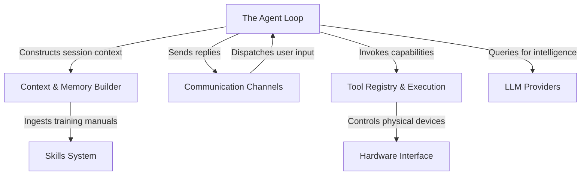

# Tutorial: picoclaw

PicoClaw is an **ultra-lightweight personal AI agent** designed to run on embedded devices and development boards. It acts as a central "brain" that connects various **communication channels** (like Telegram or Discord) to *Large Language Models* (LLMs) to understand and process user requests. Uniquely, it combines **long-term memory** with a modular **skills system**, allowing the AI to interact directly with the physical world through **hardware interfaces** (GPIO, I2C, SPI) and local system tools.

**Source Repository:** [https://github.com/sipeed/picoclaw](https://github.com/sipeed/picoclaw)

## Chapters

1. [Communication Channels](01_communication_channels.md)
2. [The Agent Loop](02_the_agent_loop.md)
3. [LLM Providers](03_llm_providers.md)
4. [Context & Memory Builder](04_context___memory_builder.md)
5. [Skills System](05_skills_system.md)
6. [Tool Registry & Execution](06_tool_registry___execution.md)
7. [Hardware Interface](07_hardware_interface.md)

---

Generated by [Code IQ](https://github.com/adityasoni99/Code-IQ)