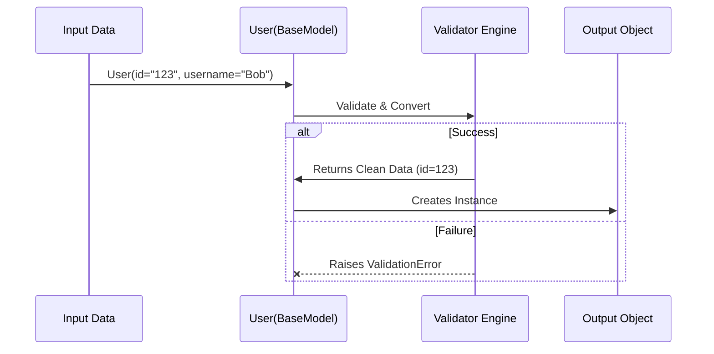

# Chapter 1: BaseModel

Welcome to the world of Pydantic! If you have ever struggled with messy dictionaries, missing keys, or messy data types in Python, you are in the right place.

We start our journey with the most fundamental building block of Pydantic: the **`BaseModel`**.

## The Problem: Unruly Dictionaries

In standard Python, we often use dictionaries to represent data. Imagine you are building a user registration system.

```python
# A raw dictionary
user = {
    "id": "123",       # Wait, should this be an integer?
    "username": "jane",
    # "email" is missing!
}
```

If you pass this dictionary around your code, you have to manually check:
1. Does the "id" exist?
2. Is "id" a number?
3. Is "email" present?

This leads to a lot of repetitive, error-prone `if` statements.

## The Solution: The Smart Blueprint

`BaseModel` is a class you inherit from to define a **schema**. Think of it as a smart blueprint or a contract. You tell Pydantic what your data *should* look like, and Pydantic ensures the data matches that description.

If the data doesn't match, Pydantic will either:
1. **Fix it** (Coercion): Turn the string "123" into the integer `123`.
2. **Reject it** (Validation Error): Raise an error if the data is completely wrong.

### Central Use Case: Creating a User

Let's define a strict structure for our User using `BaseModel`.

```python
from pydantic import BaseModel

class User(BaseModel):
    id: int
    username: str
    email: str = "no_email@example.com"
```

Here is what we just did:
*   We created a class `User` that inherits from `BaseModel`.
*   We defined fields (`id`, `username`) with **Python Type Hints**.
*   We gave `email` a default value.

## How to Use BaseModel

Let's see this "Smart Blueprint" in action.

### 1. Happy Path (Valid Data)

When we create an instance of `User`, Pydantic accepts valid data and assigns it to the object attributes.

```python
# Creating an instance
user = User(id=1, username="Alice", email="alice@test.com")

print(user.username)
# Output: Alice
print(type(user.id))
# Output: <class 'int'>
```

### 2. Automatic Data Conversion (Coercion)

This is one of Pydantic's superpowers. If you pass a string that *looks* like a number into an integer field, Pydantic fixes it for you.

```python
# 'id' is passed as a string "500"
user = User(id="500", username="Bob")

print(user.id)
# Output: 500
print(type(user.id))
# Output: <class 'int'> (It is now a real integer!)
```

### 3. Handling Errors

If you pass data that cannot be fixed (like "apple" for an ID), Pydantic stops you at the door.

```python
from pydantic import ValidationError

try:
    # 'id' cannot be "apple"
    User(id="apple", username="Charlie")
except ValidationError as e:
    print("Blocked! Invalid data.")
```

## Internal Implementation: Under the Hood

How does `BaseModel` do this magic? It relies heavily on a relationship between Python's class creation process and a high-performance validation engine written in Rust (called `pydantic-core`).

### High-Level Flow

When you define the class `User(BaseModel)`, Pydantic scans your type hints and builds a hidden "validator" function. When you create a new object `User(...)`, that hidden validator runs.



### Code Deep Dive

Let's look at a simplified view of what happens inside `pydantic/main.py`.

When you initialize a model, the `__init__` method is called. Unlike a standard Python class where you might write `self.x = x`, Pydantic hands everything over to the validator immediately.

```python
# Simplified excerpt from pydantic/main.py

class BaseModel:
    def __init__(self, /, **data):
        # The validation happens here!
        # __pydantic_validator__ is a special object built when the class was defined
        validated_self = self.__pydantic_validator__.validate_python(
            data, 
            self_instance=self
        )
```

**Key concept:** The `__pydantic_validator__` is the engine. It is extremely fast because it is written in Rust (part of [Pydantic Core Engine](07_pydantic_core_engine.md)).

But how does the class know about the types `int` or `str`? This happens **before** `__init__`, during the class definition, handled by a "Metaclass".

In `pydantic/_internal/_model_construction.py`, the `ModelMetaclass` inspects your class annotations:

```python
# Conceptual simplification of _model_construction.py

class ModelMetaclass(type):
    def __new__(cls, name, bases, namespace):
        # 1. Collect type hints (annotations)
        fields = collect_model_fields(namespace)
        
        # 2. Build the Core Schema (the validation rules)
        schema = generate_schema(fields)
        
        # 3. Create the Rust validator from the schema
        namespace['__pydantic_validator__'] = create_validator(schema)
        
        return super().__new__(cls, name, bases, namespace)
```

### Summary of Internals
1.  **Definition Time:** Pydantic reads your `id: int` hints and builds a compiled schema validator.
2.  **Runtime:** When you call `User(...)`, the data is passed straight to that high-speed validator.
3.  **Result:** You get a valid Python object with correct types, or an error.

## Conclusion

The `BaseModel` is your starting point. It transforms standard Python classes into powerful data parsers. By simply inheriting from it and adding type hints, you ensure your application deals with clean, valid data.

However, sometimes you need more control than just `int` or `str`. You might need to set default values, add descriptions, or limit a number to a specific range (e.g., `age` must be positive).

For that, we need to customize our fields.

[Next Chapter: Fields (FieldInfo)](02_fields__fieldinfo_.md)

---

Generated by [Code IQ](https://github.com/adityasoni99/Code-IQ)