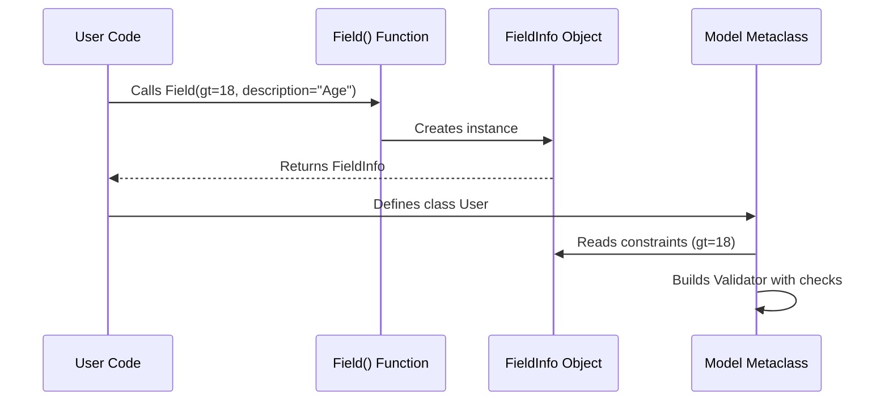

# Chapter 2: Fields (FieldInfo)

In the previous [Chapter 1: BaseModel](01_basemodel.md), we learned how to define a basic blueprint for our data using Python type hints. We ensured that an `id` is an `int` and a `username` is a `str`.

But what if a user enters `-50` as their age? Or provides an empty string `""` as a username? Python's `int` and `str` types allow these, but our application logic shouldn't.

This is where **`Field`** comes in.

## The Sticky Note Analogy

Think of a standard Python type hint (`name: str`) as a line on a blueprint. It tells the builder "Put a string here."

Using `Field(...)` is like sticking a **yellow note** on that line of the blueprint that adds extra instructions:
*   "Must be at least 3 characters long."
*   "If missing, use 'Guest' as the default."
*   "In the database, this column is named 'user_name_val'."

## Central Use Case: A Robust User Profile

Let's build a stronger `User` model. We want to ensure:
1.  **Age** must be 18 or older.
2.  **ID** should be a random unique ID generated automatically.
3.  **Username** must be provided and cannot be whitespace.

We import `Field` from `pydantic` to make this happen.

### 1. Numeric Constraints

We can enforce mathematical rules on numbers.

```python
from pydantic import BaseModel, Field

class User(BaseModel):
    # 'gt' means Greater Than
    age: int = Field(gt=17) 
    
    # 'le' means Less Than or Equal
    score: int = Field(le=100)
```

If we try to create a user with `age=10`, Pydantic will stop us.

```python
from pydantic import ValidationError

try:
    User(age=10, score=90)
except ValidationError as e:
    print(e)
    # Error: Input should be greater than 17
```

### 2. String Constraints

We can also restrict the length or pattern of strings.

```python
class User(BaseModel):
    # Must be between 3 and 20 characters
    username: str = Field(min_length=3, max_length=20)
    
    # Must match a regex (only letters and numbers)
    code: str = Field(pattern=r'^[a-zA-Z0-9]+$')
```

### 3. Dynamic Default Values (`default_factory`)

In Chapter 1, we saw simple defaults like `active: bool = True`. But what if the default needs to be generated fresh every time, like a timestamp or a unique ID?

If we used `id: UUID = uuid4()`, the ID would be generated **once** when the class loads, and every user would have the same ID!

Instead, we use `default_factory`.

```python
from uuid import UUID, uuid4
from pydantic import BaseModel, Field

class User(BaseModel):
    # Pydantic calls uuid4() every time a new User is created
    id: UUID = Field(default_factory=uuid4)
    name: str

user1 = User(name="Alice")
user2 = User(name="Bob")

print(user1.id != user2.id) # True! They are unique.
```

### 4. Aliases (Handling External Data)

Sometimes the data you receive (from an API or database) has weird names, but you want clean names in your Python code.

Imagine an API sends you data like `{"u_n": "Alice"}`.

```python
class User(BaseModel):
    # Map 'u_n' from input to 'username' in Python
    username: str = Field(alias="u_n")

# Reading the ugly external data
data = {"u_n": "Alice"}
user = User(**data)

print(user.username) 
# Output: Alice
```

## Documentation and Metadata

You can also use `Field` simply to document your code. This is incredibly useful if you generate automatic documentation (like Swagger/OpenAPI) from your models.

```python
class Item(BaseModel):
    name: str = Field(
        title="Item Name", 
        description="The name of the item in the inventory"
    )
```

## Internal Implementation: Under the Hood

What actually happens when you write `age: int = Field(gt=18)`?

### Conceptual Flow

When Python executes your class definition, `Field(...)` is a function. It doesn't return an integer. It returns a special object called **`FieldInfo`**.

Pydantic's Metaclass (the model builder) sees this `FieldInfo` object attached to the `age` attribute and says: "Aha! I shouldn't just look for an `int`. I need to bake a 'Greater Than 18' check into the validator."



### Code Deep Dive

Let's look at `pydantic/fields.py`.

The `Field` function is actually a helper. It takes your arguments and creates an instance of `FieldInfo`.

```python
# pydantic/fields.py (Simplified)

def Field(
    default: Any = PydanticUndefined,
    *,
    alias: str | None = None,
    gt: float | None = None,
    description: str | None = None,
    # ... many other arguments
) -> Any:
    # It returns a FieldInfo object!
    return FieldInfo.from_field(
        default, alias=alias, gt=gt, description=description
    )
```

The real magic holder is the `FieldInfo` class. It stores everything you passed in.

```python
# pydantic/fields.py (Simplified)

class FieldInfo:
    def __init__(self, **kwargs):
        # Stores constraints like 'gt', 'lt' in a metadata list
        self.metadata = self._collect_metadata(kwargs)
        
        # Stores attributes like description, alias
        self.description = kwargs.get('description')
        self.alias = kwargs.get('alias')
        
        # Tracks which attributes were explicitly set by the user
        self._attributes_set = {
            k: v for k, v in kwargs.items() 
            if v is not Unset
        }
```

When you inspect `User.model_fields`, you are looking at these `FieldInfo` objects.

```python
# Inspecting the internals
print(User.model_fields['age'])
# Output: FieldInfo(annotation=int, required=True, metadata=[Gt(gt=17)])
```

### Why does `Field()` return `Any`?

If you look at the source code, the type hint says `def Field(...) -> Any`.
Why not `-> FieldInfo`?

If it returned `FieldInfo`, static type checkers (like MyPy) would complain:
```python
# If Field returned FieldInfo, MyPy would say:
# "Error: Incompatible types in assignment. Expected 'int', got 'FieldInfo'."
age: int = Field(gt=18)
```
By saying it returns `Any`, Pydantic tricks the editor into accepting the assignment, while the Pydantic Metaclass handles the logic at runtime.

## Conclusion

The `Field` function allows us to attach "Sticky Notes" to our blueprint. We can enforce strict rules (`gt`, `min_length`), handle dynamic defaults (`default_factory`), and manage messy external data names (`alias`).

Now that we have powerful fields, we might encounter scenarios where `gt=0` isn't enough. What if we need to validate that `password` matches `confirm_password`? Or that a username is unique in a database?

For logic that involves custom code or multiple fields, we need **Validators**.

[Next Chapter: Functional Validators](03_functional_validators.md)

---

Generated by [Code IQ](https://github.com/adityasoni99/Code-IQ)