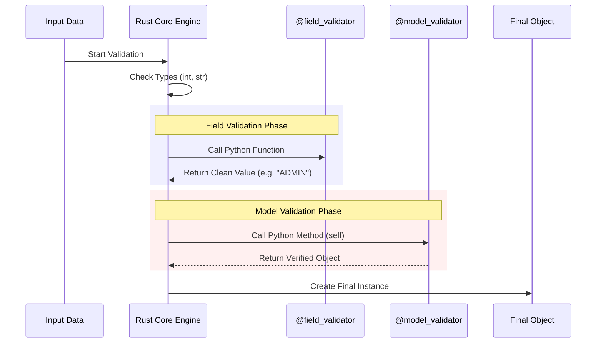

# Chapter 3: Functional Validators

In the previous [Chapter 2: Fields (FieldInfo)](02_fields__fieldinfo_.md), we learned how to attach "sticky notes" to our blueprint using `Field(...)`. We could enforce simple rules like "age > 18" or "string length < 10".

But what if your rules are more complex?
*   "The username must not contain the word 'admin'."
*   "The confirmation password must match the password."
*   "If `subscription` is 'premium', `payment_method` is required."

Standard `Field` parameters cannot handle logic involving variable code or relationships between multiple fields. For this, we need **Functional Validators**.

## The Quality Control Inspectors

Think of your data passing through a factory line.
1.  **Type Checks (`BaseModel`):** The machine ensures the raw material is the right material (Integer, String).
2.  **Field Constraints (`Field`):** The machine ensures the material fits basic dimensions (Size, Length).
3.  **Functional Validators:** These are human **Inspectors**. They pick up the object, look at it, run custom tests, and verify complex rules.

Pydantic provides two types of inspectors:
1.  **`@field_validator`**: Checks one specific part (e.g., "Is this specific string valid?").
2.  **`@model_validator`**: Checks the whole product (e.g., "Do these two parts fit together?").

## Use Case: Account Registration

Let's build a registration system. We need to:
1.  Force the `role` field to be uppercase (Normalization).
2.  Ensure `password` and `confirm_password` match (Consistency).

## 1. Field Validators (`@field_validator`)

A field validator is a function (decorator) that runs custom logic on a specific field.

### syntax
It is a class method that takes the input value and **must return** the value (either the same one or a modified one).

```python
from pydantic import BaseModel, field_validator

class User(BaseModel):
    role: str

    @field_validator('role')
    @classmethod
    def enforce_uppercase(cls, v: str) -> str:
        # v is the value being validated
        return v.upper()
```

### In Action
When we create a user, the inspector automatically runs.

```python
user = User(role="admin")
print(user.role)
# Output: ADMIN
```

### Raising Errors
If the data is bad, we raise a standard Python `ValueError`. Pydantic catches this and converts it into a nice `ValidationError`.

```python
    @field_validator('role')
    @classmethod
    def must_be_admin_or_user(cls, v: str) -> str:
        if v not in ['ADMIN', 'USER']:
            raise ValueError('Role must be ADMIN or USER')
        return v
```

## 2. Model Validators (`@model_validator`)

Sometimes, looking at one field isn't enough. To check if `password` matches `confirm_password`, we need access to the **entire object**.

This is where `model_validator` comes in. It runs **after** the individual fields have been validated.

### Syntax
We use `mode='after'` to tell Pydantic: "Let the standard checks finish first, then let me look at the complete object."

```python
from typing import Self
from pydantic import BaseModel, model_validator

class Register(BaseModel):
    password: str
    confirm_password: str

    @model_validator(mode='after')
    def check_passwords_match(self) -> Self:
        if self.password != self.confirm_password:
            raise ValueError('Passwords do not match')
        return self
```

### In Action

```python
from pydantic import ValidationError

try:
    Register(password="secret", confirm_password="wrong")
except ValidationError as e:
    print(e)
    # Output: Value error, Passwords do not match
```

### Key Difference
*   **Field Validator:** specific to one attribute. Receives the value `v`.
*   **Model Validator:** general purpose. Receives the instance `self`.

## Internal Implementation: Under the Hood

How does Pydantic know to run your custom Python function inside its Rust-based engine?

### Conceptual Flow

When you define a class with these decorators, Pydantic doesn't just leave them as simple methods. It wraps them and injects them into the validation pipeline.

1.  **Input:** Raw data comes in.
2.  **Core Validation:** Pydantic Core (Rust) checks types (`int`, `str`).
3.  **Field Validators:** The engine pauses and calls your Python function `enforce_uppercase`.
4.  **Model Validators:** Once the object is built, the engine calls your Python function `check_passwords_match`.



### Code Deep Dive

Let's look at `pydantic/functional_validators.py`.

When you use the decorator `@field_validator`, it doesn't immediately validate anything. It returns a **Descriptor Proxy**. This acts like a flag for the [BaseModel](01_basemodel.md) construction process.

```python
# pydantic/functional_validators.py (Simplified)

def field_validator(field: str, mode: str = 'after') -> Callable:
    # 1. Check if used correctly (must be on class method)
    # ... checks ...

    def dec(f):
        # 2. Return a Proxy object, not the raw function
        return _decorators.PydanticDescriptorProxy(
            f, 
            decorator_info=FieldValidatorDecoratorInfo(fields=field, mode=mode)
        )
    return dec
```

Later, when the class is being created (by the Metaclass described in Chapter 1), Pydantic scans the class for these proxies.

It converts your function into a metadata object, specifically `AfterValidator` (checks after type conversion) or `BeforeValidator` (checks before type conversion).

```python
# pydantic/functional_validators.py (Simplified)

class AfterValidator:
    def __init__(self, func):
        self.func = func

    def __get_pydantic_core_schema__(self, ...):
        # This tells the Rust engine: "Run this Python function"
        return core_schema.no_info_after_validator_function(
            self.func, 
            schema=schema
        )
```

**Why is this important?**
Because validation happens in the [Pydantic Core Engine](07_pydantic_core_engine.md) (Rust), Pydantic needs to map your Python function into a "Core Schema" that Rust understands. The decorators are just the bridge to get your code into that high-performance pipeline.

## Advanced Note: Modes

While we focused on the most common modes, validation can happen at different times:

1.  **After (Default):** `id="123"` becomes integer `123`, *then* your validator runs.
2.  **Before (`mode='before'`):** Your validator runs on the raw string `"123"` *before* Pydantic tries to parse it. (Useful for really messy data cleanup).
3.  **Wrap:** You get full control to run logic before *and* after the standard validation.

## Conclusion

Functional Validators give you unlimited flexibility. You are no longer restricted to just checking types or simple lengths. You can run any Python code—database checks, normalizing strings, or comparing fields—while still benefiting from Pydantic's error handling.

However, complex validation behavior is often driven by settings. For example, maybe you want to ban `str` to `int` coercion (strict mode), or you want to forbid extra fields in your input dictionary.

To control *how* Pydantic validates, we need to configure the model itself.

[Next Chapter: Configuration (ConfigDict)](04_configuration__configdict_.md)

---

Generated by [Code IQ](https://github.com/adityasoni99/Code-IQ)