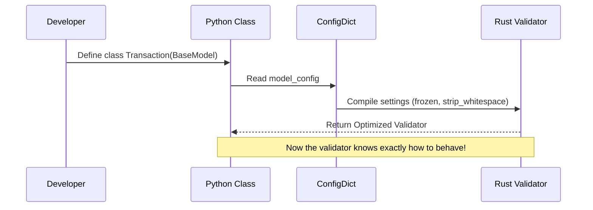

# Chapter 4: Configuration (ConfigDict)

In the previous [Chapter 3: Functional Validators](03_functional_validators.md), we learned how to write custom Python code to check complex rules, like ensuring passwords match.

But sometimes, you don't need *custom* logic. You just want to change the general behavior of the model.
*   "Can we automatically strip whitespace from all strings?"
*   "Can we stop the model from accepting extra fields?"
*   "Can we make the object read-only?"

You don't need to write validators for these. You just need to change the **Configuration**.

## The "Settings Menu" Analogy

Imagine your [BaseModel](01_basemodel.md) is a smartphone. Out of the box, it works great with default settings.
*   It ignores extra data provided by the user.
*   It lets you change values (mutable).
*   It tries to guess types (coercion).

**`ConfigDict`** is the "Settings App" for your model. It lets you toggle these behaviors on or off.

## Central Use Case: The Strict Secure Record

Let's build a model for a **Bank Transaction**.
1.  **Clean Data:** We want to automatically remove accidental spaces from names (`" Alice " -> "Alice"`).
2.  **Security:** We want to reject any extra fields (hackers shouldn't inject data).
3.  **Audit Trail:** Once created, the transaction cannot be changed (Immutable).

We use `model_config` to achieve this.

### Step 1: Importing ConfigDict

Configuration is done using a special dictionary called `ConfigDict`.

```python
from pydantic import BaseModel, ConfigDict

class Transaction(BaseModel):
    # This acts as the control panel for this specific class
    model_config = ConfigDict(
        str_strip_whitespace=True,
        extra='forbid',
        frozen=True
    )

    sender: str
    amount: float
```

Let's break down what each setting does.

### Feature 1: Automatic Whitespace Stripping

Data from forms often has accidental spaces. With `str_strip_whitespace=True`, Pydantic cleans this for us automatically.

```python
# "sender" has leading/trailing spaces
tx = Transaction(sender="  Alice  ", amount=50.0)

print(f"'{tx.sender}'")
# Output: 'Alice'
# The spaces are gone!
```

### Feature 2: Forbidding Extra Fields

By default, Pydantic ignores extra fields. But in strict APIs, extra fields might indicate a mistake or an attack. We set `extra='forbid'`.

```python
from pydantic import ValidationError

try:
    # 'currency' is not defined in our class
    Transaction(sender="Bob", amount=20, currency="USD")
except ValidationError as e:
    print(e)
    # Error: Extra inputs are not permitted
```

### Feature 3: Making Models "Frozen" (Read-Only)

If you are passing data around your application, you often want to ensure it isn't modified by accident. Setting `frozen=True` makes the instance immutable.

```python
tx = Transaction(sender="Charlie", amount=100)

try:
    # Trying to change the amount after creation
    tx.amount = 200
except ValidationError as e:
    print("Error: Instance is frozen")
```

## Other Useful Settings

`ConfigDict` has many options. Here are two more commonly used ones.

### 1. Strict Mode (`strict=True`)

Pydantic usually tries to be helpful. If you pass the string `"123"` to an `int` field, Pydantic converts it. `strict=True` disables this "helpfulness" to prevent surprises.

```python
class StrictUser(BaseModel):
    model_config = ConfigDict(strict=True)
    age: int

# This will FAIL because "25" is a string, not an integer
# StrictUser(age="25") 
```

### 2. Validate Assignment (`validate_assignment=True`)

By default, Pydantic validates data only when you **create** the object. If you change a value later (e.g., `user.age = "apple"`), standard Python won't stop you.

If you enable `validate_assignment`, Pydantic runs validation every time you change a value.

```python
class Profile(BaseModel):
    model_config = ConfigDict(validate_assignment=True)
    age: int

p = Profile(age=20)

try:
    # Pydantic catches this change!
    p.age = "bad value" 
except ValidationError:
    print("Stopped invalid assignment!")
```

## Internal Implementation: Under the Hood

How does `model_config` actually change how the model works?

### Conceptual Flow

It happens during **Class Creation**. When Python reads your `class Transaction(BaseModel):` definition, Pydantic reads your `model_config`. It compiles these settings directly into the Rust validator.

This means there is **zero performance cost** at runtime. The settings are "baked in" before you ever create an object.



### Code Deep Dive

Let's look at `pydantic/config.py`.

You might be wondering: "Is `ConfigDict` a class?"
Actually, it is a `TypedDict`. This is a standard Python feature that gives you autocomplete for dictionary keys. It doesn't contain logic itself; it just defines what keys are allowed.

```python
# pydantic/config.py (Simplified)

from typing_extensions import TypedDict

class ConfigDict(TypedDict, total=False):
    title: str | None
    str_strip_whitespace: bool
    extra: Literal['allow', 'ignore', 'forbid'] | None
    frozen: bool
    strict: bool
    # ... many other options
```

Now let's look at `pydantic/main.py` where the model is built.

When `BaseModel` detects `model_config`, it stores it. The Metaclass (the model builder) uses this to configure the `__pydantic_validator__`.

```python
# pydantic/main.py (Simplified)

class BaseModel(metaclass=ModelMetaclass):
    # Default configuration
    model_config: ClassVar[ConfigDict] = ConfigDict()
    
    # ...
```

When you define your class:

```python
class User(BaseModel):
    model_config = ConfigDict(frozen=True)
```

The Metaclass essentially does this:
1.  Finds `model_config`.
2.  Passes `frozen=True` to the Rust engine generator.
3.  The Rust engine creates a validator that forbids `__setattr__` (setting attributes).

## Conclusion

The `ConfigDict` is a powerful tool to control the "global behavior" of your models without writing custom code for every field. By simply toggling a dictionary key, you can enforce strictness, immutability, or data cleaning.

We have covered:
1.  **BaseModel**: The blueprint.
2.  **Field**: The sticky notes for constraints.
3.  **Validators**: The custom inspectors.
4.  **Config**: The global settings.

But what if your data isn't a dictionary (like `User`)? What if your root data is just a list of emails `["a@b.com", "c@d.com"]` or a single complex dictionary?

For that, we need a model that represents the "Root" of the data, not just fields.

[Next Chapter: RootModel](05_rootmodel.md)

---

Generated by [Code IQ](https://github.com/adityasoni99/Code-IQ)