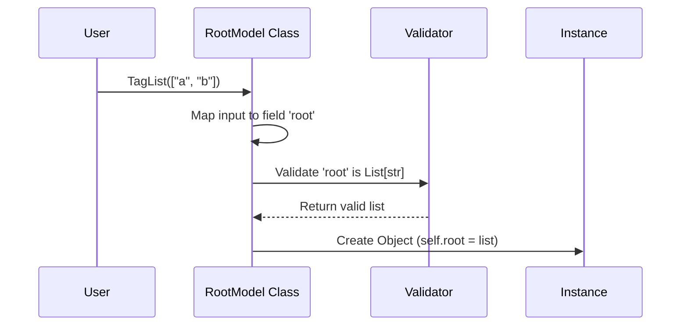

# Chapter 5: RootModel

In the previous [Chapter 4: Configuration (ConfigDict)](04_configuration__configdict_.md), we learned how to control the global settings of our models. We have mastered the `BaseModel`, which is perfect when your data looks like a dictionary with specific keys (like `{"name": "Alice", "age": 30}`).

But what if your data **isn't** a dictionary?

## The Problem: Naked Lists and Dictionaries

Imagine you are building an API that handles a list of tags for a blog post. The data you receive looks like this:

```json
["python", "coding", "tutorial"]
```

Or perhaps you are storing a dictionary of scores where user IDs are keys, but you don't know the IDs in advance:

```json
{"user_1": 100, "user_2": 55, "user_99": 80}
```

If you try to fit this into a `BaseModel`, you are forced to wrap it in a dummy key, like `{"tags": [...]}`. But that doesn't match your real data.

## The Solution: RootModel

**`RootModel`** is a specialized tool for this exact scenario. It allows you to validate and parse data that is a single **List**, a simple **Dictionary**, or even a single **Integer**, while keeping all the superpowers of Pydantic.

Think of `RootModel` as a **transparent bag**. It holds your data and validates it, but doesn't force you to put labels (field names) on it.

### Central Use Case: A List of Tags

Let's build a validator for our blog tags. We want to ensure:
1.  The data is a **List**.
2.  Every item in the list is a **String**.

## How to Use RootModel

Instead of inheriting from `BaseModel`, we inherit from `RootModel`.

### 1. Defining the Model

We use Python Generics (`List[str]`) to tell Pydantic what the "Root" of this model should look like.

```python
from pydantic import RootModel
from typing import List

class TagList(RootModel):
    # We define the type of the root data here
    root: List[str]
```

That's it! We don't define fields like `name: str`. We just define `root`.

### 2. Creating Instances

Unlike `BaseModel`, which requires keyword arguments (`key=value`), `RootModel` accepts the data directly as a positional argument.

```python
# Pass the list directly!
tags = TagList(["python", "coding"])

print(tags)
# Output: root=['python', 'coding']
```

### 3. Accessing the Data

To get your data back out, you access the `.root` attribute.

```python
raw_list = tags.root

print(raw_list[0])
# Output: python
```

### 4. Validation in Action

Just like [Chapter 1: BaseModel](01_basemodel.md), `RootModel` performs validation. If we pass integers instead of strings, Pydantic will try to convert them.

```python
# Pydantic converts integers to strings
tags = TagList([123, 456])

print(tags.root)
# Output: ['123', '456']
```

If the data is invalid (not a list), it raises an error.

```python
from pydantic import ValidationError

try:
    # This is a dict, but we expect a list
    TagList({"not": "a list"})
except ValidationError as e:
    print("Error: Expected a list!")
```

## Advanced Usage: Custom Dicts

A common headache in Python is validating a dictionary where you don't know the keys names, but you know the types.

**Scenario:** A mapping of `Username (str)` to `Score (int)`.

```python
from typing import Dict

class ScoreBoard(RootModel):
    # Keys must be str, Values must be int
    root: Dict[str, int]

scores = ScoreBoard({"alice": 10, "bob": "20"})

print(scores.root["bob"])
# Output: 20 (converted to integer!)
```

## Why not just use Python types?

You might ask: *"Why write a class? Why not just use `x: List[str]`?"*

`RootModel` gives you access to Pydantic's serialization tools. You can easily export your data to JSON using `.model_dump_json()`, just like a standard model.

```python
# Exporting to JSON string
json_data = tags.model_dump_json()

print(json_data)
# Output: ["123","456"]
```

## Internal Implementation: Under the Hood

How does `RootModel` work differently from `BaseModel`?

### Conceptual Flow

Internally, `RootModel` is actually a subclass of `BaseModel`. It creates a "fake" field named `root` behind the scenes.

When you initialize it with `TagList(["a", "b"])`, Pydantic takes that argument, assigns it to the internal field named `root`, and runs validation.



### Code Deep Dive

Let's look at `pydantic/root_model.py`.

The class definition is generic. This allows Python's type checker to know what type `.root` returns based on how you defined the class.

```python
# pydantic/root_model.py (Simplified)

class RootModel(BaseModel, Generic[RootModelRootType]):
    # The magic field where data is stored
    root: RootModelRootType

    # Standard Pydantic metadata
    __pydantic_root_model__ = True
```

The interesting part is the `__init__` method. In `BaseModel`, `__init__` expects `**kwargs` (named arguments). In `RootModel`, it checks for a single positional argument.

```python
    def __init__(self, /, root: RootModelRootType = PydanticUndefined, **data) -> None:
        if data:
            # If user provided kwargs, treat them as the root object
            # e.g., mapping keys to values
            root = data 
        
        # Send data to the Rust engine for validation
        self.__pydantic_validator__.validate_python(root, self_instance=self)
```

Notice the call to `validate_python`. This connects back to the [Chapter 7: Pydantic Core Engine](07_pydantic_core_engine.md), where the actual type checking happens.

Because `RootModel` inherits from `BaseModel`, it also supports `model_config` (from [Chapter 4: Configuration (ConfigDict)](04_configuration__configdict_.md)) and custom methods.

## Conclusion

`RootModel` fills the gap when your data isn't a structured object with named fields. It is perfect for validating Lists, simple Dictionaries, or raw types, wrapping them in Pydantic's safety net.

However, sometimes defining a whole class (like `class TagList(RootModel)`) feels like too much work for a simple check. What if you want to validate a list of integers on the fly, right in the middle of a function, without creating a class?

For that, we have the **TypeAdapter**.

[Next Chapter: TypeAdapter](06_typeadapter.md)

---

Generated by [Code IQ](https://github.com/adityasoni99/Code-IQ)