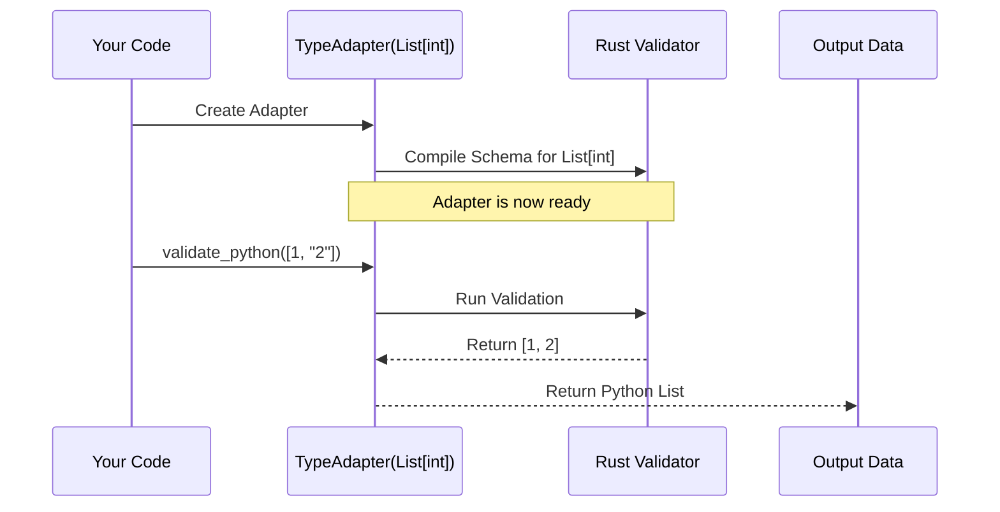

# Chapter 6: TypeAdapter

In the previous [Chapter 5: RootModel](05_rootmodel.md), we learned how to wrap lists and dictionaries into a class to validate them. While `RootModel` is powerful, it still requires you to define a **class**.

Sometimes, defining a class feels like overkill.

Imagine you are writing a quick script to process a list of numbers. You don't want to write `class NumberList(RootModel): ...`. You just want to say to Pydantic: *"Here is a list. Make sure it contains integers."*

Enter the **`TypeAdapter`**.

## The Problem: One-Off Validation

You have a variable `data` that comes from an API. It is supposed to be a list of integers, but it might contain strings or bad data.

```python
# Raw input data
data = [1, "2", 3] 
```

You want to convert `"2"` to an integer `2` and ensure everything else is correct. Creating a full class for this simple task feels heavy. You just want a validator that runs **on the fly**.

## The Solution: The Universal Scanner

Think of `TypeAdapter` as a **Handheld Barcode Scanner**.

*   **`BaseModel`** is like a custom-built factory machine. You build it once, and it produces specific objects (`User`, `Transaction`).
*   **`TypeAdapter`** is a portable tool. You pick it up, dial in the setting (e.g., "Scan for Integers"), and point it at any data.

It exposes all of Pydantic's validation logic without forcing you to create a class structure.

### Central Use Case: The Quick Converter

Let's validate a list of integers (`List[int]`) immediately.

## How to Use TypeAdapter

Using `TypeAdapter` involves two steps:
1.  **Initialize** the adapter with the type you want.
2.  **Run** validation methods (like `validate_python`).

### 1. Basic Validation

We import `TypeAdapter` and pass it a standard Python type hint.

```python
from pydantic import TypeAdapter
from typing import List

# 1. Create the adapter. Tell it what to expect.
adapter = TypeAdapter(List[int])

# 2. Validate data
output = adapter.validate_python([1, "200", 3])

print(output)
# Output: [1, 200, 3] (All real integers now!)
```

Notice that `output` is just a standard Python `list`. It is **not** an instance of a model class.

### 2. Validating Dictionaries

It works perfectly for dictionaries too. Let's say we need a mapping of item names (string) to prices (float).

```python
from typing import Dict

# Expect a Dict where keys are strings, values are floats
price_adapter = TypeAdapter(Dict[str, float])

# "10.50" string is converted to float
data = {"apple": 1.20, "banana": "10.50"}

result = price_adapter.validate_python(data)
print(result["banana"])
# Output: 10.5 (Float)
```

### 3. Parsing JSON Directly

Just like [Chapter 1: BaseModel](01_basemodel.md), the `TypeAdapter` has a `validate_json` method. This is incredibly useful for parsing raw data from files or APIs.

```python
json_data = '[1, 2, 3, 4]'

# Create adapter
adapter = TypeAdapter(List[int])

# Parse string directly
result = adapter.validate_json(json_data)

print(result)
# Output: [1, 2, 3, 4]
```

### 4. Dumping to JSON

You can also go the other way: converting Python data to a JSON string.

```python
adapter = TypeAdapter(List[int])

# Convert list back to JSON string
json_output = adapter.dump_json([1, 2, 3])

print(json_output)
# Output: b'[1,2,3]'
```

## Mixing with BaseModels

`TypeAdapter` plays nicely with models you have already defined. This is useful if you have a `User` model, but you receive a **list** of users from an API.

```python
from pydantic import BaseModel, TypeAdapter
from typing import List

class User(BaseModel):
    name: str

# Create an adapter for a LIST of User models
user_list_adapter = TypeAdapter(List[User])

# Validate a list of dicts
users = user_list_adapter.validate_python([{"name": "Alice"}, {"name": "Bob"}])

print(users[0].name)
# Output: Alice
```

## Internal Implementation: Under the Hood

How does `TypeAdapter` know how to validate a `List[int]` without a class definition?

### Conceptual Flow

When you create `TypeAdapter(List[int])`, Pydantic pauses to "compile" that type.
1.  It looks at `List[int]`.
2.  It generates a **Core Schema** (a set of rules: "Expect List", "Items must be Int").
3.  It builds a Rust Validator for that schema.

When you call `validate_python`, it simply hands the data to that pre-built Rust validator.



### Code Deep Dive

Let's look at the source code in `pydantic/type_adapter.py`.

The `__init__` method is where the setup happens. It doesn't store data; it stores the **mechanism** to process data.

```python
# pydantic/type_adapter.py (Simplified)

class TypeAdapter(Generic[T]):
    def __init__(self, type: Any, config: ConfigDict | None = None):
        self._type = type
        self._config = config
        
        # 1. Initialize the core validator immediately
        self._init_core_attrs(force=False)
```

The method `_init_core_attrs` does the heavy lifting. It calls the schema generator to build the Rust object.

```python
    def _init_core_attrs(self, ...):
        # 2. Generate the Schema (Rules)
        core_schema = schema_generator.generate_schema(self._type)
        
        # 3. Create the Validator (The Engine)
        self.validator = create_schema_validator(
            schema=core_schema,
            ...
        )
```

Now look at `validate_python`. It is a thin wrapper around `self.validator`.

```python
    def validate_python(self, object: Any, ...) -> T:
        # 4. Delegate to the Rust engine
        return self.validator.validate_python(object, ...)
```

**Key Takeaway:** The `TypeAdapter` is essentially a Python wrapper around a compiled Rust validator specific to the type you passed in. This is why it is extremely fast.

## When to use TypeAdapter vs BaseModel

| Feature | BaseModel | TypeAdapter |
| :--- | :--- | :--- |
| **Structure** | Validates a dictionary (Key-Value pairs) | Validates **any** type (List, Int, Dict, Model) |
| **Definition** | Requires defining a `class` | Created in one line |
| **Output** | Returns an instance of your Class | Returns standard Python types (list, dict, int) |
| **Use Case** | Structured business data (User, Product) | Ad-hoc lists, parsing JSON files, simple types |

## Conclusion

The `TypeAdapter` fills the gap between strict Model definitions and raw data processing. It allows you to apply Pydantic's powerful validation engine to **any** Python type—Lists, Dictionaries, Unions, or simple Integers—without the boilerplate of creating a class.

We have now covered the entire surface of Pydantic:
1.  **BaseModel** for objects.
2.  **Fields** for constraints.
3.  **Validators** for logic.
4.  **Config** for settings.
5.  **RootModel** for custom objects.
6.  **TypeAdapter** for on-the-fly validation.

Throughout these chapters, we kept mentioning that validation happens "in Rust" or "in the core". How does that actually work? What is this "Schema" we keep talking about?

It is time to look into the engine room.

[Next Chapter: Pydantic Core Engine](07_pydantic_core_engine.md)

---

Generated by [Code IQ](https://github.com/adityasoni99/Code-IQ)