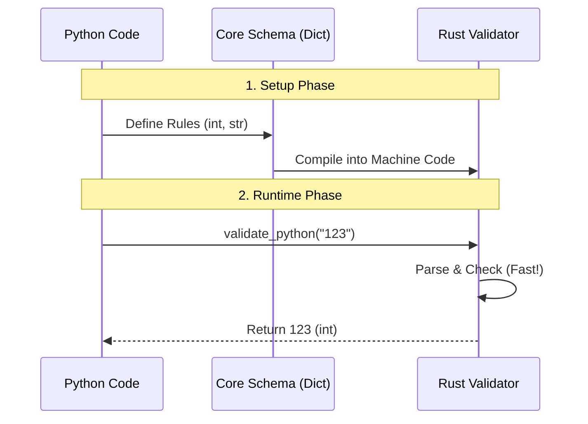

# Chapter 7: Pydantic Core Engine

In the previous [Chapter 6: TypeAdapter](06_typeadapter.md), we learned how to perform quick, one-off validations without defining classes. We touched briefly on the fact that Pydantic compiles your types into a "Rust Validator."

Now, we are going to open the hood of the car. We will look at the engine that makes Pydantic one of the fastest validation libraries in the world: the **Pydantic Core Engine**.

## The Problem: Python is Slow, Rust is Fast

Python is an amazing language. It is easy to read and write (like English). However, because it is so dynamic, checking types and looping through data in Python can be slow compared to lower-level languages.

**The Solution:**
Pydantic uses a split-brain approach:
1.  **The User Interface (Python):** You define models using standard Python classes. It's easy and friendly.
2.  **The Heavy Lifter (Rust):** The actual validation logic runs in a separate library called `pydantic-core`, written in Rust.

Rust is a language known for blazing speed and memory safety. By handing off the work to Rust, Pydantic gives you the best of both worlds.

## Use Case: Peeking Behind the Curtain

Throughout this tutorial, we have used `BaseModel`. But `BaseModel` is just a manager. It creates a plan and hands it to the core engine.

Let's see what that plan looks like.

### 1. The Core Schema

When you define a model, Pydantic generates a "Core Schema". This is a dictionary that acts as a set of instructions for the Rust engine.

```python
from pydantic import BaseModel

class User(BaseModel):
    name: str
    age: int

# Access the hidden schema
# This is the "Blueprint" Pydantic sends to Rust
print(User.__pydantic_core_schema__)
```

The output (simplified) looks like a tree of instructions:
*   "I am a model."
*   "I have a field 'name' which must be a String."
*   "I have a field 'age' which must be an Int."

### 2. Using the Engine Directly

You normally don't need to import `pydantic_core` directly. But to understand how it works, let's bypass `BaseModel` and talk straight to the engine.

We will use **`SchemaValidator`**. This is the Rust object wrapper.

```python
from pydantic_core import SchemaValidator, core_schema

# 1. We create the blueprint manually
# "This data must be an integer"
schema = core_schema.int_schema()

# 2. We build the Rust validator
v = SchemaValidator(schema)
```

Now that the validator `v` is built, we can run data through it.

```python
# 3. Run validation
result = v.validate_python("123")

print(result)
# Output: 123
print(type(result))
# Output: <class 'int'>
```

If we pass bad data, the Rust engine rejects it immediately.

```python
from pydantic_core import ValidationError

try:
    v.validate_python("apple")
except ValidationError as e:
    print("Rust says no!")
```

## Internal Implementation: Under the Hood

How does the data flow from your Python script into compiled Rust code and back?

### Conceptual Flow

1.  **Setup Phase:** Python generates a Schema (Dict).
2.  **Build Phase:** The `SchemaValidator` reads that dict and creates a highly optimized validator in memory (C++/Rust space).
3.  **Runtime:** When you call `validate_python`, your data crosses the boundary from Python to Rust. Rust processes it efficiently and returns the new Python object.



### Code Deep Dive

Let's look at the source code to see how this connection is made.

#### 1. The Python Wrapper (`_pydantic_core.pyi`)
In the Pydantic Core python package, there is a class `SchemaValidator`. This is not a normal Python class; it is a "stub" that points to C/Rust code.

```python
# pydantic-core/python/pydantic_core/_pydantic_core.pyi (Simplified)

@final
class SchemaValidator:
    def __init__(self, schema: CoreSchema, config: CoreConfig | None = None) -> None:
        """
        Initializes the validator.
        Internally, this creates the Rust object.
        """
        ...

    def validate_python(self, input: Any, *, strict: bool | None = None) -> Any:
        """
        Validate a Python object against the schema.
        """
        ...
```

When you call `validate_python`, it calls the Rust function defined in `src/lib.rs`.

#### 2. The Rust Implementation (`src/validators/mod.rs`)

Inside the Rust code, there isn't just one validator. There is a massive **Enum** (a list of options) called `CombinedValidator`.

Think of `CombinedValidator` as a toolbox. When you define your schema, the engine picks the right tool (Integer Tool, String Tool, List Tool) and puts it in the box.

```rust
// pydantic-core/src/validators/mod.rs (Simplified)

pub enum CombinedValidator {
    // If the schema is a string, use the String Validator
    Str(string::StrValidator),
    
    // If the schema is an integer, use the Int Validator
    Int(int::IntValidator),
    
    // If the schema is a list, use the List Validator
    List(list::ListValidator),
    
    // ... many others
}
```

#### 3. The Validation Trait (`Validator`)

Every tool in that toolbox must follow the same rule: they must implement a `validate` function.

```rust
// pydantic-core/src/validators/mod.rs (Simplified)

pub trait Validator {
    fn validate<'py>(
        &self,
        py: Python<'py>,
        input: &(impl Input<'py> + ?Sized),
        state: &mut ValidationState,
    ) -> ValResult<Py<PyAny>>;
}
```

This design is why Pydantic is so fast. When you validate a `List[int]`:
1.  The `ListValidator` (Rust) iterates over the list.
2.  For each item, it calls the `IntValidator` (Rust).
3.  It hardly ever needs to ask Python for help, avoiding the slowness of the Python interpreter.

## Conclusion

The **Pydantic Core Engine** is the hidden powerhouse of the library. 
*   It takes **Schemas** (definitions) from Python.
*   It compiles them into **Validators** (workers) in Rust.
*   It processes data at speeds impossible in pure Python.

You have now completed the Pydantic Tutorial! You've journeyed from the basic [Chapter 1: BaseModel](01_basemodel.md), through [Fields](02_fields__fieldinfo_.md) and [Validators](03_functional_validators.md), all the way down to the Rust metal.

You are now equipped to build robust, type-safe, and high-performance data applications in Python. Happy coding!

---

Generated by [Code IQ](https://github.com/adityasoni99/Code-IQ)