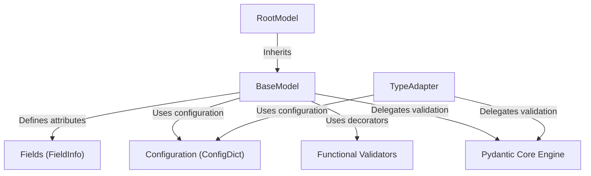

# Tutorial: pydantic

**Pydantic** is a data validation and settings management library that uses Python type annotations to define data schemas. At its core, users define *models* inheriting from `BaseModel` with typed **Fields** and optional **Functional Validators**, which the high-performance **Pydantic Core Engine** (written in Rust) uses to validate and serialize data. The project also provides flexible tools like `TypeAdapter` for on-the-fly validation and `RootModel` for custom root types, all governed by a centralized **Configuration** system.

**Source Repository:** [https://github.com/pydantic/pydantic](https://github.com/pydantic/pydantic)

## Chapters

1. [BaseModel](01_basemodel.md)
2. [Fields (FieldInfo)](02_fields__fieldinfo_.md)
3. [Functional Validators](03_functional_validators.md)
4. [Configuration (ConfigDict)](04_configuration__configdict_.md)
5. [RootModel](05_rootmodel.md)
6. [TypeAdapter](06_typeadapter.md)
7. [Pydantic Core Engine](07_pydantic_core_engine.md)

---

Generated by [Code IQ](https://github.com/adityasoni99/Code-IQ)