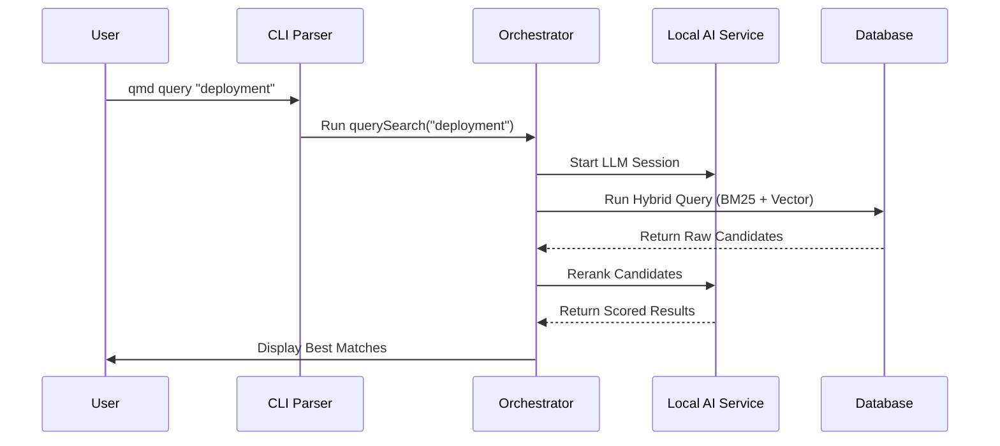

# Chapter 1: Hybrid Search Orchestrator

Welcome to the **QMD** project! If you have ever tried to find a specific note or document on your computer but couldn't remember the exact filename or keywords, you know the frustration of standard search tools.

In this first chapter, we will build the **Hybrid Search Orchestrator**. Think of this component as a **Master Librarian**. When you ask a question, this librarian doesn't just look up index cards (keywords); they also understand the *intent* behind your question (semantics) and then read through the best matches to rank them for you.

## The Problem: Why Hybrid?

In search technology, there are usually two camps:

1.  **Keyword Search (BM25):** Great for exact matches (e.g., searching for "Error 404"). It fails if you search for "Page not found" but the document only says "Error 404".
2.  **Vector Search (Semantic):** Great for meaning (e.g., "Page not found" matches "Error 404"). However, it can sometimes be too vague and miss specific technical terms.

The **Hybrid Search Orchestrator** combines both. It acts as the command center that receives your query, delegates work to both search engines, and then uses a Large Language Model (LLM) to pick the winners.

## The Entry Point: The CLI

The Orchestrator lives primarily in `src/qmd.ts`. This file is the entry point for the Command Line Interface (CLI). It listens to what you type in the terminal and decides which workflow to trigger.

### Parsing User Input

First, the Orchestrator needs to understand what you want. We use a function called `parseCLI` to strip away the complex flags and get to the core of your request.

```typescript
// src/qmd.ts
function parseCLI() {
  const { values, positionals } = parseArgs({
    args: process.argv.slice(2), 
    options: {
      // We define flags like --json or -c (collection)
      json: { type: "boolean" },
      collection: { type: "string", short: "c", multiple: true },
      // ... other options
    },
    // ... config
  });

  return { command: positionals[0], query: positionals.slice(1).join(" "), values };
}
```

**What is happening here?**
We are taking the raw text you typed (like `qmd query "project plan" --json`) and breaking it down. The `command` becomes `"query"`, the `query` becomes `"project plan"`, and `values.json` becomes `true`.

## The "Query" Workflow

When you run `qmd query "..."`, the Orchestrator triggers the `querySearch` function. This is the heart of the hybrid system.

Here is the high-level logic flow of the Orchestrator:



### 1. Setting the Stage

Before searching, the Orchestrator checks the health of your index and prepares the AI models.

```typescript
// src/qmd.ts
async function querySearch(query: string, opts: OutputOptions) {
  const store = getStore();

  // 1. Check if the index is healthy
  checkIndexHealth(store.db);

  // 2. Start an AI session (manages memory for models)
  await withLLMSession(async () => {
    // ... search logic happens here ...
  }, { maxDuration: 10 * 60 * 1000, name: 'querySearch' });
}
```

**Explanation:**
The `withLLMSession` is a crucial wrapper. Loading AI models into memory (RAM/VRAM) is expensive. This wrapper ensures the models are loaded once, used for the search, and then properly managed. You will learn more about how this works in [Chapter 2: Local AI Service](02_local_ai_service.md).

### 2. The Hybrid Call

Inside that session, the Orchestrator calls `hybridQuery`. This function (imported from the store) does the heavy lifting of running BM25 and Vector searches in parallel and fusing them together.

```typescript
// src/qmd.ts - inside querySearch
    let results = await hybridQuery(store, query, {
      limit: opts.limit || 10,
      minScore: opts.minScore || 0,
      hooks: {
        // We provide "hooks" to give the user progress updates
        onExpand: (original, expanded) => {
          console.log(`Searching for "${original}" and variations...`);
        },
        onRerankStart: (count) => {
           console.log(`AI is reading ${count} documents...`);
        }
      },
    });
```

**Explanation:**
The Orchestrator doesn't know *how* to calculate vector math; it delegates that. However, it passes **Hooks** (callbacks). These hooks allow the Orchestrator to print status messages (like "AI is reading...") to the terminal so the user knows what is happening during the pause.

### 3. Filtering and Displaying

Once the results come back, the Orchestrator needs to format them for the user. It filters out results that don't match specific collections (if requested) and formats the output.

```typescript
// src/qmd.ts
    // Filter results if the user asked for a specific collection
    if (collectionNames.length > 1) {
      results = results.filter(r => {
        // Check if file path matches requested collections
        return isMatch(r.file, collectionNames); 
      });
    }

    // Send final results to the output formatter
    outputResults(results, query, opts);
```

**Explanation:**
The search engine might return 50 results. The Orchestrator applies final filters (like `--collection notes`) and then decides how to show them. If the user passed `--json`, it prints JSON; otherwise, it prints a colorful CLI list.

## Internal Implementation Details

Let's look deeper into how the Orchestrator handles output. The `outputResults` function is responsible for making the data look good.

### Snippet Extraction

We don't want to show the whole document. We want a "snippet" that shows *why* the document matched.

```typescript
// src/qmd.ts
function outputResults(results, query, opts) {
  for (const row of results) {
    // Extract a relevant slice of text based on the query
    const { line, snippet } = extractSnippet(row.body, query, 500, row.chunkPos);
    
    // Highlight the keywords in yellow
    const highlighted = highlightTerms(snippet, query);
    
    console.log(`File: ${row.displayPath}`);
    console.log(`Score: ${row.score}`);
    console.log(highlighted); // The preview text
  }
}
```

**Explanation:**
1.  **`extractSnippet`**: Finds the part of the document where the match occurred.
2.  **`highlightTerms`**: Adds color codes to the keywords so they pop out in the terminal.

## Why "Orchestrator"?

We call this an Orchestrator because it doesn't do the heavy lifting itself.
1.  It asks the **Store** (Database) for data. (See [Chapter 3: Cross-Runtime Persistence](03_cross_runtime_persistence.md)).
2.  It asks the **LLM** for intelligence. (See [Chapter 2: Local AI Service](02_local_ai_service.md)).
3.  It asks the **Formatter** to make things pretty.

Its job is to coordinate these specialized workers to answer your question.

## Conclusion

In this chapter, we explored the **Hybrid Search Orchestrator**. We learned how `qmd` interprets your command line arguments, sets up an environment for the AI models, and coordinates the flow of data between the user and the underlying search engines.

It acts as the "Face" of the application, ensuring that the complex technology underneath feels like a simple magic tool to the user.

However, an Orchestrator is useless without workers. In the next chapter, we will build the brain of the operation: the service that manages the AI models for embedding and re-ranking.

[Next Chapter: Local AI Service](02_local_ai_service.md)

---

Generated by [Code IQ](https://github.com/adityasoni99/Code-IQ)