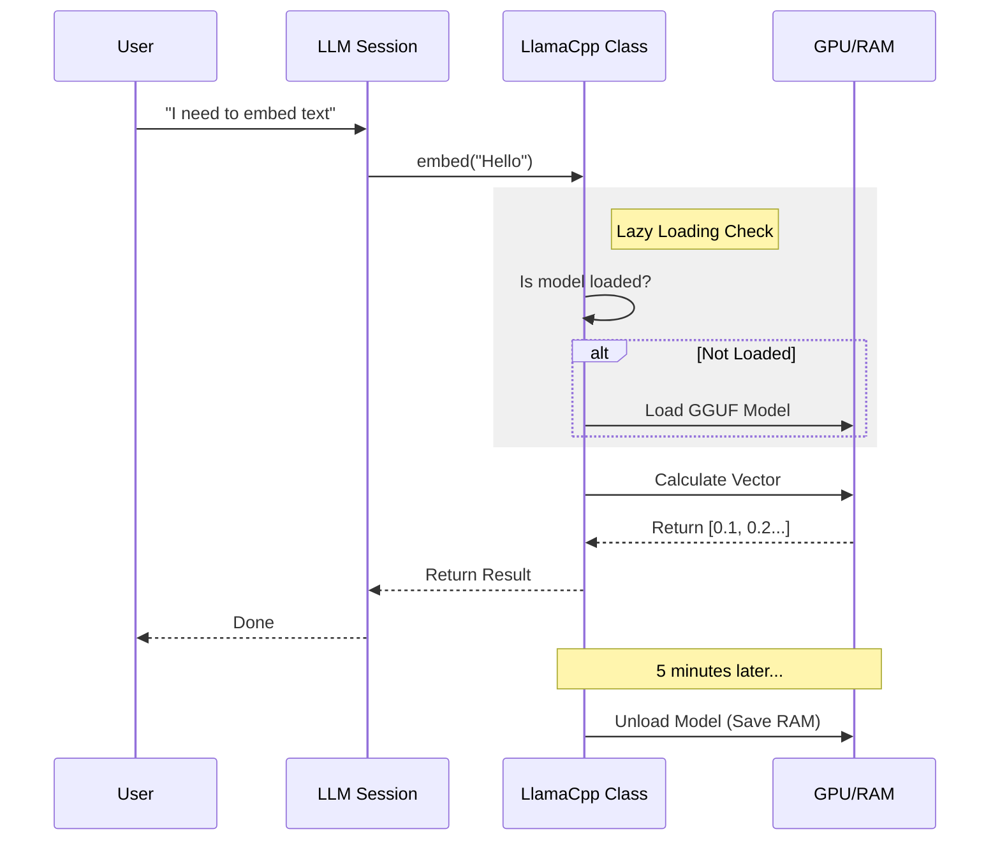

# Chapter 2: Local AI Service

In the previous [Chapter 1: Hybrid Search Orchestrator](01_hybrid_search_orchestrator.md), we built the "Master Librarian" that coordinates your search. But a librarian needs a brain to understand the meaning of words.

In this chapter, we will build that brain: the **Local AI Service**.

## The Motivation: Why Local?

Most modern AI apps rely on APIs (like OpenAI). This is easy, but it has downsides:
1.  **Privacy:** You are sending your personal notes to a server.
2.  **Cost:** You pay for every search.
3.  **Offline:** You can't search without Wi-Fi.

**The Solution:** Run the AI models directly on your computer.

**The Challenge:** AI models are heavy. If you load a text generation model, an embedding model, and a re-ranking model all at once, your computer might run out of memory (RAM/VRAM) and crash.

Our **Local AI Service** is a smart traffic controller. It ensures models are loaded only when needed (Lazy Loading) and unloaded when you are done to save resources.

## Key Concepts

Before looking at the code, let's understand the three superpowers this service provides:

1.  **Embeddings:**
    Think of this as a translator that turns text into a list of numbers (coordinates).
    *   *Input:* "Apple"
    *   *Output:* `[0.1, 0.8, -0.5]`
    *   *Why?* Computers can calculate the distance between numbers. "Apple" is numerically closer to "Fruit" than to "Car".

2.  **Reranking:**
    This is like a strict teacher grading test papers.
    *   *Input:* A question and 10 possible documents.
    *   *Output:* A score for each document (e.g., 0.99 relevance).
    *   *Why?* It is much more accurate than vector search but slower, so we only use it on the top results.

3.  **Lazy Loading & Sessions:**
    Loading a model takes time (1-2 seconds) and memory. We don't want to load them when the app starts. We wait until the user actually asks a question.

## How to Use It

We interact with the service using a **Session**. A session guarantees that the model won't be unloaded while you are using it.

Here is how simple it is to use in `qmd`:

```typescript
import { withLLMSession } from "./src/llm";

// 1. Open a session. The service ensures models are ready.
await withLLMSession(async (session) => {
  
  // 2. Turn text into numbers
  const vector = await session.embed("Project Deadline");
  
  console.log(`Generated ${vector.embedding.length} numbers.`);

}, { name: "demo-session" });
// 3. Session closes automatically here.
```

**What happens underneath?**
1.  `withLLMSession` starts.
2.  You request an embedding.
3.  The service checks: "Is the model loaded?"
    *   If **No**: It loads the GGUF file from your hard drive into RAM/GPU.
    *   If **Yes**: It uses the existing one.
4.  It returns the data.
5.  The session ends. The service waits a few minutes. If no new queries come in, it unloads the model to free up your RAM.

## Internal Implementation

Let's look under the hood. We use a library called `node-llama-cpp` to talk to the hardware.

Here is the flow of a typical request:



### The Code: `src/llm.ts`

We will look at the most critical parts of the implementation.

#### 1. The Singleton Service

We wrap the raw AI logic in a class called `LlamaCpp`. It holds the references to our models.

```typescript
// src/llm.ts
export class LlamaCpp implements LLM {
  // We keep track of models here. Initially, they are null.
  private embedModel: LlamaModel | null = null;
  private generateModel: LlamaModel | null = null;

  // Configuration (paths to models on disk)
  constructor(config: LlamaCppConfig = {}) {
    this.embedModelUri = config.embedModel || DEFAULT_EMBED_MODEL;
    // ... other config
  }
}
```

#### 2. Lazy Loading (The "Magic")

We never load models in the constructor. We use a helper method called `ensureEmbedModel`.

```typescript
// src/llm.ts inside LlamaCpp class
  private async ensureEmbedModel(): Promise<LlamaModel> {
    // 1. If it's already there, just return it!
    if (this.embedModel) {
      return this.embedModel;
    }

    // 2. Otherwise, load it from the disk/GPU
    const llama = await this.ensureLlama();
    const modelPath = await this.resolveModel(this.embedModelUri);
    
    // 3. Store it for next time
    this.embedModel = await llama.loadModel({ modelPath });
    
    return this.embedModel;
  }
```
**Explanation:**
This pattern prevents the app from freezing on startup. The heavy lifting happens only when `ensureEmbedModel()` is called for the first time.

#### 3. Resource Management (The "Cleanup")

Models are heavy. If the user stops searching, we want to give their RAM back. We use a "touch" system. Every time you use a model, we reset a timer.

```typescript
// src/llm.ts
  private touchActivity(): void {
    // Stop any pending unload timer
    if (this.inactivityTimer) clearTimeout(this.inactivityTimer);

    // Set a new timer. If no one calls me in 5 minutes...
    this.inactivityTimer = setTimeout(() => {
      this.unloadIdleResources(); 
    }, 5 * 60 * 1000); // 5 minutes
  }

  async unloadIdleResources() {
    // Dispose of the heavy context to free VRAM
    await this.embedContexts.dispose(); 
    this.embedContexts = [];
    console.log("Cleaned up idle AI resources.");
  }
```

#### 4. The Session Wrapper

Finally, we need to make sure we don't unload the model while a query is running! The `LLMSession` class acts as a "lock".

```typescript
// src/llm.ts
export async function withLLMSession(fn, options) {
  const manager = getSessionManager();
  
  // 1. Create a session (increases usage count)
  const session = new LLMSession(manager, options);

  try {
    // 2. Run the user's function
    return await fn(session);
  } finally {
    // 3. Release the session (decreases usage count)
    // If count is 0, the inactivity timer from step 3 starts ticking.
    session.release();
  }
}
```

## Why GGUF?

You might notice the code references `.gguf` files. GGUF is a file format designed specifically for fast inference on consumer hardware (like Apple Silicon MacBooks or standard NVIDIA GPUs). It allows us to "quantize" models (shrink them) so they run fast without needing a massive server.

## Conclusion

In this chapter, we built the **Local AI Service**. It acts as the intelligent engine of `qmd`.

1.  It abstracts away the complexity of `node-llama-cpp`.
2.  It uses **Lazy Loading** to keep startup fast.
3.  It uses **Sessions** and **Timers** to manage your RAM and VRAM automatically.

Now we have a Librarian (Chapter 1) and a Brain (Chapter 2). But a librarian is useless without a library of books. Where do we store the embeddings we generate?

In the next chapter, we will build the storage engine that saves our data to disk.

[Next Chapter: Cross-Runtime Persistence](03_cross_runtime_persistence.md)

---

Generated by [Code IQ](https://github.com/adityasoni99/Code-IQ)