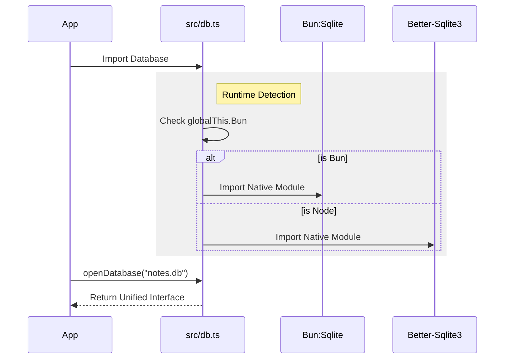

# Chapter 3: Cross-Runtime Persistence

In [Chapter 1: Hybrid Search Orchestrator](01_hybrid_search_orchestrator.md), we built the **Librarian** (the interface). In [Chapter 2: Local AI Service](02_local_ai_service.md), we built the **Brain** (the AI models).

Now, we need a **Library**. A librarian is useless if the books disappear every time you close the building. We need a place to store your notes and their AI embeddings permanently.

## The Problem: The "Travel Adapter" Issue

In the JavaScript world, there are two main ways to run code: **Node.js** (the old standard) and **Bun** (the new, fast contender). `qmd` is designed to run on both.

However, they talk to databases differently:
1.  **Node.js** uses a library called `better-sqlite3`.
2.  **Bun** has its own built-in `bun:sqlite`.

To make matters more complex, we need a special "superpower" for our database called **`sqlite-vec`**. This is a plugin written in C that allows SQLite to understand Vector Math (finding similar items). Loading this plugin works completely differently in Node.js versus Bun.

If we didn't handle this, you would need two different versions of the app. Instead, we build a **Cross-Runtime Persistence** layer. Think of this as a universal travel adapter: you plug it in, and it works, regardless of whether the wall socket is Node.js or Bun.

## Key Concepts

### 1. The Abstract Database
We don't want the rest of our app to know *how* the database works. We just want to say "Run this SQL command." We create a standard interface that looks the same regardless of what is happening under the hood.

### 2. Native Extensions (`sqlite-vec`)
Standard databases store text and numbers. Ours needs to store **Vectors** (arrays of numbers like `[0.1, 0.5, ...]`).
Standard SQLite cannot do math on these arrays efficiently. We use `sqlite-vec`, a "Native Extension." It acts like a turbocharger bolted onto the database engine.

## How to Use It

Using this layer is incredibly simple. You don't need to check if you are using Bun or Node. You just ask for a database.

Here is how the Orchestrator (Chapter 1) starts the database:

```typescript
// src/store.ts uses src/db.ts
import { openDatabase, loadSqliteVec } from "./db";

// 1. Open the file (works in Bun OR Node)
const db = openDatabase("my_notes.db");

// 2. Enable Vector Search superpowers
loadSqliteVec(db);

// 3. Create tables normally
db.exec("CREATE TABLE IF NOT EXISTS notes (id TEXT, body TEXT);");
```

**What just happened?**
1.  `openDatabase` automatically detected your runtime and gave you a connection.
2.  `loadSqliteVec` found the correct path to the C-extension file on your hard drive and loaded it into memory.

## Internal Implementation

Let's look at how we build this "Universal Adapter."

### The Logic Flow

When the app starts, this file (`src/db.ts`) runs a quick check to see where it is living.



### The Code: `src/db.ts`

We use a technique called **Dynamic Import**. We cannot use standard `import` statements at the top of the file, because if we try to import `better-sqlite3` while running in Bun, the app might crash (and vice versa).

#### 1. Detecting the Runtime

First, we ask the environment: "Are you Bun?"

```typescript
// src/db.ts

// Check if the global variable "Bun" exists
export const isBun = typeof globalThis.Bun !== "undefined";

// We will fill these variables based on the result
let _Database: any;
let _sqliteVecLoad: (db: any) => void;
```

#### 2. The Branching Logic

This is the most critical part. We load the correct driver dynamically.

```typescript
if (isBun) {
  // We are in Bun!
  // We use a string trick so TypeScript doesn't get confused
  const bunSqlite = "bun:" + "sqlite"; 
  _Database = (await import(/* @vite-ignore */ bunSqlite)).Database;
  
  // Bun needs the full path to the extension file
  const { getLoadablePath } = await import("sqlite-vec");
  _sqliteVecLoad = (db: any) => db.loadExtension(getLoadablePath());

} else {
  // We are in Node!
  _Database = (await import("better-sqlite3")).default;
  
  // Node's better-sqlite3 has a simpler helper
  const sqliteVec = await import("sqlite-vec");
  _sqliteVecLoad = (db: any) => sqliteVec.load(db);
}
```

**Explanation:**
*   **Bun path:** Bun requires us to ask `sqlite-vec` for the file path (`getLoadablePath`) and manually tell SQLite to `loadExtension` from that path.
*   **Node path:** The library `better-sqlite3` is helpful and has a `.load()` utility built-in.
*   **The Result:** `_Database` now holds the correct class for the current system.

#### 3. The Unified Wrapper

Now we export a clean function that hides the mess above from the user.

```typescript
export function openDatabase(path: string): Database {
  // New up the class we loaded in the previous step
  return new _Database(path) as Database;
}

export function loadSqliteVec(db: Database): void {
  // call the specific loading function defined above
  _sqliteVecLoad(db);
}
```

#### 4. Defining the Shape (TypeScript)

Since `bun:sqlite` and `better-sqlite3` have slightly different function names, we define an **Interface** that forces them to look the same to our app.

```typescript
// A contract that guarantees the database has these methods
export interface Database {
  exec(sql: string): void;
  prepare(sql: string): Statement;
  loadExtension(path: string): void;
  close(): void;
}
```

**Why do this?**
If we switch from Node to Bun later, or even add a third runtime (like Deno), the rest of the application (Chapters 1, 2, 4, 5, 6) never has to change. We only change this one file.

## Conclusion

In this chapter, we solved the headache of **Cross-Runtime Persistence**.

1.  We identified that Node.js and Bun handle databases differently.
2.  We created a **Compatibility Layer** in `src/db.ts`.
3.  We successfully loaded the **Native Extension** `sqlite-vec` to enable vector search.

We now have a working search engine:
*   **Orchestrator** (User Input)
*   **AI Service** (Intelligence)
*   **Persistence** (Storage)

But currently, this only works if you type commands in the terminal. What if other apps (like a text editor or a chatbot UI) want to talk to our database?

In the next chapter, we will wrap our tool in a standardized server protocol.

[Next Chapter: Model Context Protocol (MCP) Server](04_model_context_protocol__mcp__server.md)

---

Generated by [Code IQ](https://github.com/adityasoni99/Code-IQ)