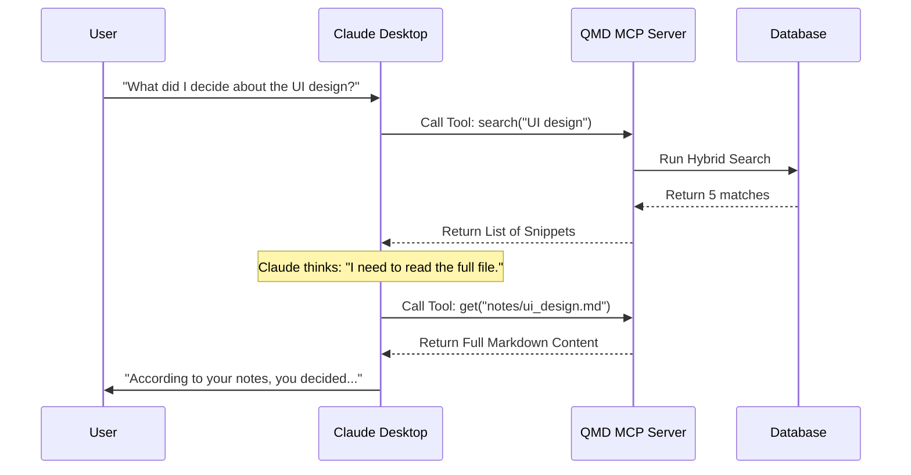

# Chapter 4: Model Context Protocol (MCP) Server

In [Chapter 3: Cross-Runtime Persistence](03_cross_runtime_persistence.md), we built a robust storage engine that saves your notes and embeddings. Currently, `qmd` is a great Command Line Interface (CLI) tool for *humans*. You type `qmd search`, and you get results.

But what if you want **AI Agents** (like Claude, Cursor, or ChatGPT) to use your notes?

In this chapter, we will build the **Model Context Protocol (MCP) Server**. This transforms `qmd` from a standalone tool into a **"Skill"** that other AIs can learn.

## The Motivation: Copy-Paste Fatigue

Imagine you are using the Claude Desktop app to write a project proposal. You have 50 relevant notes scattered in your `qmd` database.
*   **The Old Way:** You manually search `qmd` in your terminal, copy the text, paste it into Claude, and say "Read this."
*   **The MCP Way:** You tell Claude, "Check my local notes for project requirements." Claude automatically calls `qmd`, searches your database, reads the files, and answers you.

The **MCP Server** acts as a bridge. It creates a standard "socket" that any AI agent can plug into.

## Key Concepts

To build this, we need to understand three concepts from the [MCP Specification](https://modelcontextprotocol.io):

1.  **Tools:**
    These are functions the AI can call. Instead of a human clicking a button, the AI sends a text command like:
    `{ "name": "search", "args": { "query": "project plan" } }`

2.  **Resources:**
    These are the actual files. When the AI finds a note it wants to read, it requests a resource URI like:
    `qmd://notes/2023-plans.md`

3.  **Transports:**
    How does the AI talk to `qmd`? Usually via **Stdio** (Standard Input/Output). The AI runs `qmd` in the background and sends JSON messages to it through the "pipes" of the operating system.

## How to Use It

Before writing code, let's see how a user would connect `qmd` to Claude Desktop. They would edit their Claude configuration file:

```json
{
  "mcpServers": {
    "qmd": {
      "command": "node",
      "args": ["dist/mcp.js"]
    }
  }
}
```

Once connected, the AI "sees" `qmd` as a set of tools. It's like giving the AI a utility belt.

## Internal Implementation

The implementation lives in `src/mcp.ts`. We use the official `@modelcontextprotocol/sdk` to make things easy.

### The Workflow

Here is what happens when you ask Claude a question that requires your notes:



### 1. Setting Up the Server

First, we create the server and give it a name.

```typescript
// src/mcp.ts
import { McpServer } from "@modelcontextprotocol/sdk/server/mcp.js";

function createMcpServer(store: Store) {
  // We initialize the server with instructions
  // These instructions tell the AI *how* to use our tools.
  const server = new McpServer(
    { name: "qmd", version: "1.0.0" },
    { instructions: "QMD is your local search engine..." }
  );
  
  return server;
}
```

**Explanation:**
The `instructions` are crucial. When the AI starts, it receives a system prompt saying: *"You have a tool called QMD. Use it when the user asks about local notes."*

### 2. Exposing the "Search" Tool

We need to wrap our search logic from [Chapter 1: Hybrid Search Orchestrator](01_hybrid_search_orchestrator.md) so the AI can use it.

```typescript
// src/mcp.ts
  server.registerTool(
    "search", 
    {
      // We use Zod to define what inputs are allowed
      query: z.string().describe("Keywords to find"),
      limit: z.number().default(10),
    },
    async ({ query, limit }) => {
      // 1. Run the actual search logic we built previously
      const results = store.searchFTS(query, limit);

      // 2. Return text that the AI can read
      return {
        content: [{ type: "text", text: JSON.stringify(results) }]
      };
    }
  );
```

**Explanation:**
*   `registerTool`: Tells the AI "I can do a search".
*   `z.string()`: Schema definition. If the AI tries to send a number as a query, the server will reject it.
*   The return value must be text or JSON so the AI can process the results.

### 3. Exposing the "Get" Tool

Searching only gives snippets. To read the whole file, we need a `get` tool.

```typescript
// src/mcp.ts
  server.registerTool(
    "get",
    { file: z.string().describe("Path to the file") },
    async ({ file }) => {
      // 1. Look up the file in our Store
      const result = store.findDocument(file);
      
      // 2. Return the full content as a "Resource"
      return {
        content: [{ 
          type: "resource", 
          resource: { 
            uri: `qmd://${file}`, 
            text: result.body // The full markdown text
          } 
        }]
      };
    }
  );
```

**Explanation:**
This allows the AI to perform "Retrieval Augmented Generation" (RAG). It finds relevant docs (Search) and then reads them (Get) to generate an answer.

### 4. Connecting the Wires (The Transport)

Finally, we need to start the server. We support two modes:
1.  **Stdio:** For local desktop apps (Claude).
2.  **HTTP:** If we want to run `qmd` on a server.

```typescript
// src/mcp.ts
import { StdioServerTransport } from "@modelcontextprotocol/sdk/server/stdio.js";

export async function startMcpServer() {
  const store = createStore(); // Open the DB (Chapter 3)
  const server = createMcpServer(store);
  
  // Create the communication channel
  const transport = new StdioServerTransport();
  
  // Start listening to stdin/stdout
  await server.connect(transport);
}
```

## Deep Dive: Specialized Tools

In our implementation, we actually expose three different search flavors to the AI:

1.  **`search`:** Fast keyword search (BM25). Good for specific error codes or names.
2.  **`vector_search`:** Semantic search (Embeddings). Good for vague concepts ("ideas about happiness").
3.  **`deep_search`:** The heavy lifter.

Let's look at `deep_search`. It combines everything we learned in [Chapter 2: Local AI Service](02_local_ai_service.md).

```typescript
// src/mcp.ts
  server.registerTool("deep_search", { query: z.string() }, 
    async ({ query }) => {
      // Calls the Hybrid Query from Chapter 1 & 2
      // This triggers:
      // 1. Query Expansion (AI rewrites your query)
      // 2. Vector + Keyword search
      // 3. Reranking (AI grades the results)
      const results = await hybridQuery(store, query, {});

      return formatResults(results);
    }
  );
```

We give the AI these options so *it* can decide. If you ask for a specific file name, it uses `search` (fast). If you ask a complex question, it uses `deep_search` (smart but slow).

## Conclusion

In this chapter, we unlocked the ability for **External Agents** to use our local knowledge base.

1.  We wrapped our **Store** and **Search** logic into standardized **MCP Tools**.
2.  We defined **Input Schemas** so the AI knows how to call our functions.
3.  We set up a **Stdio Transport** to allow seamless integration with tools like Claude Desktop.

Now we have a powerful system: `qmd` searches, retrieves, and understands data. But how do we know if our search results are actually *good*? Is the AI finding the right note, or just a random one?

In the next chapter, we will build a system to grade our own performance.

[Next Chapter: Reward & Evaluation Logic](05_reward___evaluation_logic.md)

---

Generated by [Code IQ](https://github.com/adityasoni99/Code-IQ)