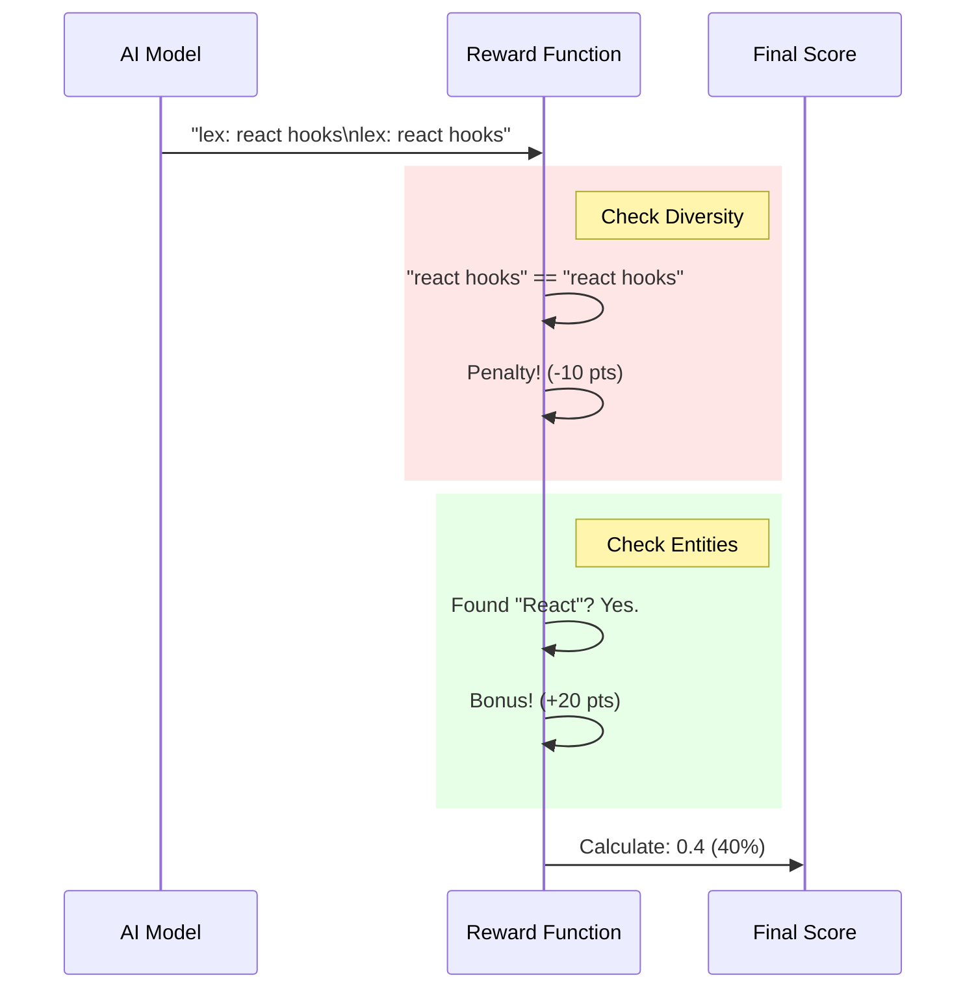

# Chapter 5: Reward & Evaluation Logic

In [Chapter 4: Model Context Protocol (MCP) Server](04_model_context_protocol__mcp__server.md), we turned our search engine into a tool that AI agents like Claude can use. But this raises a critical question: **How do we know if the AI is doing a good job?**

If you search for "login issues," and the AI gives you a document about "lunch menus," the system has failed. But computers don't have "common sense" to know that lunch menus aren't relevant to login issues.

In this chapter, we will build the **Reward & Evaluation Logic**. Think of this component as the **Strict Teacher**. It uses math and rules to grade the AI's performance.

## The Problem: Subjectivity

"Good search" is hard to define.
1.  **Exact Match:** Easy. "Error 500" should find "Error 500".
2.  **Semantic Match:** Harder. "My app crashed" should find "Error 500".
3.  **Query Expansion:** Hardest. When the AI rewrites your query to find better results, how do we know the rewrite is good?

We solve this with two distinct tools:
1.  **Evaluation Harness:** Grades the **final result** (Did we find the right file?).
2.  **Reward Function:** Grades the **AI's thinking** (Did the AI generate good keywords?).

## Part 1: The Evaluation Harness (The Final Exam)

The Evaluation Harness simulates a user asking questions and checks if the correct document appears in the results.

We define a list of "Golden Queries" where we know exactly which document *should* appear.

### The Test Data

We categorize queries by difficulty.

```typescript
// test/eval-harness.ts
const evalQueries = [
  {
    query: "API versioning",
    expectedDoc: "api-design", // The filename we expect
    difficulty: "easy",        // Direct keyword match
  },
  {
    query: "what went wrong with the launch",
    expectedDoc: "product-launch", 
    difficulty: "medium",      // Conceptual query
  }
];
```

### Running the Search

The harness runs the actual `qmd` command we built in [Chapter 1: Hybrid Search Orchestrator](01_hybrid_search_orchestrator.md) and captures the output.

```typescript
// test/eval-harness.ts
function runSearch(query: string) {
  // We execute the CLI command via the operating system
  const output = execSync(
    `bun src/qmd.ts search "${query}" --json -n 5`,
    { encoding: "utf-8" }
  );
  
  // Parse the JSON result
  return JSON.parse(output);
}
```

### Grading the Results (Metrics)

We use a standard search metric called **Hit@K**.
*   **Hit@1:** Was the correct document the very first result? (Perfect score).
*   **Hit@5:** Was the correct document somewhere in the top 5? (Partial credit).

```typescript
// test/eval-harness.ts
function evaluate() {
  for (const testCase of evalQueries) {
    const results = runSearch(testCase.query);
    
    // Find where the expected document ranked
    const rank = results.findIndex(r => 
      r.file.includes(testCase.expectedDoc)
    );

    if (rank === 0) console.log("✅ Perfect match!");
    else if (rank < 5) console.log("⚠️  Found in top 5");
    else console.log("❌  Failed to find document");
  }
}
```

**Why is this important?**
Before you change any code in the Orchestrator or the AI Service, you run this harness. If your changes cause "Hit@1" scores to drop, you know you broke something.

## Part 2: The Reward Function (The Process Grader)

While the Harness checks the *result*, the **Reward Function** checks the *process*.

When `qmd` performs a "Deep Search," it uses an AI to generate synonyms and expansion terms (see [Chapter 2: Local AI Service](02_local_ai_service.md)). We need to make sure the AI isn't hallucinating or being lazy.

We use a Python script (`finetune/reward.py`) to mathematically score the text generated by the AI. This is used during **Reinforcement Learning** (training the model).

### The Grading Rubric

The Reward Function analyzes the AI's output based on five strict rules:

1.  **Format (30pts):** Did it follow the `lex:` and `vec:` syntax?
2.  **Diversity (30pts):** Are the keywords different from each other?
3.  **Echoing (Penalty):** Did it just repeat the user's query? (A lazy AI does this often).
4.  **Entities (20pts):** Did it keep important names (like "React" or "SQL")?
5.  **Quality (20pts):** Are the words actual English?

### The Flow of Grading



## Internal Implementation Details

Let's look at the Python code that enforces these rules.

### Detecting Laziness (Echoing)

One of the biggest problems with small AI models is that they just parrot back what you said. We write code to detect this.

```python
# finetune/reward.py
def echoes_query(expansion: str, query: str) -> bool:
    exp = expansion.lower().strip()
    q = query.lower().strip()
    
    # 1. Exact match?
    if exp == q: 
        return True
        
    # 2. Contained within?
    if q in exp and len(exp) < len(q) + 10:
        return True
        
    return False
```

**Explanation:**
If the user asks "login", and the AI outputs "lex: login", that is useless. We want "lex: authentication" or "lex: sign in". This function catches those lazy answers.

### Preserving Entities

If you search for "React Props", and the AI expands it to "JavaScript attributes", you might lose the context of the *React* library. We must protect proper nouns.

```python
# finetune/reward.py
def extract_named_entities(query: str) -> set:
    entities = set()
    for word in query.split():
        # Check for Capitalized words (like "React")
        if word[0].isupper():
            entities.add(word.lower())
            
        # Check for technical terms (like "node.js")
        if "." in word or "-" in word:
            entities.add(word.lower())
            
    return entities
```

### The Final Score Calculation

We combine all these checks into a single function that returns a detailed report.

```python
# finetune/reward.py
def score_expansion_detailed(query, expansion):
    score = 0
    deductions = []

    # 1. Check Format
    if "lex:" in expansion: score += 30
    else: deductions.append("Missing lex prefix")

    # 2. Check Echoing
    if echoes_query(expansion, query):
        score -= 20
        deductions.append("Echoed query")

    # ... other checks ...

    return { "total": score, "issues": deductions }
```

**Output Example:**
If the AI does a bad job, this function might return:
`{ "total": 45, "issues": ["Echoed query", "Lex longer than vec"] }`

This feedback is crucial. In the next chapter, we will use this exact feedback loop to teach the AI to get better over time.

## Conclusion

In this chapter, we built the "Judge" of our system.

1.  **Evaluation Harness:** A typescript tool that runs "Final Exams" on the search engine to ensure specific documents are found.
2.  **Reward Function:** A Python tool that acts as a strict grammar teacher, grading the AI's internal keyword generation to prevent laziness and hallucinations.

Now that we have a way to *grade* the AI, we can *train* it.

In the final chapter, we will connect this Reward Function to a training pipeline to make our Local AI smarter than the generic models.

[Next Chapter: Fine-Tuning Pipeline](06_fine_tuning_pipeline.md)

---

Generated by [Code IQ](https://github.com/adityasoni99/Code-IQ)