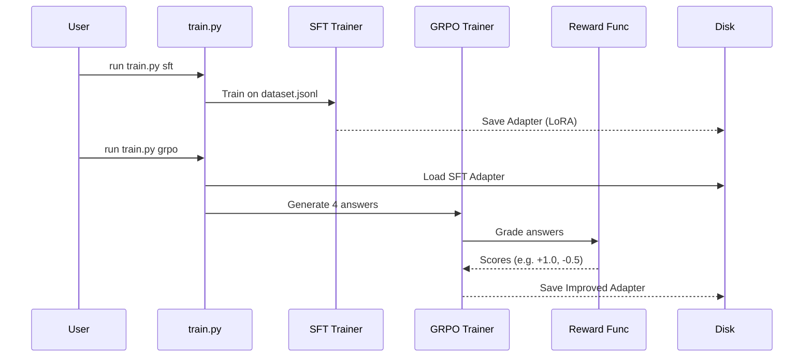

# Chapter 6: Fine-Tuning Pipeline

Welcome to the final chapter of the **QMD** project!

In [Chapter 5: Reward & Evaluation Logic](05_reward___evaluation_logic.md), we built a "Strict Teacher" (the Reward Function) that knows how to grade an AI's homework. But a teacher is useless without a student.

In this chapter, we will build the **Fine-Tuning Pipeline**. Think of this as the **Training Dojo**. It is an automated system that takes a generic, somewhat "dumb" language model and transforms it into a specialized expert at search query expansion.

## The Problem: Generic Models vs. Specialists

We want to run `qmd` locally on your laptop. This means we must use small AI models (like Qwen-1.5B or Llama-3-8B).

**The Issue:** Small generic models are easily distracted.
*   **User:** "login error"
*   **Generic Model:** "A login error occurs when credentials..." (This is a chat response, not a search query).
*   **What we want:**
    ```text
    lex: authentication failure
    lex: invalid password
    vec: trouble signing into account
    ```

We need to force the model to *only* speak in this specific format and generate high-quality search terms. To do this, we need a pipeline to train it.

## The "Training Dojo" Architecture

Our pipeline consists of three distinct stages. Think of it like learning a martial art:

1.  **Synthetic Data Generation (The Textbook):** We create thousands of examples of "perfect" behavior.
2.  **Supervised Fine-Tuning / SFT (The Lecture):** The model reads the textbook and tries to mimic it exactly.
3.  **Reinforcement Learning / GRPO (The Sparring Match):** The model tries to answer new questions, gets graded by the Reward Function, and improves based on the score.

### Stage 1: Synthetic Data Generation

We cannot write 10,000 training examples by hand. That would take forever. Instead, we use a very smart (but expensive) model like Claude 3.5 Sonnet or GPT-4 to write the textbook for our small model.

We use the script `finetune/dataset/generate_data.py`.

```typescript
// Conceptual logic of generate_data.py
while (examples < 1000) {
  // 1. Pick a random topic (e.g., "React", "Rust", "Cooking")
  const query = generateRandomQuery(); 

  // 2. Ask the Big Smart AI to expand it perfectly
  const expansion = await claude.ask(query);

  // 3. Save to our "textbook"
  saveToJson({ input: query, output: expansion });
}
```

**Why do this?**
We are "distilling" the intelligence of a massive cloud model into a tiny local model. The local model learns to copy the smart model's reasoning.

### Stage 2: Supervised Fine-Tuning (SFT)

Now we have the data. We use **Supervised Fine-Tuning (SFT)** to teach the model.

In this stage, the model is shown the Input ("login error") and forced to memorize the Output ("lex: authentication...").

We use `finetune/train.py` with the `sft` command.

```python
# finetune/train.py snippet
def cmd_sft(args):
    # 1. Load the "Textbook" we generated
    dataset = load_dataset("data/train.jsonl")

    # 2. Configure the Trainer
    trainer = SFTTrainer(
        model="Qwen/Qwen2.5-1.5B",
        train_dataset=dataset,
        # ... hyperparams
    )

    # 3. Start the "Lecture"
    trainer.train()
```

**What is happening here?**
The model adjusts its internal weights so that next time it sees "login error", it has a high statistical probability of outputting the specific keywords it saw in the training data. This teaches **Format** and **Basic Style**.

### Stage 3: Reinforcement Learning (GRPO)

SFT is good, but sometimes the model just memorizes without understanding. To make it truly smart, we use **Group Relative Policy Optimization (GRPO)**.

This is where we plug in the **Reward Function** from [Chapter 5: Reward & Evaluation Logic](05_reward___evaluation_logic.md).

1.  The model generates 4 different answers for a query.
2.  The Reward Function grades them (e.g., A, B, C, F).
3.  The model mathematically "nudges" itself to produce more answers like A and fewer like F.

```python
# finetune/train.py snippet for GRPO
    # Load our strict teacher from Chapter 5
    from reward import QMDRewardFunction

    trainer = GRPOTrainer(
        model=sft_trained_model, # Start with the model from Stage 2
        reward_funcs=[QMDRewardFunction()], # The Grader
        args=config
    )
    
    # Start the "Sparring"
    trainer.train()
```

**The Result:**
After GRPO, the model isn't just copying text; it is actively trying to maximize the "Diversity" and "Quality" metrics we defined in the previous chapter.

## Internal Implementation: The `train.py` Script

The heart of this chapter is the `finetune/train.py` script. It acts as the manager for the entire process.

Let's look at the workflow diagram:



### The "Export" Problem

The training tools (PyTorch/HuggingFace) save models in a format that is very large and requires Python to run.
However, our **Local AI Service** ([Chapter 2: Local AI Service](02_local_ai_service.md)) uses `node-llama-cpp`, which requires **GGUF** files.

Therefore, the final step of our pipeline is **Export & Quantization**.

```python
# finetune/train.py
def export_gguf(model, output_dir):
    # 1. Merge the "Sticky Notes" (LoRA) into the main brain
    merged_model = model.merge_and_unload()
    
    # 2. Convert to GGUF format (C++ compatible)
    subprocess.run([
        "python", "llama.cpp/convert.py", 
        merged_model 
    ])
    
    # 3. Quantize (Shrink from 16-bit to 4-bit)
    # This makes the model 4x smaller and faster!
    subprocess.run(["llama-quantize", "model.gguf", "Q4_K_M"])
```

**Explanation:**
1.  **Merge:** During training, we used LoRA (Low-Rank Adaptation), which acts like sticky notes on top of the brain. We must glue them down permanently.
2.  **Quantize:** We reduce the precision of the numbers in the model (like rounding 3.14159 to 3.14). This makes the model run smoothly on consumer laptops without losing much intelligence.

## How to Run It

To train your own model for `qmd`, you would run these commands in your terminal:

```bash
# 1. Generate Data
uv run generate_data.py --count 5000

# 2. Teach Format (SFT)
uv run train.py sft --config configs/sft.yaml

# 3. Optimize Quality (GRPO)
uv run train.py grpo --config configs/grpo.yaml
```

Once finished, you will have a file named `qmd-model-q4_k_m.gguf`. You simply drop this file into your `models/` folder, and the **Local AI Service** (Chapter 2) will automatically load it to power your searches.

## Project Conclusion

Congratulations! You have navigated the entire architecture of **QMD**.

Let's recap what we built:
1.  **[Hybrid Search Orchestrator](01_hybrid_search_orchestrator.md):** The command center that understands user intent.
2.  **[Local AI Service](02_local_ai_service.md):** The efficient engine running AI models on your hardware.
3.  **[Cross-Runtime Persistence](03_cross_runtime_persistence.md):** The database layer that works everywhere.
4.  **[MCP Server](04_model_context_protocol__mcp__server.md):** The bridge allowing other AI agents (like Claude) to use your tool.
5.  **[Reward & Evaluation Logic](05_reward___evaluation_logic.md):** The strict teacher that grades performance.
6.  **[Fine-Tuning Pipeline](06_fine_tuning_pipeline.md):** The school that creates the specialized AI models.

You now have a fully functional, private, local search engine that learns to understand *your* specific notes and documents. Happy coding!

---

Generated by [Code IQ](https://github.com/adityasoni99/Code-IQ)