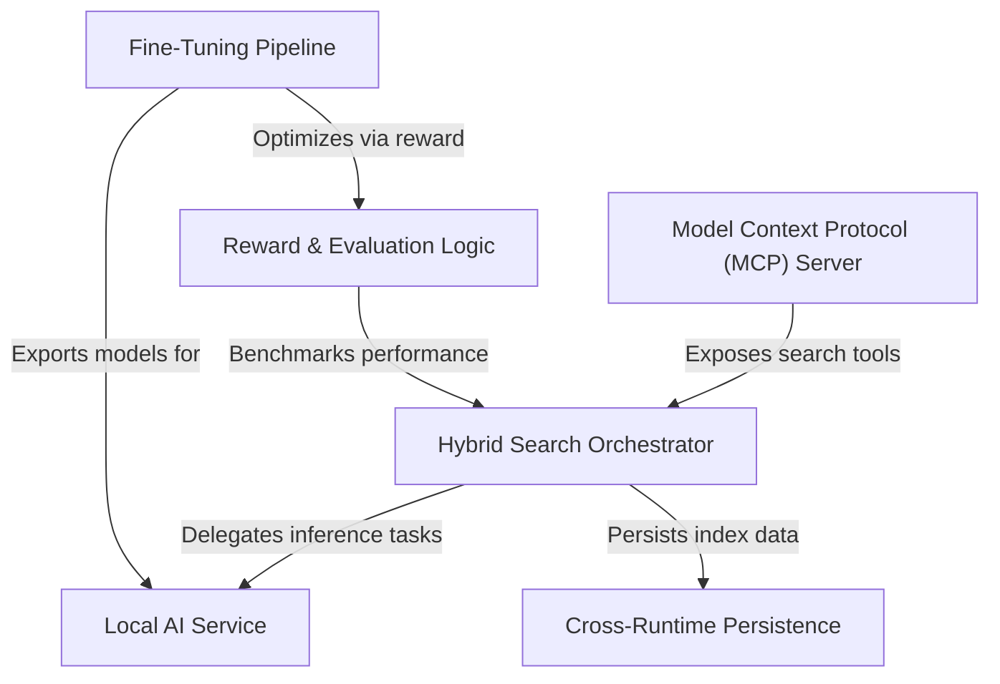

# Tutorial: qmd

QMD is an **on-device** search engine designed to index and retrieve knowledge from markdown notes, documentation, and transcripts using a **hybrid approach**. It combines keyword search (BM25), vector semantic search, and **LLM-based re-ranking** into a unified pipeline that runs locally. The project includes a **fine-tuning workflow** to train custom query expansion models and exposes its capabilities to external AI agents via the **Model Context Protocol (MCP)**.

**Source Repository:** [https://github.com/tobi/qmd](https://github.com/tobi/qmd)

## Chapters

1. [Hybrid Search Orchestrator](01_hybrid_search_orchestrator.md)
2. [Local AI Service](02_local_ai_service.md)
3. [Cross-Runtime Persistence](03_cross_runtime_persistence.md)
4. [Model Context Protocol (MCP) Server](04_model_context_protocol__mcp__server.md)
5. [Reward & Evaluation Logic](05_reward___evaluation_logic.md)
6. [Fine-Tuning Pipeline](06_fine_tuning_pipeline.md)

---

Generated by [Code IQ](https://github.com/adityasoni99/Code-IQ)