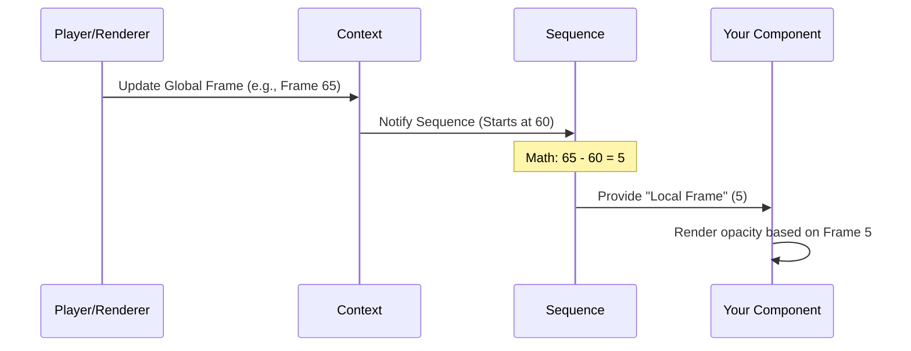

# Chapter 1: Core React Primitives

Welcome to the world of Remotion! If you come from a web development background, you are used to creating static layouts or interactive apps. But video is different—it introduces the dimension of **time**.

In this chapter, we will explore the **Core React Primitives**. These are the fundamental building blocks provided by Remotion that turn standard React components into a timeline-based video project.

## The Motivation

Imagine you want to create a video using HTML and CSS. You create a `<div>` with some text. But how do you tell React:

1.  "This video should be 1920x1080 pixels."
2.  "This text should appear only after 2 seconds."
3.  "This text should fade in based on the current time."

Standard React doesn't know about video duration or frames per second (FPS). Remotion solves this by providing special components and hooks that manage **Time** and **Layout** for you.

## The Building Blocks

Let's look at the four main tools you'll use in almost every file.

1.  **`<Composition />`**: The "Project Settings." It defines the canvas size, frame rate, and duration.
2.  **`<AbsoluteFill />`**: The "Paper." A layout helper to easily position layers.
3.  **`<Sequence />`**: The "Timeline Track." It shifts time, allowing you to say "start this clip at frame 30."
4.  **`useCurrentFrame()`**: The "Clock." It tells your component exactly which frame is currently being rendered.

---

## 1. The Canvas: `<Composition />`

Before you draw anything, you need to define the canvas. In video editing software, this is where you set your resolution and FPS.

In Remotion, you do this in your entry file (usually `index.tsx`) using the `<Composition />` component.

```tsx
import {Composition} from 'remotion';
import {MyVideo} from './MyVideo';

export const RemotionVideo: React.FC = () => {
  return (
    <Composition
      id="MyFirstVideo"
      component={MyVideo}
      durationInFrames={150} // 5 seconds at 30fps
      fps={30}
      width={1920}
      height={1080}
    />
  );
};
```

**What happens here?**
*   **id**: A unique name for your video.
*   **component**: The actual React component that contains your visual content.
*   **durationInFrames**: How long the video is.
*   **fps**: Frames Per Second.

## 2. The Layout: `<AbsoluteFill />`

In web design, positioning elements can be tricky (margins, padding, flexbox). In video, we usually want layers stacked on top of each other, filling the whole screen.

`<AbsoluteFill />` is a simple helper component. It is essentially a `<div>` with `position: absolute`, `top: 0`, `left: 0`, `width: 100%`, and `height: 100%`.

```tsx
import {AbsoluteFill} from 'remotion';

export const MyVideo = () => {
  return (
    <AbsoluteFill style={{backgroundColor: 'white'}}>
      <h1>Hello World</h1>
    </AbsoluteFill>
  );
};
```

Using this ensures your component creates a solid layer covering the previous one, just like a track in a video editor.

## 3. The Timeline: `<Sequence />`

This is the magic component. By default, all React components render at the same time (frame 0). To make a scene appear *later* in the video, we wrap it in a `<Sequence />`.

Think of a Sequence as a container that **shifts time** for its children.

```tsx
import {Sequence} from 'remotion';
import {Title} from './Title';
import {Subtitle} from './Subtitle';

export const MyVideo = () => {
  return (
    <>
      {/* Starts at 0 seconds, lasts for 60 frames */}
      <Sequence from={0} durationInFrames={60}>
        <Title />
      </Sequence>

      {/* Starts at 2 seconds (frame 60) */}
      <Sequence from={60} durationInFrames={90}>
        <Subtitle />
      </Sequence>
    </>
  );
};
```

**Key Concept:**
Inside the second sequence (the Subtitle), frame 0 acts like frame 60 of the main video. The component inside doesn't know it's being delayed; it just plays from its own start.

## 4. The Clock: `useCurrentFrame`

To animate things, we need to know what time it is. The `useCurrentFrame()` hook gives us the current frame number as an integer (0, 1, 2, 3...).

When React re-renders, this number increases. We can use math to change styles based on this number.

```tsx
import {useCurrentFrame} from 'remotion';

export const Title = () => {
  const frame = useCurrentFrame();
  
  // Opacity increases from 0 to 1 over the first 20 frames
  const opacity = Math.min(1, frame / 20);

  return <h1 style={{ opacity }}>Hello!</h1>;
};
```

If this component is wrapped in a `<Sequence from={60}>`, `useCurrentFrame()` will return `0` when the video is actually at frame `60`. This "relative time" makes components reusable!

> **Note:** For more complex animations, we will look at [Animation Utilities](02_animation_utilities.md) in the next chapter.

---

## Under the Hood

How does Remotion actually achieve this time travel logic? Let's visualize the flow of time.

When the video plays, the "Engine" (either [The Player](03_the_player.md) or [The Rendering Engine](05_the_rendering_engine.md)) updates the global frame number.



### Deep Dive: `Sequence.tsx`

The `Sequence` component is primarily a Context Provider. It calculates the offset between the parent's time and its own start time.

Here is a simplified look at how `Sequence.tsx` calculates time logic:

```tsx
// Simplified logic from packages/core/src/Sequence.tsx

const Sequence = ({ from, children }) => {
  // 1. Get the current absolute frame of the video
  const absoluteFrame = useTimelinePosition(); 
  
  // 2. Calculate if we should show children
  const shouldShow = absoluteFrame >= from;

  // 3. Create context for children so they see relative time
  const contextValue = {
    cumulatedFrom: from, // Used to subtract from absolute frame later
    relativeFrom: from,
  };

  if (!shouldShow) return null;

  return (
    <SequenceContext.Provider value={contextValue}>
      <AbsoluteFill>{children}</AbsoluteFill>
    </SequenceContext.Provider>
  );
};
```

### Deep Dive: `useCurrentFrame.ts`

When you call `useCurrentFrame`, you aren't just asking for the global video time. You are asking: "What frame is it *inside this specific sequence*?".

```tsx
// Simplified logic from packages/core/src/use-current-frame.ts

export const useCurrentFrame = () => {
  // 1. Get the absolute video frame (e.g., 65)
  const frame = useTimelinePosition();
  
  // 2. Check if we are inside a Sequence
  const context = useContext(SequenceContext);

  // 3. Subtract the offset (e.g., 60)
  const offset = context ? context.cumulatedFrom : 0;

  // 4. Return relative frame (65 - 60 = 5)
  return frame - offset;
};
```

This elegant architecture allows you to nest Sequences within Sequences endlessly, and the math will always ensure the child component sees frame `0` when it appears on screen.

## Summary

In this chapter, you learned the grammar of Remotion:
1.  **Composition**: Defines the video settings.
2.  **AbsoluteFill**: Handles CSS positioning.
3.  **Sequence**: Handles timing and placement on the timeline.
4.  **useCurrentFrame**: Drives animation by reading the time.

With these primitives, you can place elements on screen and determine *when* they appear. However, calculating raw math like `frame / 20` for animations can get messy.

In the next chapter, we will learn how to make movement smooth and easy using [Animation Utilities](02_animation_utilities.md).

---

Generated by [Code IQ](https://github.com/adityasoni99/Code-IQ)