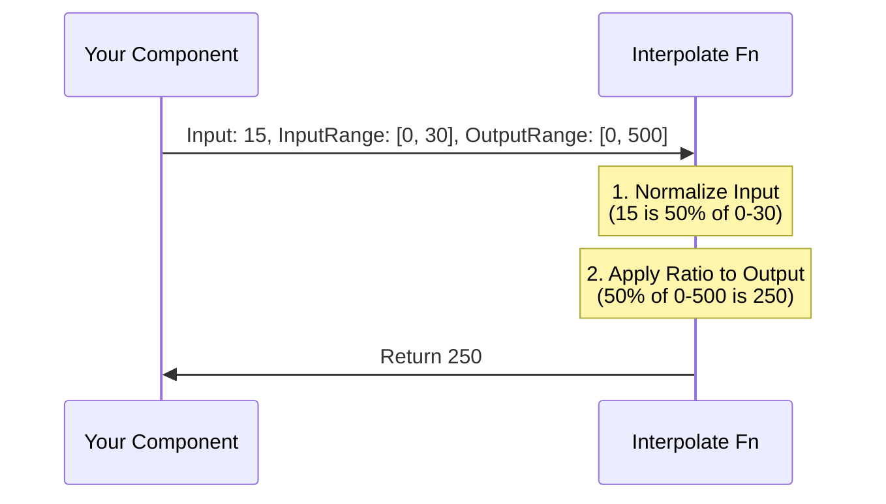

# Chapter 2: Animation Utilities

In the previous chapter, [Core React Primitives](01_core_react_primitives.md), we learned how to set up a video and position elements on a timeline. We briefly touched on animation using raw math (`frame / 20`), but as you might guess, calculating complex movements manually is difficult and error-prone.

In this chapter, we will explore **Animation Utilities**. These are helper functions designed to make movement smooth, natural, and easy to read.

## The Motivation

Imagine you want to move a red box from the left side of the screen (0px) to the right side (500px). You want this movement to happen specifically between **frame 0** and **frame 30**.

If you use raw math:
```tsx
const x = (frame / 30) * 500;
```

**The Problem:**
1.  **Before frame 0:** The box moves backwards into negative pixels.
2.  **After frame 30:** The box keeps moving forever (at frame 60, it's at 1000px).

We need a way to say: *"Map frame 0-30 to pixel 0-500, and don't go beyond that."*

## 1. Linear Motion: `interpolate`

The `interpolate` function is the bread and butter of Remotion. It maps an **Input Range** (usually time) to an **Output Range** (values like opacity, pixels, rotation).

### Basic Usage

Let's solve the "moving box" problem.

```tsx
import { interpolate, useCurrentFrame } from 'remotion';

export const MovingBox = () => {
  const frame = useCurrentFrame();

  // Map time (0 to 30) to position (0 to 500)
  const x = interpolate(frame, [0, 30], [0, 500]);

  return <div style={{ transform: `translateX(${x}px)` }} />;
};
```

**What happens here?**
*   At frame **0**, `x` is **0**.
*   At frame **15**, `x` is **250** (halfway).
*   At frame **30**, `x` is **500**.

### Handling Limits (Clamping)

By default, `interpolate` extends values endlessly. If we are at frame 100, `x` will be huge. To stop the animation when it reaches the target, we use **Extrapolation**.

```tsx
const x = interpolate(
  frame, 
  [0, 30], 
  [0, 500], 
  {
    extrapolateRight: 'clamp', // Stop increasing after frame 30
    extrapolateLeft: 'clamp',  // Stop decreasing before frame 0
  }
);
```

Now, at frame 100, `x` stays at **500**. The box stops moving.

## 2. Fluid Motion: `spring`

While `interpolate` creates linear, robotic movement, `spring` creates natural, physics-based motion. It simulates pulling a heavy object with a rubber band.

It doesn't just stop abruptly; it might overshoot slightly and settle, just like real objects.

### Basic Usage

The `spring` function takes the current time, the video FPS, and a configuration object.

```tsx
import { spring, useCurrentFrame, useVideoConfig } from 'remotion';

export const BouncyBox = () => {
  const frame = useCurrentFrame();
  const { fps } = useVideoConfig();

  // Calculates a value from 0 to 1 with physics
  const scale = spring({
    frame,
    fps,
    config: { stiffness: 100 }
  });

  return <div style={{ transform: `scale(${scale})` }} />; 
};
```

**Key Differences from Interpolate:**
1.  You don't define an end frame (like "finish at frame 30"). The physics engine decides when the animation finishes based on the energy.
2.  The output usually goes from **0** to **1** by default (perfect for `scale` or `opacity`).

### Customizing Physics

You can tune the "feel" of the animation using the `config` prop:

*   **Mass**: How heavy the object is (heavier = slower to start/stop).
*   **Damping**: Friction (low damping = wobbles for a long time).
*   **Stiffness**: How strong the spring is (high stiffness = snappy).

```tsx
const move = spring({
  frame,
  fps,
  from: 0,
  to: 100, // Move 100 pixels
  config: {
    mass: 1,
    damping: 10, // Try changing this to 200 for no bounce
  },
});
```

---

## Under the Hood

How does Remotion calculate these values so fast without storing state?

### 1. The Logic of `interpolate`

`interpolate` is a **stateless** mathematical function. It doesn't know what happened in the previous frame. It simply calculates a ratio.



Let's look at the simplified implementation from `packages/core/src/interpolate.ts`.

**Step 1: Normalization**
First, we figure out how far along the input we are (0.0 to 1.0).

```ts
// Simplified concept
const inputMin = 0; 
const inputMax = 30;
const input = 15;

// Result is 0.5 (50%)
let result = (input - inputMin) / (inputMax - inputMin);
```

**Step 2: Linear Interpolation (Lerp)**
Then, we map that percentage to the output range.

```ts
const outputMin = 0;
const outputMax = 500;

// 0.5 * (500 - 0) + 0 = 250
const finalValue = result * (outputMax - outputMin) + outputMin;
```

This math is incredibly efficient, allowing Remotion to render thousands of frames quickly.

### 2. The Logic of `spring`

You might think physics requires simulating every previous frame to know the current velocity. However, Remotion uses a closed-form solution (analytical math) to calculate the position of a spring at any specific time *instantly*.

This means you can jump to frame 100, and `spring` calculates the exact position without needing to calculate frames 0-99.

**Simplified flow in `packages/core/src/spring/index.ts`:**

1.  **Validate**: Ensure FPS and Frames are numbers.
2.  **Measure**: If `durationInFrames` is passed, it stretches the physics to fit that time.
3.  **Calculate**: It runs the physics formula for the specific `frame` requested.
4.  **Interpolate**: If `from` and `to` are provided, it maps the spring's natural 0-1 movement to your desired values.

```tsx
// Inside spring() function
const spr = springCalculation({
    fps,
    frame: durationProcessed, // The current time
    config,
});

// If you asked for 0 to 100px, we map the spring result (0-1) to 0-100
return interpolate(spr.current, [0, 1], [from, to]);
```

## Helper for Complex Styles

Sometimes you want to animate a CSS string like `10px` to `50%` or colors like `red` to `blue`. Remotion provides `interpolateStyles` for this.

It automatically detects units and numbers inside strings.

```tsx
import { interpolateStyles } from 'remotion';

const style = interpolateStyles(
  frame,
  [0, 30],
  [{ color: 'red', width: '10px' }, { color: 'blue', width: '100px' }]
);
// Result at frame 15: { color: 'purple', width: '55px' }
```

*See `packages/animation-utils/src/transformation-helpers/interpolate-styles/index.tsx` for details on how it parses and splits strings to animate numbers individually.*

## Summary

In this chapter, we unlocked the power of motion:

1.  **`interpolate`**: Maps time to values linearly. Use `clamp` to set limits.
2.  **`spring`**: Creates fluid, organic motion based on physics.
3.  **Statelessness**: These utilities calculate values instantly based on the current frame, making your video "seekable" (you can click anywhere on the timeline and see the correct frame immediately).

Now that we know how to create components and animate them, we need a way to view and debug our video. In the next chapter, we will explore the tool you see in the browser: [The Player](03_the_player.md).

---

Generated by [Code IQ](https://github.com/adityasoni99/Code-IQ)