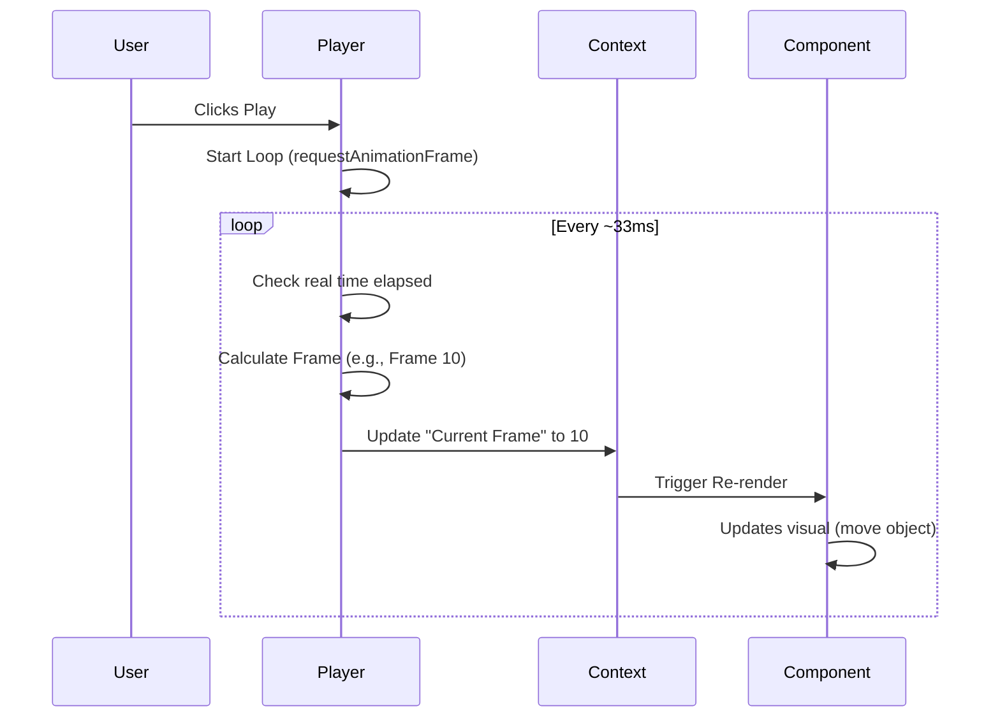

# Chapter 3: The Player

In the previous chapters, we learned how to build video scenes using [Core React Primitives](01_core_react_primitives.md) and move them around using [Animation Utilities](02_animation_utilities.md).

However, we currently only have a way to define **one single frame** at a time. If we want to see our animation move, we need something to rapidly update the frame number, just like flipping through the pages of a flipbook.

In this chapter, we will explore **The Player**.

## The Motivation

Imagine you have created a React component that displays a clock. The time on the clock depends on the frame number.

To see the clock move, you need a mechanism that:
1.  **Increments the frame** 30 times per second (for 30fps).
2.  **Synchronizes** this visual update with any audio.
3.  **Provides controls** (Play, Pause, Seek) so you can review specific moments.

Standard React doesn't have a "Play" button. **The Player** component bridges this gap. It acts as a wrapper around your video, turning a static React render into an interactive video preview directly in the browser.

## Basic Usage

The `<Player />` component is part of the `@remotion/player` package. It requires two main things:
1.  **What** to show (your React component).
2.  **The Physics** of the video (duration, size, FPS).

### A Minimal Example

Let's say you have a component `MyVideo` that uses `useCurrentFrame()`. Here is how you embed it in a web page:

```tsx
import {Player} from '@remotion/player';
import {MyVideo} from './MyVideo';

export const Preview = () => {
  return (
    <Player
      component={MyVideo}
      durationInFrames={300}
      compositionWidth={1920}
      compositionHeight={1080}
      fps={30}
      controls // Shows Play/Pause/Seek bar
    />
  );
};
```

**What happens here?**
*   **component**: Remotion will render `<MyVideo />`.
*   **controls**: Remotion adds a UI layer (play button, timeline, volume slider) on top of your video.
*   **fps**: The Player now knows it needs to trigger a re-render every ~33 milliseconds (1000ms / 30fps).

## Key Concepts

### 1. The Context Provider
Remember `useCurrentFrame()` from Chapter 1? That hook looks for a number provided by a **Context**.

When you use the `<Player />`, it wraps your `MyVideo` component in a Provider. When the player is paused at frame 0, it provides `0`. When you click "Play", it rapidly updates that context value to `1`, `2`, `3`... causing your component to re-render with new positions.

### 2. Auto-Scaling
If you define your video as `1920x1080`, it likely won't fit on a mobile phone screen or inside a small dashboard widget.

The Player automatically calculates a CSS `scale()` transform. It keeps your video at full resolution internal coordinates but shrinks the display to fit the parent container (like a `<div>`).

### 3. Audio Synchronization
Browsers are not perfect metronomes. If the Player simply added `frame + 1` every time the screen refreshed, the video might play faster or slower than the audio if the computer lags.

To solve this, the Player uses **Time-Based Synchronization**. It checks the real-world clock (`performance.now()`) to decide exactly which frame *should* be displayed right now.

---

## Under the Hood

How does the Player actually drive the animation? It uses a browser API called `requestAnimationFrame`.

### The Playback Loop

When you click "Play", the Player starts a loop.



### Deep Dive: `use-playback.ts`

This file is the "heartbeat" of the player. It manages the loop.

**1. The Loop Mechanism**
The player doesn't use `setInterval` (which is inaccurate). It uses `requestAnimationFrame`, which asks the browser "Please run this function before you paint the screen next time."

```ts
// Simplified from packages/player/src/use-playback.ts

const callback = () => {
  // 1. How much real time passed since we started?
  const time = performance.now() - startedTime;
  
  // 2. Math: Time * FPS = Current Frame
  const nextFrame = calculateNextFrame({ time, fps, ... });

  // 3. Update React State (triggers re-render)
  setFrame(nextFrame);

  // 4. Request the next loop
  requestAnimationFrame(callback);
};
```

**2. Handling "Backgrounding"**
If you switch tabs in your browser, `requestAnimationFrame` stops running to save battery. If the audio keeps playing, the video would freeze and lose sync.

Remotion detects this and switches to a backup timer (`setTimeout`) so the frame number keeps updating even if you can't see the video.

```ts
// Simplified from packages/player/src/use-playback.ts

if (document.visibilityState === 'hidden') {
  // Browser is backgrounded, use timeout instead of RAF
  setTimeout(callback, 1000 / fps);
} else {
  // Browser is visible, use smooth animation
  requestAnimationFrame(callback);
}
```

### Deep Dive: `Player.tsx`

This is the public-facing component. Its job is to validate your inputs and set up the environment.

**1. Validation**
Before starting, the Player ensures you aren't asking for the impossible, like a video with `0` frames or negative FPS.

```ts
// Simplified from packages/player/src/Player.tsx

validateDimension(compositionHeight, 'height');
validateFps(fps);
validateDurationInFrames(durationInFrames);

// Checks if you provided a valid component
if (component === Composition) {
  throw new Error("Pass your own component, not <Composition />");
}
```

**2. Context Injection**
This is where the magic connection happens. The Player wraps your video in the `TimelineContext`.

```tsx
// Simplified from packages/player/src/Player.tsx

return (
  <SharedPlayerContexts
    timelineContext={{ frame, playing, ... }} // The state changing rapidly
    width={width}
    height={height}
  >
    <PlayerUI /> {/* The UI with buttons */}
  </SharedPlayerContexts>
);
```

Because of this wrapper, any hook like `useCurrentFrame` inside your video can simply ask "What time is it?" without knowing *who* is controlling the time.

## Summary

In this chapter, we learned:
1.  **The Player** acts as the engine that drives your video, updating the frame number continuously.
2.  It uses **Context** to inject the current time into your components.
3.  It handles **Time-Based Sync** to ensure your animation matches the audio, even if the computer lags.
4.  It manages the **Playback Loop** using `requestAnimationFrame`.

The Player is excellent for embedding videos on websites. However, usually, you want a more powerful environment to *create* your video—one with a timeline, property editors, and debugging tools.

For that, Remotion provides a specialized development environment built on top of The Player. In the next chapter, we will explore [The Studio](04_the_studio.md).

---

Generated by [Code IQ](https://github.com/adityasoni99/Code-IQ)