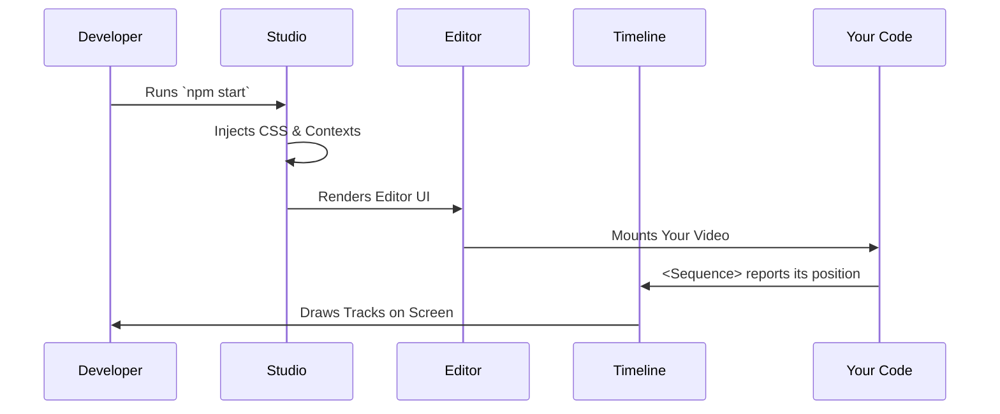

# Chapter 4: The Studio

In the previous chapter, [The Player](03_the_player.md), we learned how to embed our video in a web page to watch it play. While the Player is great for *viewing*, it lacks the tools needed for *editing*.

Imagine trying to write a complex document without a text cursor, spellcheck, or page numbers. That is what coding video feels like without a proper environment.

In this chapter, we explore **The Studio**.

## The Motivation

You have written code that says: "Start the title at frame 0" and "Start the subtitle at frame 60."
But as your project grows, you have 50 different sound effects, video clips, and text layers.

**The Problem:**
1.  How do you visualize which clip plays at the same time as another?
2.  How do you find the exact frame number where a specific beat drops in the music?
3.  How do you tweak a color without reloading the whole page?

**The Solution:**
**The Studio** is the "Integrated Development Environment" (IDE) for your video. It wraps the Player with a visual interface that resembles tools like Adobe Premiere or Final Cut Pro.

## What is The Studio?

The Studio is a React application that runs locally on your computer while you develop. It does three main things:

1.  **Visualizes Time:** It turns your `<Sequence>` components into horizontal tracks on a timeline.
2.  **Inspects Properties:** It allows you to change props (like text or color) using a sidebar form.
3.  **Fast Refreshes:** It updates the video instantly when you save your code, keeping the current time position.

## Using The Studio

Unlike the Player, which you embed in your own app, the Studio is usually launched via the command line (e.g., `npm start` in a Remotion project).

However, structurally, it is just another React Component that wraps your video.

### 1. The Entry Point

In a standard Remotion project, `remotion/index.ts` registers your root component. When you run the studio, it wraps your Root with the Studio interface.

```tsx
// simplified concept
import { Studio } from 'remotion';
import { MyVideo } from './MyVideo';

export const DevEnvironment = () => {
  return (
    <Studio
      rootComponent={MyVideo}
      readOnly={false} // We want to edit!
    />
  );
};
```

### 2. The Visual Timeline

The most important feature of the Studio is the **Timeline**.

If you write this code:

```tsx
<Sequence from={0} durationInFrames={30} name="Intro">
  <Title />
</Sequence>
<Sequence from={30} durationInFrames={60} name="Body">
  <Content />
</Sequence>
```

The Studio scans your React tree and renders a visual representation:

*   **Row 1:** A purple bar named "Intro" from 0 to 30.
*   **Row 2:** A blue bar named "Body" from 30 to 90.

This gives you immediate visual feedback on the structure of your video.

---

## Under the Hood

How does the Studio know what you wrote in your code? React components are usually just functions.

The Studio uses a clever combination of **Contexts** and **Tree Traversal** to "spy" on your sequences.

### High-Level Flow



### Deep Dive: `Studio.tsx`

The `Studio.tsx` file is the container. It sets up the environment necessary for the editor to work.

It wraps everything in a `CompositionManagerProvider`. This system keeps track of all the videos (Compositions) you have defined in your project.

```tsx
// Simplified from packages/studio/src/Studio.tsx

export const Studio = ({rootComponent}) => {
  // 1. Inject global CSS for the dark mode UI
  useLayoutEffect(() => injectCSS(), []);

  return (
    <FastRefreshProvider>
       {/* 2. Set up the internal state managers */}
      <Internals.CompositionManagerProvider>
         <Internals.RemotionRootContexts>
            {/* 3. Render the Editor Interface */}
            <Editor Root={rootComponent} />
         </Internals.RemotionRootContexts>
      </Internals.CompositionManagerProvider>
    </FastRefreshProvider>
  );
};
```

### Deep Dive: `Editor.tsx`

The `Editor` component builds the layout. It divides the screen into the **Preview Area** (top) and the **Timeline Area** (bottom).

It calculates the size of the window so it knows how large to draw the video player.

```tsx
// Simplified from packages/studio/src/components/Editor.tsx

export const Editor = ({Root}) => {
  // 1. Measure the window size
  const size = PlayerInternals.useElementSize(drawRef);

  return (
    <div style={background}>
      {/* 2. The Video Preview Area */}
      <EditorContent>
         <TopPanel /> 
         {/* Your actual video component is rendered here conceptually */}
         <Root /> 
      </EditorContent>

      {/* 3. Notification popups */}
      <NotificationCenter />
    </div>
  );
};
```

### Deep Dive: The Timeline Logic

The most complex part is converting React components into timeline bars. This happens in `Timeline.tsx`.

Remotion maintains a list of active `sequences` in a Context. The Timeline component reads this list and calculates where to draw the bars.

```tsx
// Simplified from packages/studio/src/components/Timeline/Timeline.tsx

export const Timeline = () => {
  // 1. Get list of sequences from Context
  const { sequences } = useContext(Internals.SequenceManager);
  
  // 2. Sort and organize them into tracks (rows)
  const timeline = useMemo(() => {
    return calculateTimeline({ sequences });
  }, [sequences]);

  // 3. Render the tracks
  return (
    <TimelineScrollable>
       <TimelineTracks timeline={timeline} />
       <TimelineTimeIndicators /> {/* The numbers (0s, 1s, 2s) */}
    </TimelineScrollable>
  );
};
```

### Deep Dive: Drawing Tracks

Finally, `TimelineTracks.tsx` iterates over the calculated data and renders the actual DOM elements for the bars.

```tsx
// Simplified from packages/studio/src/components/Timeline/TimelineTracks.tsx

export const TimelineTracks = ({ timeline }) => {
  return (
    <div>
      {timeline.map((track) => (
        <div key={track.sequence.id}>
           {/* Render the colored bar */}
           <TimelineSequence sequence={track.sequence} />
        </div>
      ))}
    </div>
  );
};
```

## Summary

In this chapter, we learned that **The Studio**:
1.  Is a visual development environment wrapping your code.
2.  Visualizes your `<Sequence>` code as tracks on a timeline.
3.  Allows for fast feedback loops during development.

At this point, you have defined your video (Primitives), animated it (Utilities), previewed it (Player), and fine-tuned it (Studio).

Now, how do we turn this React code into an actual MP4 file that you can upload to YouTube? For that, we need to take a snapshot of every single frame and stitch them together.

In the next chapter, we will learn about [The Rendering Engine](05_the_rendering_engine.md).

---

Generated by [Code IQ](https://github.com/adityasoni99/Code-IQ)