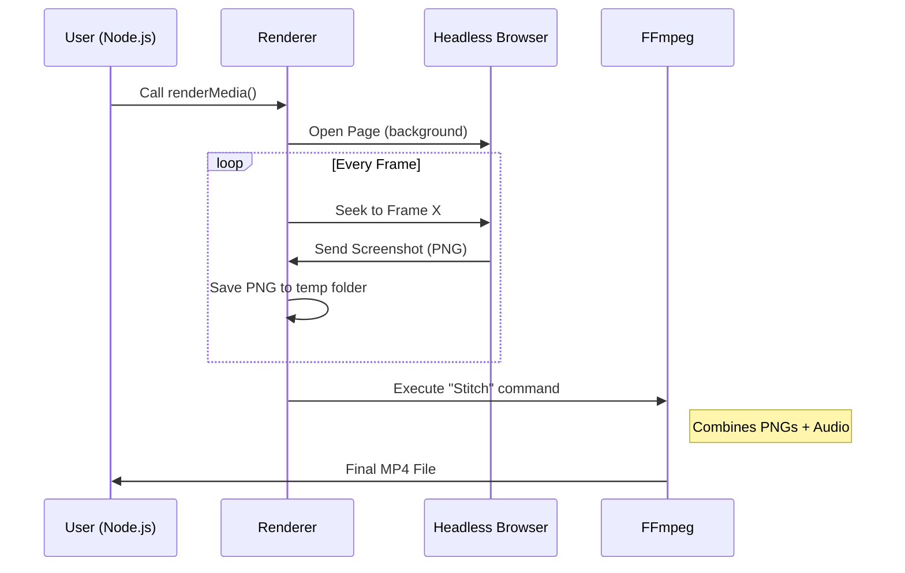

# Chapter 5: The Rendering Engine

In the previous chapter, we explored [The Studio](04_the_studio.md), a visual environment that lets you preview and edit your video in real-time.

However, The Studio is just a preview running in your web browser. You cannot email a "Studio Preview" to a client or upload it to YouTube. To do that, you need to "bake" your React code into a standalone video file (like an MP4).

This is the job of **The Rendering Engine**.

## The Motivation

Video files are essentially a stack of still images played in rapid succession (usually 30 or 60 per second).

Your React code is dynamic—it calculates positions and colors on the fly using JavaScript. To create a video file, we need a process that:
1.  **Freezes** time at a specific frame.
2.  **Takes a picture** (screenshot) of what the browser sees.
3.  **Repeats** this for every single frame in the video.
4.  **Stitches** these thousands of images together into an MP4.

This process is exactly what a stop-motion animator does with clay figures, but Remotion does it with DOM elements.

## The Solution: `renderMedia()`

The Rendering Engine is a Node.js process. It doesn't run inside the webpage; it runs on your computer's terminal or a server. The main function you will use is `renderMedia`.

### Basic Usage

You typically create a script (e.g., `build.ts`) to trigger the render.

```ts
import { renderMedia, selectComposition } from '@remotion/renderer';
import path from 'path';

const start = async () => {
  // 1. Find the composition you want to render
  const composition = await selectComposition({
    serveUrl: './public', // Path to your built web project
    id: 'MyVideo',
  });

  // 2. Start the rendering process
  await renderMedia({
    composition,
    serveUrl: './public',
    codec: 'h264',
    outputLocation: path.join(__dirname, 'out/video.mp4'),
  });
};

start();
```

**What happens here?**
*   **serveUrl**: Remotion needs to visit your project like a website. This points to your bundled code.
*   **codec**: Defines the format (h264 is standard for MP4).
*   **outputLocation**: Where to save the final file.

## Key Concepts

### 1. The Headless Browser
To take screenshots of your React components, Remotion needs a browser. It uses **Puppeteer**, which is a version of Google Chrome that runs without a visible window ("headless").

It opens your React app in the background, invisible to you, to perform the photography.

### 2. Concurrency
Rendering one frame at a time is slow. If your video is 60 seconds at 30fps, that is 1,800 frames.

Remotion speeds this up by opening **multiple browser tabs** at once.
*   Tab 1 renders frames 0-100.
*   Tab 2 renders frames 101-200.
*   Tab 3 renders frames 201-300.

This turns your multi-core CPU into a rendering powerhouse.

### 3. Stitching (FFmpeg)
Once Remotion has thousands of PNG images saved in a temporary folder, it needs to glue them together.

It uses a tool called **FFmpeg**, which is the industry standard for processing video and audio. Remotion commands FFmpeg to take the images and the audio track and compress them into a single file.

---

## Under the Hood

How does Remotion coordinate Chrome, React, and FFmpeg? Let's visualize the flow.



Let's look at the actual code that powers this logic.

### Phase 1: The Orchestrator (`render-media.ts`)

This is the main entry point. It sets up the environment, prepares the browser, and manages the loop.

```ts
// Simplified from packages/renderer/src/render-media.ts

export const renderMedia = async (options) => {
  // 1. Create a temporary folder for screenshots
  const workingDir = fs.mkdtempSync('remotion-render');

  // 2. Calculate how many frames we need
  const totalFrames = options.composition.durationInFrames;

  // 3. Start the frame extraction loop (opens browsers)
  await internalRenderFrames({
    outputDir: workingDir,
    frames: totalFrames,
    // ... other options
  });

  // 4. Stitch the images into a video
  await internalStitchFramesToVideo({
    assetsInfo: workingDir,
    outputLocation: options.outputLocation
    // ... other options
  });
};
```

### Phase 2: The Photographer (`render-frame.ts`)

This function runs inside the loop. Its only job is to get the browser to the right moment and snap a picture.

```ts
// Simplified from packages/renderer/src/render-frame.ts

const renderFrame = async ({ page, frame, composition }) => {
  // 1. Update the "Time" inside the browser
  // This triggers useCurrentFrame() in your component!
  await page.evaluate((f) => {
    remotion_setFrame(f);
  }, frame);

  // 2. Wait for data to load (like  tags)
  await page.waitForFunction(() => remotion_readyToRender());

  // 3. Take the screenshot
  const screenshot = await page.screenshot({
    type: 'png',
    omitBackground: true,
  });

  return screenshot;
};
```

### Phase 3: The Stitcher (`stitch-frames-to-video.ts`)

Once all frames are captured, we call FFmpeg. This file constructs the complex command line arguments needed to encode video.

```ts
// Simplified from packages/renderer/src/stitch-frames-to-video.ts

const stitchFramesToVideo = async ({ fps, width, height }) => {
  // Construct the command for FFmpeg
  const args = [
    '-r', fps,                  // Set Frame Rate
    '-f', 'image2',             // Input format is images
    '-s', `${width}x${height}`, // Resolution
    '-i', 'frame-%d.png',       // Input filename pattern
    'output.mp4'                // Output file
  ];

  // Spawn the FFmpeg process
  await callFfNative({
    bin: 'ffmpeg',
    args: args
  });
};
```

## Why is this approach powerful?

1.  **Reproducibility**: Because we render frame-by-frame, the output is pixel-perfect every time. It doesn't matter if your computer lags; the rendering engine simply waits for the screenshot to be ready before moving to the next frame.
2.  **Web Technologies**: You can use any CSS, SVG, or WebGL feature. If Chrome can display it, Remotion can render it.
3.  **Parallelization**: Unlike screen recording software, Remotion can render faster than real-time by using multiple browser instances simultaneously.

## Summary

In this chapter, we learned:
1.  **The Rendering Engine** converts dynamic React code into static video files.
2.  It uses **Puppeteer** (Headless Chrome) to take screenshots of every frame.
3.  It uses **FFmpeg** to stitch those screenshots into an MP4.
4.  The process is managed by `renderMedia()`.

Rendering video on your local computer is great for testing. But what if you want to generate thousands of personalized videos for users? Rendering locally isn't scalable.

In the next chapter, we will learn how to move this rendering engine to the cloud using [Serverless Architecture (Lambda)](06_serverless_architecture__lambda_.md).

---

Generated by [Code IQ](https://github.com/adityasoni99/Code-IQ)