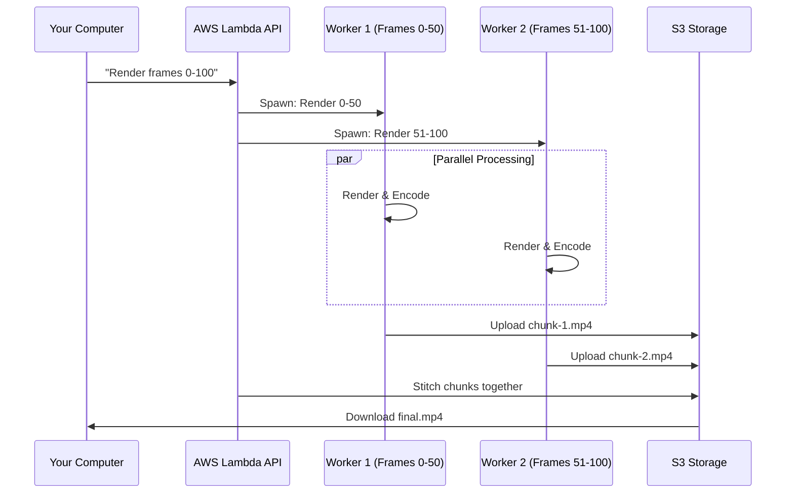

# Chapter 6: Serverless Architecture (Lambda)

In the previous chapter, [The Rendering Engine](05_the_rendering_engine.md), we learned how to turn your React code into an MP4 file using your local computer.

While rendering locally is great for testing, it has a major limitation: **Speed**. Even a powerful computer can only render frames so fast. If you have a 10-minute video, it might take 20 minutes to render.

What if you could render that same video in 30 seconds? Or what if you needed to render 1,000 personalized videos for different users at the same time?

In this chapter, we will explore **Serverless Architecture** (specifically using AWS Lambda) to solve these problems by massively parallelizing the workload.

## The Motivation: The Kitchen Analogy

Imagine you are a chef in a kitchen (your computer). You need to chop 1,000 carrots (frames).
*   **Local Rendering:** You chop one carrot at a time. It takes 1,000 seconds.
*   **Serverless Rendering:** You hire 100 chefs (Lambda functions) for just 10 seconds. You give each chef 10 carrots. They all chop at the exact same time.

**Result:** The job is done in 10 seconds instead of 1,000.

Remotion Lambda allows you to "rent" hundreds of cloud computers for a few seconds, render small pieces of your video simultaneously, and stitch them together.

## Core Concepts

To make this work, Remotion breaks the rendering process into three specific steps:

### 1. Chunking (The Split)
Instead of one long task, Remotion splits your video into small ranges called **chunks**.
*   Chunk 1: Frames 0–99
*   Chunk 2: Frames 100–199
*   Chunk 3: Frames 200–299

### 2. Parallelism (The Swarm)
Remotion spins up a separate AWS Lambda function for *each* chunk.
*   Lambda A renders Chunk 1.
*   Lambda B renders Chunk 2.
*   Lambda C renders Chunk 3.

All of these happen at the exact same time.

### 3. Stitching (The Glue)
Once all Lambdas finish, they upload their small video snippets to a storage bucket (S3). Remotion then starts one final process to glue (concatenate) these snippets into a single output file (e.g., `final.mp4`).

---

## How to Use It

Using Remotion Lambda involves two main parts: **Deploying** the infrastructure code once, and then **Invoking** the render whenever you want.

### 1. Deploying the Function

Before you can render, you need to set up the "kitchen" in the cloud. You do this using `deployFunction`. This uploads a zip file containing the Remotion engine to your AWS account.

```ts
import { deployFunction } from '@remotion/lambda';

const setup = async () => {
  const { functionName } = await deployFunction({
    region: 'us-east-1',
    memorySizeInMb: 2048,
    timeoutInSeconds: 240,
    createCloudWatchLogGroup: true,
  });
  
  console.log(`Deployed! Function name: ${functionName}`);
};
```

**What happens here?**
*   **region**: Which AWS data center to use.
*   **memorySizeInMb**: How powerful the cloud computer should be.
*   **functionName**: You receive an ID (like `remotion-render-3-0-0`) to use later.

### 2. Rendering the Video

Now that the function exists, you can tell it to render your video. You use `renderMediaOnLambda`.

```ts
import { renderMediaOnLambda } from '@remotion/lambda';

const startRender = async () => {
  const { renderId, bucketName } = await renderMediaOnLambda({
    region: 'us-east-1',
    functionName: 'remotion-render-3-0-0', // From step 1
    serveUrl: 'https://my-site.com/remotion-bundle',
    composition: 'MyVideo',
    framesPerLambda: 20, // Small chunks = more speed
  });

  console.log(`Render started! ID: ${renderId}`);
};
```

**What happens here?**
*   **serveUrl**: Your React code must be hosted on the web (S3 or Vercel) so the Lambdas can download it.
*   **framesPerLambda**: We tell Remotion to split the video into chunks of 20 frames each.
*   **bucketName**: The S3 bucket where the final video will appear.

---

## Under the Hood

How does your computer coordinate hundreds of remote servers? Let's visualize the flow.



### Deep Dive: The Client (`render-media-on-lambda.ts`)

The client (running on your laptop or server) acts as the project manager. It calculates how many chunks are needed and sends the command to AWS.

Here is how it prepares the "Job Description" (Payload) for the cloud:

```ts
// Simplified from packages/lambda-client/src/render-media-on-lambda.ts

export const renderMediaOnLambda = async (input) => {
  // 1. Prepare the instructions
  const payload = await makeLambdaRenderMediaPayload(input);

  // 2. Send command to AWS (Start the process)
  const res = await awsImplementation.callFunctionSync({
    functionName: input.functionName,
    type: 'start', // Routine type
    payload: payload,
    region: input.region,
  });

  // 3. Return the IDs so user can check progress
  return {
    renderId: res.renderId,
    bucketName: res.bucketName,
  };
};
```

### Deep Dive: The Worker (`renderer.ts`)

This is the code running inside the cloud function. When a Lambda wakes up, it checks its assigned `chunk` and `frameRange`.

It behaves very similarly to the local [Rendering Engine](05_the_rendering_engine.md), but it only cares about its small slice of the video.

**1. Receiving the Assignment**
The handler receives parameters telling it which frames to render.

```ts
// Simplified from packages/serverless/src/handlers/renderer.ts

const renderHandler = async ({ params }) => {
  // "I am responsible for frames 0 to 50"
  const { frameRange, chunk } = params;

  // Setup a temporary folder
  const videoOutputLocation = `/tmp/chunk-${chunk}.mp4`;
  
  // ... proceed to render
};
```

**2. Performing the Render**
It calls the internal rendering logic (the same logic used locally!) but restricts it to the specific frame range.

```ts
// Simplified from packages/serverless/src/handlers/renderer.ts

await RenderInternals.internalRenderMedia({
  // Use Headless Chrome to take screenshots
  puppeteerInstance: browserInstance,
  
  // Only do my assigned frames
  frameRange: params.frameRange, 
  
  // Save the result to the temp folder
  outputLocation: videoOutputLocation, 
  
  // ... other configs
});
```

**3. Uploading the Result**
Once the small MP4 is created, it streams the file back to the main process or S3 so it can be stitched.

```ts
// Simplified from packages/serverless/src/handlers/renderer.ts

// Read the created video file
const buffer = fs.readFileSync(videoOutputLocation);

// Report back: "I am done with my chunk!"
await onStream({
  type: 'video-chunk-rendered',
  payload: new Uint8Array(buffer),
});
```

## Summary

In this chapter, we learned how to scale Remotion:
1.  **Serverless Architecture** allows us to parallelize rendering across hundreds of machines.
2.  **Chunking** splits a large video into small, manageable pieces.
3.  **Deploying** sets up the environment, and **Rendering** invokes the swarm.

This architecture turns hours of waiting into minutes. However, rendering is only half the battle. Often, videos need to change based on the content inside them (e.g., "Make the video length match the song duration").

To do that, we need to understand the media files *before* we render. In the next chapter, we will explore [Media Analysis & Parsing](07_media_analysis___parsing.md).

---

Generated by [Code IQ](https://github.com/adityasoni99/Code-IQ)