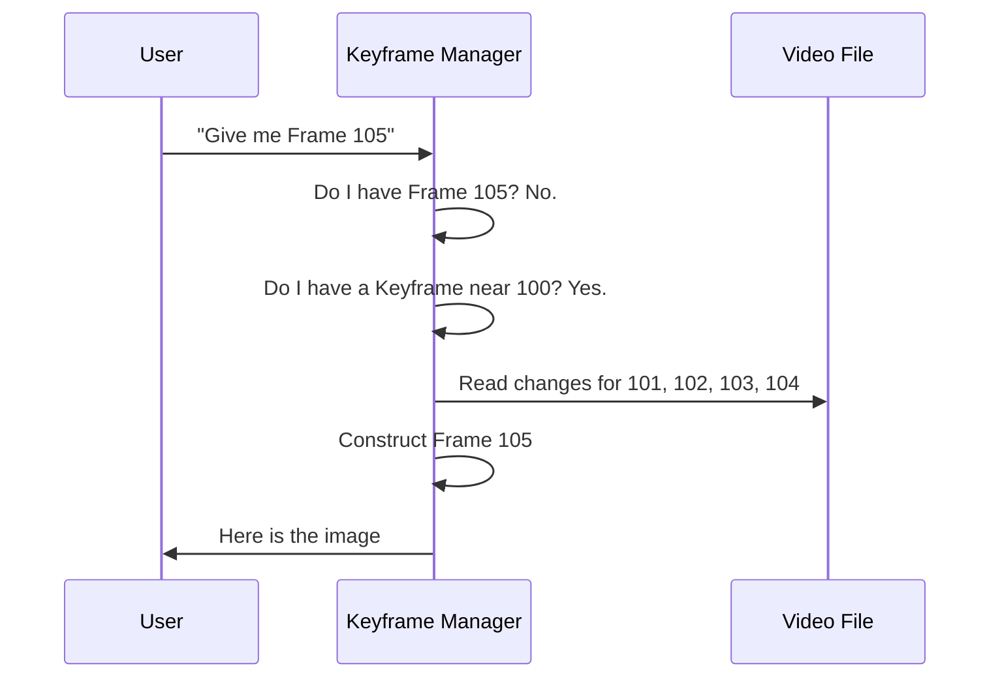

# Chapter 7: Media Analysis & Parsing

In the previous chapter, [Serverless Architecture (Lambda)](06_serverless_architecture__lambda_.md), we learned how to render videos at massive scale using the cloud.

However, rendering assumes you already know *what* you are rendering. But what if the content is dynamic? What if a user uploads a voiceover, and you want your video to be exactly as long as that audio file?

To do this, Remotion needs to peek inside video and audio files to understand them *before* it puts them on the timeline. This is the role of **Media Analysis & Parsing**.

## The Motivation

Imagine you are building a **Music Visualizer**.
1.  The user uploads an MP3 file.
2.  You want the video duration to match the song length exactly.
3.  You want bars to jump up and down based on the beat.

**The Problem:** Standard React doesn't know how long an MP3 is until it plays it. It also can't see the "beats" inside the audio file; it just hears sound.

**The Solution:** Remotion provides tools to read the binary data of media files. It extracts the **Metadata** (duration, FPS) and the **Samples** (raw audio/video data) so you can build your video programmatically.

## Concept 1: The "Digital Librarian" (Metadata)

Think of a video file (MP4, WebM) like a closed book. To know how many pages it has, you don't need to read every word. You just need to look at the Table of Contents.

Remotion includes a parser that reads the "headers" of a file to get technical details immediately.

### How to Use It
The `@remotion/media-parser` package allows you to inspect a file.

```tsx
import { parseMedia } from '@remotion/media-parser';

const analyzeFile = async (url) => {
  const metadata = await parseMedia({
    src: url,
    fields: {
      durationInSeconds: true,
      fps: true,
    },
  });

  console.log(`Duration: ${metadata.durationInSeconds}`);
};
```

**What happens here?**
*   **src**: The URL of the video/audio.
*   **fields**: We ask specifically for duration and FPS.
*   **Result**: Remotion reads the first few kilobytes of the file and returns the answer instantly, without downloading the whole gigabyte.

## Concept 2: Inside the Box (Containers)

Video files are actually containers (like a ZIP file). Inside, they hold tracks (Video, Audio, Subtitles).

Remotion needs to open this container to understand the file. For WebM files, the internal format is called **EBML**. It looks like a tree structure.

### Deep Dive: `parse-ebml.ts`

To parse a WebM file, Remotion reads bytes one by one. It looks for specific "Hex IDs" that act like HTML tags.

```ts
// Simplified from packages/media-parser/src/containers/webm/parse-ebml.ts

export const parseEbml = async (iterator) => {
  // 1. Read the ID (like a tag name)
  const hex = iterator.getMatroskaSegmentId();
  
  // 2. Read the Size (how much data follows)
  const size = iterator.getVint();

  // 3. Look up what this ID means
  const element = ebmlMap[hex];

  // 4. Return the data
  return { type: element.name, value: iterator.getSlice(size) };
};
```

**The Logic:**
It acts like a scanner. If it finds the hex code for "Duration", it reads the number next to it. If it finds "Video Track", it notes down the resolution.

## Concept 3: Checkpoints (Keyframes)

Video compression is tricky. To save space, video files don't store every single image.
*   **Frame 1 (Keyframe):** A full picture.
*   **Frame 2:** "Change pixel at 10,10 to red."
*   **Frame 3:** "Change pixel at 20,20 to blue."

If you want to show **Frame 3**, you can't just read Frame 3. You must read Frame 1, apply changes from Frame 2, and then apply Frame 3.

### The Keyframe Manager

When you edit video in Remotion, you might jump around the timeline randomly. Remotion uses a **Keyframe Manager** to cache the nearest "Full Picture" so it can generate the frame you asked for quickly.



### Deep Dive: `keyframe-manager.ts`

This manager ensures we don't run out of memory by caching too many images.

```ts
// Simplified from packages/media/src/video-extraction/keyframe-manager.ts

const requestKeyframeBank = async ({ timestamp, src }) => {
  // 1. Check if we already have this part of the video cached
  const existingBank = sources[src].find(bank => 
    bank.canSatisfyTimestamp(timestamp)
  );

  if (existingBank) {
    return existingBank;
  }

  // 2. If not, fetch a new "Bank" (group of frames)
  const newBank = await makeKeyframeBank({ src, timestamp });
  
  // 3. Save it for later
  sources[src].push(newBank);
  
  return newBank;
};
```

## Concept 4: Audio Extraction (Waveforms)

To make a visualization, we need raw audio numbers (frequencies), not just a file duration.

Remotion can decode the audio and give you a Float32Array (a list of numbers between -1 and 1 representing volume).

### Deep Dive: `extract-audio.ts`

This function decodes the specific slice of audio needed for the current frame.

```ts
// Simplified from packages/media/src/audio-extraction/extract-audio.ts

const extractAudioInternal = async ({ src, timeInSeconds }) => {
  // 1. Locate the audio track inside the file
  const audio = await getAudio(src);

  // 2. Find the specific samples for this timestamp
  const samples = await sampleIterator.getSamples(timeInSeconds);

  // 3. Convert raw bytes into usable numbers (PCM)
  const audioData = convertAudioData(samples);

  return { data: audioData };
};
```

This allows components like `<AudioViz />` to render bars that react perfectly to the music, frame by frame.

## Summary

In this chapter, we learned how Remotion understands media files:

1.  **Parsing**: It reads file headers (like a Table of Contents) to get Metadata without downloading the whole file.
2.  **Container Logic**: It understands formats like WebM/EBML to find where tracks are hidden.
3.  **Keyframes**: It intelligently manages compressed video frames to allow random seeking on the timeline.
4.  **Extraction**: It decodes raw audio/video data for visualization and processing.

This abstraction ensures that when you use a `<Video>` or `<Audio>` tag, Remotion knows exactly what that file contains and how to synchronize it with your animation timeline.

However, extracting frames and mixing them using JavaScript can be slow for very complex video effects. For heavy-duty lifting, Remotion uses a lower-level engine written in a systems programming language.

In the final chapter, we will look at **The Compositor**, built with Rust: [The Compositor (Rust)](08_the_compositor__rust_.md).

---

Generated by [Code IQ](https://github.com/adityasoni99/Code-IQ)